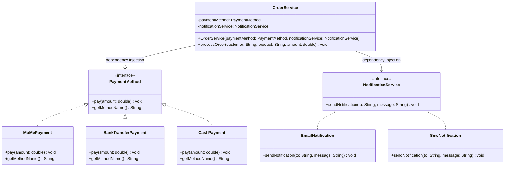

# 📝 BTVN Buổi 1

## Đề bài: Hệ thống Thanh toán Đơn hàng

Xây dựng module xử lý đơn hàng cho ứng dụng e-commerce, áp dụng **Dependency Injection** và **IoC**.

### Yêu cầu:

- Tạo interface `IPaymentMethod` với method `pay(double amount)` và `getMethodName()`.
- Implement 3 phương thức thanh toán: `MoMoPayment`, `BankTransferPayment`, `CashPayment` (Giả lập console).
- Tạo interface `INotificationService` với method `sendNotification(String to, String message)`.
- Implement 2 cách gửi thông báo: `EmailNotification`, `SmsNotification` (Có thể giả lập console hoặc email thật).
- Tạo class `OrderService` nhận `PaymentMethod` và `NotificationService` qua **Constructor Injection** (DI), có method `processOrder(String customer, String product, double amount)` để thanh toán và gửi thông báo.
- Trong `main()`: tạo nhiều `OrderService` với các tổ hợp payment + notification khác nhau, chứng minh có thể **đổi implementation mà không sửa `OrderService`** (Tức thực thi nhiều phương thức thanh toán + thông báo khác nhau mà không cần sửa đổi lớp OrderService).
- Chuyển sang **Spring IoC**: dùng `@Component`, `@Primary`/`@Qualifier`, `@Autowired` để Spring tự inject dependency.

### Class Diagram:

### Notice
- Có thể code theo bất kỳ cách nào, miễn tuân thủ DI, DIP và tận dụng tối đa cơ chế IoC.
- Có thể ghi chú ngay trong code những đoạn khó hiểu do AI gen ra.
- Có thể ghi chú ngay trong code những kiến thức các bạn học được hoặc giải thích vì sao lại làm theo cách đó.
- Clean code và cấu trúc thư mục hợp lý, rõ ràng. Không ràng buộc về tính sáng tạo và cách chia folder, miễn clean và rõ ràng.
- Gửi bài tập về nhà qua group facebook của lớp.
### Nộp bài:
- Push lên GitHub, hạn nộp 23h00p 19/03/2026
