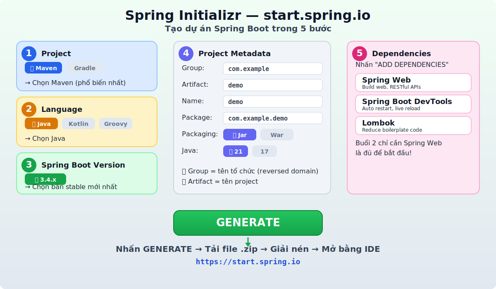
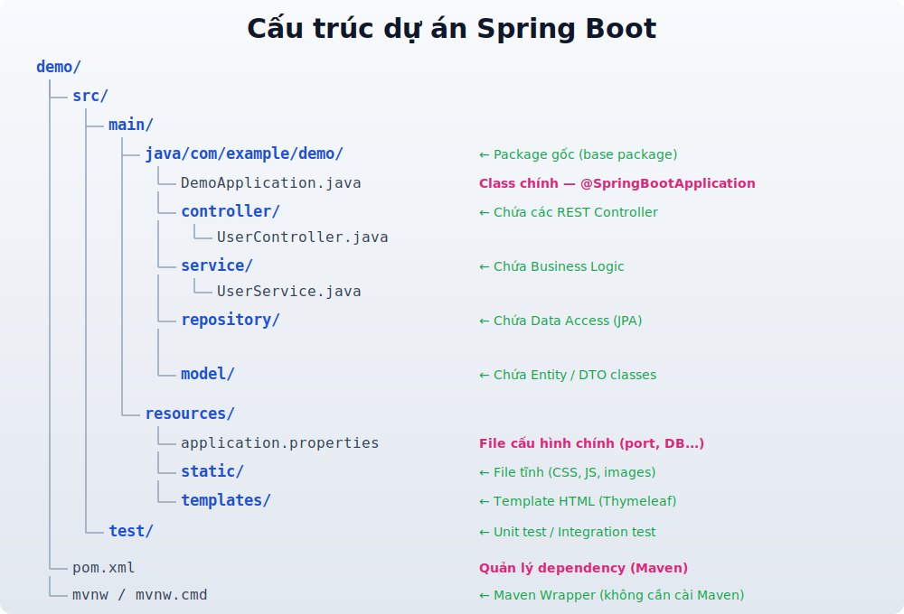
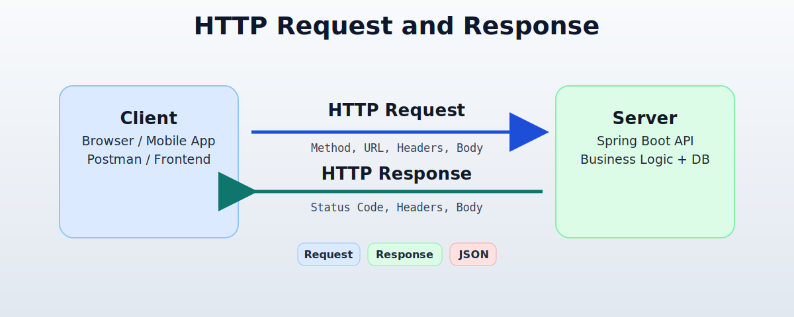
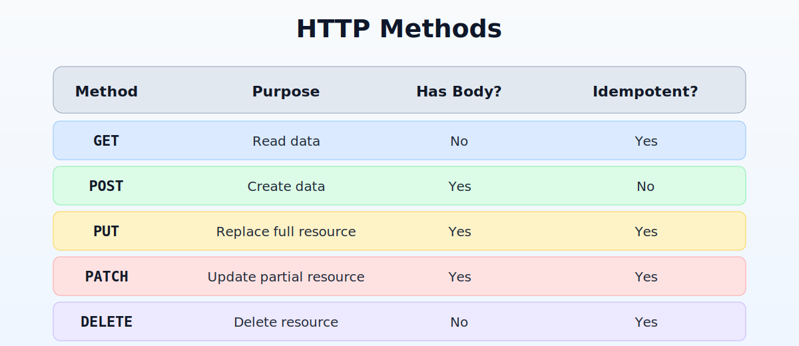
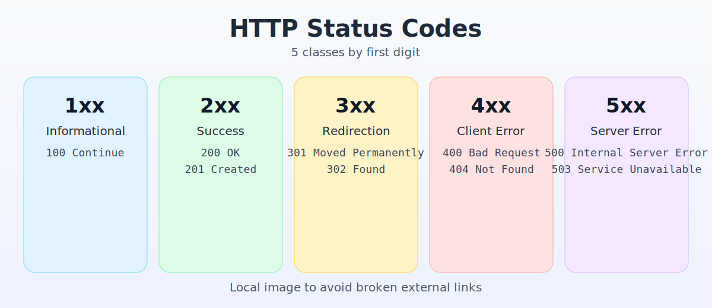
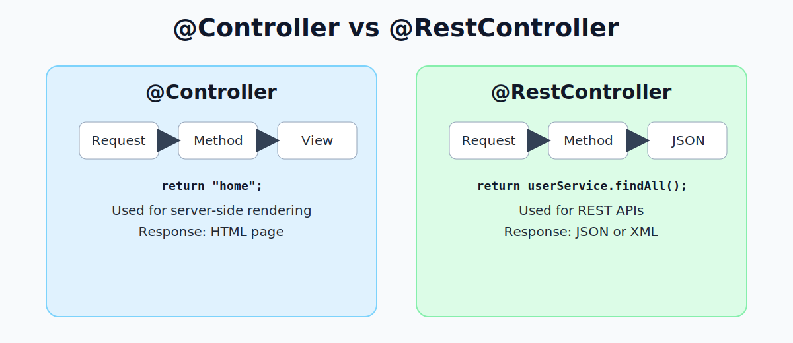
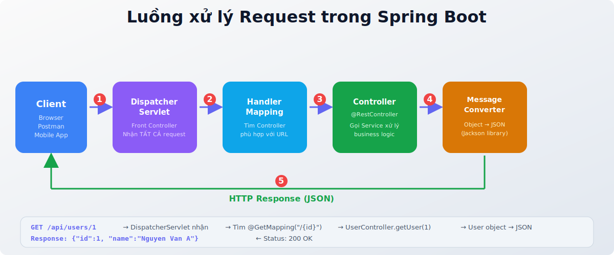
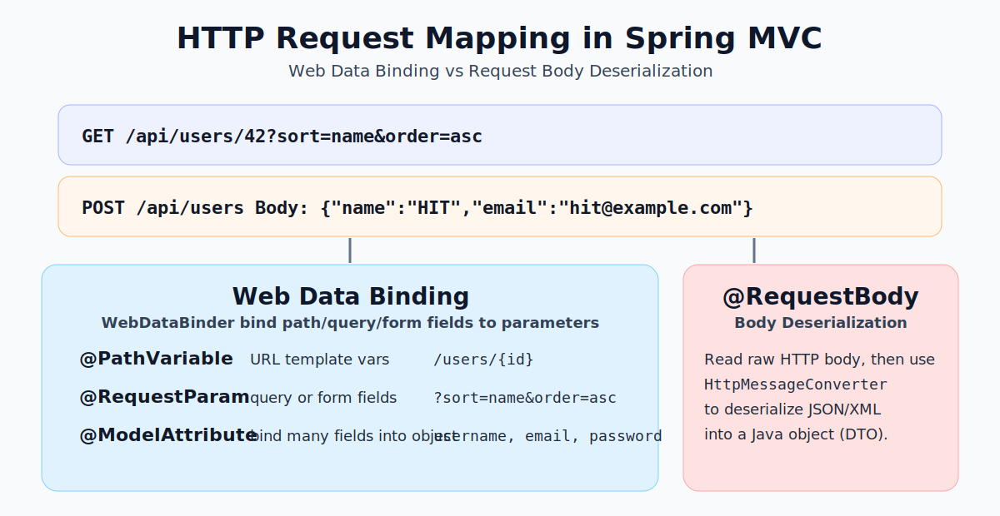
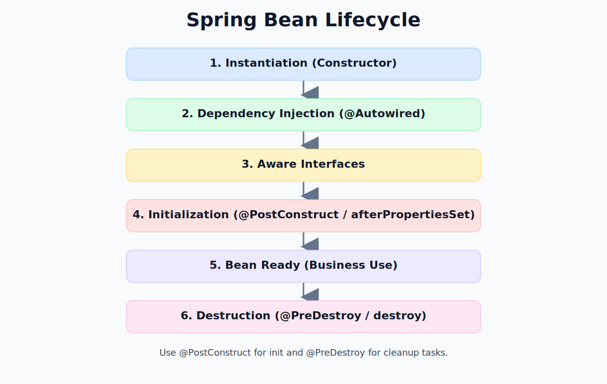

# Buổi 2: HTTP, Controller & Bean trong Spring Boot

---

## Mục tiêu buổi học

- Hiểu về giao thức HTTP: Request, Response, các phương thức HTTP
- Nắm vững các HTTP Status Code thường gặp
- Sử dụng các Annotation cho Controller trong Spring Boot
- Hiểu 3 cách nhận dữ liệu từ client: `@RequestParam`, `@PathVariable`, `@RequestBody`
- Hiểu sâu về Bean: các loại Bean, Bean Scope
- Nắm được ApplicationContext và cách hoạt động
- Hiểu vòng đời (Lifecycle) của Bean trong Spring

---

## 0. Hướng dẫn tạo dự án Spring Boot bằng Spring Initializr

> Trước khi học lý thuyết, hãy tạo sẵn một dự án Spring Boot để thực hành ngay!

### Bước 1: Truy cập Spring Initializr

Mở trình duyệt và truy cập: **[https://start.spring.io](https://start.spring.io)**

Spring Initializr là công cụ **chính thức** của Spring giúp tạo project Spring Boot với cấu hình sẵn — không cần setup thủ công.

### Bước 2: Cấu hình Project



Cấu hình theo bảng sau:

| Mục | Chọn | Giải thích |
|---|---|---|
| **Project** | Maven | Build tool phổ biến nhất, dùng file `pom.xml` |
| **Language** | Java | Ngôn ngữ chính của Spring Boot |
| **Spring Boot** | 3.4.x (stable mới nhất) | Không chọn bản SNAPSHOT (đang phát triển) |
| **Group** | `com.example` | Tên tổ chức (reversed domain name) |
| **Artifact** | `demo` | Tên project (cũng là tên thư mục) |
| **Packaging** | Jar | Đóng gói thành file `.jar` chạy được |
| **Java** | 21 (hoặc 17) | Phải khớp với JDK đã cài |

### Bước 3: Thêm Dependencies

Nhấn nút **"ADD DEPENDENCIES"** và thêm:

| Dependency | Mô tả | Bắt buộc? |
|---|---|---|
| **Spring Web** | Xây dựng REST API, tích hợp Tomcat | Bắt buộc |
| **Spring Boot DevTools** | Auto restart khi sửa code | Khuyến nghị |
| **Lombok** | Giảm boilerplate (getter/setter/constructor) | Khuyến nghị |

> **Buổi 2 chỉ cần thêm `Spring Web` là đủ để bắt đầu!**

### Bước 4: Generate & Mở project

1. Nhấn nút **GENERATE** → Tải về file `demo.zip`
2. **Giải nén** file zip
3. Mở bằng **IntelliJ IDEA**: `File` → `Open` → Chọn thư mục `demo`
4. Đợi IDE tải dependencies (lần đầu có thể mất 2-5 phút)

### Bước 5: Hiểu cấu trúc dự án



```
demo/
├── src/
│   ├── main/
│   │   ├── java/com/example/demo/
│   │   │   └── DemoApplication.java        ← Class chính
│   │   │   └── controller/                  ← Tạo thêm package này
│   │   │       └── HelloController.java     ← Controller đầu tiên
│   │   └── resources/
│   │       ├── application.properties       ← File cấu hình
│   │       ├── static/                      ← File tĩnh
│   │       └── templates/                   ← Template HTML
│   └── test/                                ← Unit test
├── pom.xml                                  ← Quản lý dependency
└── mvnw / mvnw.cmd                          ← Maven Wrapper
```

### Bước 6: Viết và chạy API đầu tiên

**Tạo file `HelloController.java`** trong package `controller`:

```java
package com.example.demo.controller;

import org.springframework.web.bind.annotation.GetMapping;
import org.springframework.web.bind.annotation.RestController;

import java.util.HashMap;
import java.util.Map;

@RestController
public class HelloController {

    @GetMapping("/hello")
    public String hello() {
        return "Xin chào! Đây là API đầu tiên của tôi";
    }

    @GetMapping("/api/info")
    public Map<String, String> info() {
        Map<String, String> data = new HashMap<>();
        data.put("club", "HIT - Spring Boot");
        data.put("lesson", "Buổi 2");
        data.put("topic", "HTTP, Controller & Bean");
        return data;  // Tự động convert sang JSON
    }
}
```

**Chạy ứng dụng:**

```bash
# Cách 1: Chạy từ IDE — Nhấn nút Run trên DemoApplication.java

# Cách 2: Chạy từ terminal
./mvnw spring-boot:run        # Mac/Linux
mvnw.cmd spring-boot:run      # Windows
```

**Kiểm tra kết quả:**

Mở trình duyệt hoặc Postman:

```
GET http://localhost:8080/hello
→ Response: Xin chào! Đây là API đầu tiên của tôi

GET http://localhost:8080/api/info
→ Response: {"club":"HIT - Spring Boot","lesson":"Buổi 2","topic":"HTTP, Controller & Bean"}
```

### Bước 7: Test API bằng Postman

**Postman** là công cụ phổ biến nhất để test REST API — cho phép gửi request với bất kỳ HTTP method nào (GET, POST, PUT, DELETE...) và xem response chi tiết.

**Cài đặt:**

- Tải Postman tại: https://www.postman.com/downloads/
- Cài đặt và mở ứng dụng (không cần tạo tài khoản, chọn **Skip** khi được hỏi)

**Cách sử dụng cơ bản:**

1. Nhấn nút **+** để tạo request mới
2. Chọn **HTTP method** (GET, POST, PUT, DELETE...) ở dropdown bên trái
3. Nhập **URL** vào ô address bar, ví dụ: `http://localhost:8080/hello`
4. Nhấn **Send**
5. Xem kết quả ở phần **Response** bên dưới (Body, Status Code, Headers, Time)

**Test các API vừa tạo:**

| Method | URL | Kết quả mong đợi |
|---|---|---|
| GET | `http://localhost:8080/hello` | `Xin chào! Đây là API đầu tiên của tôi` |
| GET | `http://localhost:8080/api/info` | JSON object chứa club, lesson, topic |

**Test POST request (sẽ dùng ở phần sau):**

1. Chọn method **POST**
2. Nhập URL: `http://localhost:8080/api/users`
3. Chọn tab **Body** → chọn **raw** → chọn **JSON** ở dropdown
4. Nhập JSON body:

```json
{
    "name": "Nguyen Van A",
    "email": "a@example.com"
}
```

5. Nhấn **Send**

> **Tại sao dùng Postman thay vì trình duyệt?**
> - Trình duyệt chỉ gửi được **GET** request (gõ URL trên thanh địa chỉ)
> - Postman gửi được **tất cả** HTTP methods (POST, PUT, DELETE...)
> - Postman hiển thị **Status Code, Headers, Response Time** — rất tiện để debug

### Bước 8: Cấu hình `application.properties`

File `src/main/resources/application.properties` là nơi **cấu hình toàn bộ** ứng dụng Spring Boot.

**Các cấu hình thường dùng:**

```properties
# === Server ===
server.port=8080                    # Đổi port (mặc định 8080)

# === Logging ===
logging.level.root=INFO             # Log level chung
logging.level.com.example.demo=DEBUG  # Log level cho package cụ thể

# === JSON Output ===
spring.jackson.serialization.indent-output=true  # Format JSON đẹp (pretty print)

# === Application Info ===
spring.application.name=demo        # Tên ứng dụng
```

**Khi nào cần đổi cấu hình?**

| Tình huống | Cấu hình |
|---|---|
| Port 8080 đã bị chiếm | `server.port=8081` |
| Muốn xem log chi tiết hơn | `logging.level.root=DEBUG` |
| Kết nối database (buổi sau) | `spring.datasource.url=...` |
| Đổi context path | `server.servlet.context-path=/api/v1` |

> **Lưu ý:** Sau khi sửa `application.properties`, cần **restart** ứng dụng để áp dụng thay đổi (hoặc dùng **DevTools** để auto restart).


---

## I. API là gì?

### 1. Khái niệm API

- **API** (Application Programming Interface) là **giao diện lập trình ứng dụng** — một tập hợp các quy tắc cho phép các phần mềm giao tiếp với nhau
- API giống như **người phục vụ trong nhà hàng**: bạn (client) gọi món → phục vụ (API) nhận yêu cầu → chuyển cho bếp (server) xử lý → mang đồ ăn (response) về cho bạn
- Trong phát triển web, **API** thường chỉ **Web API** — cho phép frontend giao tiếp với backend qua mạng

### 2. REST API

- **REST** (Representational State Transfer) là kiến trúc phổ biến nhất để thiết kế Web API
- **REST API** sử dụng HTTP làm giao thức truyền tải, với các quy ước:

| Quy ước | Mô tả |
|---|---|
| Sử dụng HTTP methods | GET (đọc), POST (tạo), PUT (cập nhật), DELETE (xóa) |
| URL đại diện cho tài nguyên | `/api/users`, `/api/products/1` |
| Stateless | Mỗi request độc lập, server không lưu trạng thái client |
| Trả về JSON | Định dạng dữ liệu phổ biến nhất hiện nay |

```
Client (React, Mobile App)
    │
    │   GET /api/users/1
    │   Authorization: Bearer token123
    ▼
REST API (Spring Boot)
    │
    │   { "id": 1, "name": "Nguyen Van A" }
    │   Status: 200 OK
    ▼
Client nhận JSON → hiển thị lên giao diện
```

> **Trong khóa học này, chúng ta sẽ xây dựng REST API bằng Spring Boot.**

### 3. Các cách giao tiếp khác ngoài REST API

REST API không phải cách duy nhất để client và server giao tiếp. Tùy bài toán, có thể dùng:

| Cách giao tiếp | Mô tả | Khi nào dùng? |
|---|---|---|
| **REST API** | Request-Response qua HTTP, trả JSON | CRUD thông thường, web/mobile app (phổ biến nhất) |
| **WebSocket** | Kết nối 2 chiều, real-time | Chat, game online, bảng giá chứng khoán |
| **GraphQL** | Client tự chọn dữ liệu cần lấy | Khi cần linh hoạt query, tránh over-fetching |
| **gRPC** | Giao tiếp binary, hiệu năng cao | Microservices giao tiếp nội bộ |
| **Message Queue** | Giao tiếp bất đồng bộ qua broker (RabbitMQ, Kafka) | Xử lý nền, hệ thống phân tán |

So sánh nhanh REST vs WebSocket:

```
REST API (Request-Response):
Client ──request──▶ Server
Client ◀─response── Server
→ Mỗi lần cần dữ liệu mới phải gửi request

WebSocket (Bidirectional):
Client ◀──────────▶ Server
→ Kết nối mở liên tục, server có thể chủ động gửi dữ liệu cho client
```

> **Kết luận:** REST API là lựa chọn mặc định cho hầu hết ứng dụng web. Các cách khác dùng khi có yêu cầu đặc biệt (real-time, hiệu năng cao, bất đồng bộ).

---

## II. HTTP Request & Response

### 1. HTTP là gì?

- **HTTP** (HyperText Transfer Protocol) là giao thức truyền tải siêu văn bản — nền tảng giao tiếp trên Web
- Mọi tương tác giữa **Client** (trình duyệt, app di động, Postman...) và **Server** đều thông qua HTTP



### 2. Cấu trúc HTTP Request

Khi client gửi yêu cầu đến server, nó gửi một **HTTP Request** gồm:

```
┌─────────────────────────────────────────────┐
│              HTTP REQUEST                    │
├─────────────────────────────────────────────┤
│  Request Line:                               │
│    POST /api/users HTTP/1.1                  │
├─────────────────────────────────────────────┤
│  Headers:                                    │
│    Content-Type: application/json            │
│    Authorization: Bearer token123            │
│    Accept: application/json                  │
├─────────────────────────────────────────────┤
│  Body (tuỳ chọn):                            │
│    {                                         │
│      "name": "Nguyen Van A",                 │
│      "email": "a@example.com"                │
│    }                                         │
└─────────────────────────────────────────────┘
```

| Thành phần | Mô tả |
|---|---|
| **Request Line** | Chứa HTTP Method + URL + HTTP Version |
| **Headers** | Metadata bổ sung (kiểu dữ liệu, xác thực, ngôn ngữ...) |
| **Body** | Dữ liệu gửi kèm (thường có ở POST, PUT, PATCH) |

### 3. Cấu trúc HTTP Response

Server xử lý xong sẽ trả về **HTTP Response**:

```
┌─────────────────────────────────────────────┐
│              HTTP RESPONSE                   │
├─────────────────────────────────────────────┤
│  Status Line:                                │
│    HTTP/1.1 200 OK                           │
├─────────────────────────────────────────────┤
│  Headers:                                    │
│    Content-Type: application/json            │
│    Content-Length: 85                         │
├─────────────────────────────────────────────┤
│  Body:                                       │
│    {                                         │
│      "id": 1,                                │
│      "name": "Nguyen Van A",                 │
│      "email": "a@example.com"                │
│    }                                         │
└─────────────────────────────────────────────┘
```

### 4. Các phương thức HTTP (HTTP Methods)


|---|---|---|---|---|
| **GET** | Lấy dữ liệu | ❌ Không | ✅ Có | Lấy danh sách user |
| **POST** | Tạo mới dữ liệu | ✅ Có | ❌ Không | Tạo user mới |
| **PUT** | Cập nhật **toàn bộ** dữ liệu | ✅ Có | ✅ Có | Update toàn bộ thông tin user |
| **PATCH** | Cập nhật **một phần** dữ liệu | ✅ Có | ✅ Có | Update email của user |
| **DELETE** | Xóa dữ liệu | ❌ Không | ✅ Có | Xóa user |

> **Idempotent** (lũy đẳng): Gọi nhiều lần cho cùng kết quả. `POST` không idempotent vì gọi 2 lần sẽ tạo 2 bản ghi.

#### Ví dụ thực tế — CRUD API cho User

```
GET     /api/users          → Lấy danh sách tất cả users
GET     /api/users/1        → Lấy user có id = 1
POST    /api/users          → Tạo user mới (dữ liệu trong body)
PUT     /api/users/1        → Cập nhật toàn bộ user id = 1
PATCH   /api/users/1        → Cập nhật một phần user id = 1
DELETE  /api/users/1        → Xóa user id = 1
```

### 5. So sánh GET vs POST

| Tiêu chí | GET | POST |
|---|---|---|
| Mục đích | Lấy dữ liệu | Gửi/tạo dữ liệu |
| Dữ liệu gửi qua | URL (query string) | Body |
| Bảo mật | Thấp (hiện trên URL) | Cao hơn (ẩn trong body) |
| Cache | Có thể cache | Không cache |
| Bookmark | Có thể bookmark | Không |
| Giới hạn dữ liệu | ~2048 ký tự (URL length) | Không giới hạn |
| Idempotent | ✅ Có | ❌ Không |

---

## III. HTTP Status Code



### 1. HTTP Status Code là gì?

- Là **mã số 3 chữ số** server trả về trong response, cho biết **kết quả xử lý** request
- Chia thành **5 nhóm** theo chữ số đầu tiên

### 2. Phân loại Status Code

```
┌──────────┬─────────────────────┬────────────────────────────────────┐
│  Nhóm    │  Ý nghĩa            │  Mô tả                             │
├──────────┼─────────────────────┼────────────────────────────────────┤
│  1xx     │  Informational       │  Server đã nhận request, đang xử lý│
│  2xx     │  Success ✅          │  Request thành công                 │
│  3xx     │  Redirection ↪️      │  Cần thêm hành động (chuyển hướng) │
│  4xx     │  Client Error ❌     │  Lỗi từ phía client                │
│  5xx     │  Server Error 💥     │  Lỗi từ phía server                │
└──────────┴─────────────────────┴────────────────────────────────────┘
```

### 3. Các Status Code thường gặp

#### 2xx — Thành công ✅

| Code | Tên | Mô tả | Khi nào dùng? |
|---|---|---|---|
| **200** | OK | Thành công | GET, PUT, PATCH thành công |
| **201** | Created | Tạo thành công | POST tạo mới resource |
| **204** | No Content | Thành công, không trả body | DELETE thành công |

```java
// Ví dụ trong Spring Boot
@GetMapping("/users")
public ResponseEntity<List<User>> getUsers() {
    return ResponseEntity.ok(userService.findAll());  // 200 OK
}

@PostMapping("/users")
public ResponseEntity<User> createUser(@RequestBody User user) {
    User saved = userService.save(user);
    return ResponseEntity.status(HttpStatus.CREATED).body(saved);  // 201 Created
}

@DeleteMapping("/users/{id}")
public ResponseEntity<Void> deleteUser(@PathVariable Long id) {
    userService.delete(id);
    return ResponseEntity.noContent().build();  // 204 No Content
}
```

#### 4xx — Lỗi từ Client ❌

| Code | Tên | Mô tả | Khi nào xảy ra? |
|---|---|---|---|
| **400** | Bad Request | Request không hợp lệ | Thiếu field, sai format JSON |
| **401** | Unauthorized | Chưa xác thực | Thiếu token, token hết hạn |
| **403** | Forbidden | Không có quyền | Đã đăng nhập nhưng không đủ quyền |
| **404** | Not Found | Không tìm thấy | URL sai hoặc resource không tồn tại |
| **405** | Method Not Allowed | Sai HTTP method | Gọi POST nhưng API chỉ hỗ trợ GET |
| **409** | Conflict | Xung đột dữ liệu | Email đã tồn tại khi đăng ký |
| **422** | Unprocessable Entity | Dữ liệu không xử lý được | Validation thất bại |

> **Phân biệt 401 vs 403:**
> - **401 Unauthorized**: "Tao không biết mày là ai" → Chưa đăng nhập
> - **403 Forbidden**: "Tao biết mày là ai, nhưng mày không có quyền" → Đã đăng nhập nhưng role không đủ

#### 5xx — Lỗi từ Server 💥

| Code | Tên | Mô tả | Khi nào xảy ra? |
|---|---|---|---|
| **500** | Internal Server Error | Lỗi server chung | NullPointerException, bug trong code |
| **502** | Bad Gateway | Gateway/proxy nhận response lỗi | Server phía sau bị crash |
| **503** | Service Unavailable | Server quá tải hoặc bảo trì | Server đang restart, quá nhiều request |
| **504** | Gateway Timeout | Timeout khi chờ server phía sau | Database query quá lâu |

### 4. Sử dụng ResponseEntity trong Spring Boot

`ResponseEntity` cho phép kiểm soát **toàn bộ** HTTP Response: status code, headers, body.

```java
@RestController
@RequestMapping("/api/users")
public class UserController {

    @GetMapping("/{id}")
    public ResponseEntity<?> getUser(@PathVariable Long id) {
        User user = userService.findById(id);

        if (user == null) {
            return ResponseEntity
                    .status(HttpStatus.NOT_FOUND)            // 404
                    .body("User không tồn tại với id: " + id);
        }

        return ResponseEntity.ok(user);                       // 200
    }
}
```

---

## IV. Annotation cho Controller

### 1. @Controller vs @RestController



#### @Controller — Trả về View (HTML)

```java
@Controller
public class HomeController {

    @GetMapping("/home")
    public String home(Model model) {
        model.addAttribute("message", "Xin chào!");
        return "home";  // → Trả về file home.html (Thymeleaf template)
    }
}
```

#### @RestController — Trả về Data (JSON/XML)

```java
@RestController  // = @Controller + @ResponseBody
public class UserController {

    @GetMapping("/api/users")
    public List<User> getUsers() {
        return userService.findAll();  // → Trả về JSON tự động
    }
}
```

| Tiêu chí | @Controller | @RestController |
|---|---|---|
| Trả về | View name (HTML template) | Data trực tiếp (JSON/XML) |
| Cần `@ResponseBody`? | Có, nếu muốn trả JSON | Không, đã tích hợp sẵn |
| Dùng cho | Server-side rendering (Thymeleaf, JSP) | REST API (phổ biến hiện nay) |

> **Quy tắc thực tế:** Trong các dự án modern, **90% dùng `@RestController`** vì frontend (React, Vue, Angular) giao tiếp với backend qua REST API.

### 2. @RequestMapping — Mapping URL

`@RequestMapping` dùng để **ánh xạ** (map) URL request đến method xử lý.

```java
@RestController
@RequestMapping("/api/v1/users")  // Base path cho tất cả method trong class
public class UserController {

    @RequestMapping(value = "/{id}", method = RequestMethod.GET)
    public User getUser(@PathVariable Long id) {
        return userService.findById(id);
    }

    @RequestMapping(value = "", method = RequestMethod.POST)
    public User createUser(@RequestBody User user) {
        return userService.save(user);
    }
}
```

### 3. Shortcut Annotations (khuyến nghị ✅)

Thay vì dùng `@RequestMapping(method = ...)`, Spring cung cấp các **shortcut annotation** gọn hơn:

```
┌────────────────────┬──────────────────────────────────────────────────┐
│   Annotation       │  Tương đương                                     │
├────────────────────┼──────────────────────────────────────────────────┤
│  @GetMapping       │  @RequestMapping(method = RequestMethod.GET)     │
│  @PostMapping      │  @RequestMapping(method = RequestMethod.POST)    │
│  @PutMapping       │  @RequestMapping(method = RequestMethod.PUT)     │
│  @DeleteMapping    │  @RequestMapping(method = RequestMethod.DELETE)  │
│  @PatchMapping     │  @RequestMapping(method = RequestMethod.PATCH)   │
└────────────────────┴──────────────────────────────────────────────────┘
```

#### Ví dụ đầy đủ — CRUD Controller

```java
@RestController
@RequestMapping("/api/users")
public class UserController {

    private final UserService userService;

    public UserController(UserService userService) {  // Constructor Injection
        this.userService = userService;
    }

    // GET /api/users → Lấy tất cả users
    @GetMapping
    public List<User> getAllUsers() {
        return userService.findAll();
    }

    // GET /api/users/1 → Lấy user theo id
    @GetMapping("/{id}")
    public User getUserById(@PathVariable Long id) {
        return userService.findById(id);
    }

    // POST /api/users → Tạo user mới
    @PostMapping
    public ResponseEntity<User> createUser(@RequestBody User user) {
        User saved = userService.save(user);
        return ResponseEntity.status(HttpStatus.CREATED).body(saved);
    }

    // PUT /api/users/1 → Cập nhật toàn bộ user
    @PutMapping("/{id}")
    public User updateUser(@PathVariable Long id, @RequestBody User user) {
        return userService.update(id, user);
    }

    // DELETE /api/users/1 → Xóa user
    @DeleteMapping("/{id}")
    public ResponseEntity<Void> deleteUser(@PathVariable Long id) {
        userService.delete(id);
        return ResponseEntity.noContent().build();
    }
}
```

### 4. Luồng xử lý Request trong Spring MVC



> **DispatcherServlet** là "Front Controller" — tiếp nhận **tất cả** request và phân phối đến Controller phù hợp.

---

## V. 3 Cách nhận dữ liệu từ Client (3 Types of Data)



Khi client gửi request, dữ liệu có thể nằm ở **3 vị trí** khác nhau:

```
GET /api/users/42?sort=name&order=asc
     ──────────── ───────────────────
     Path Variable    Query Parameters

POST /api/users
Body: { "name": "HIT", "email": "hit@example.com" }
      ──────────────────────────────────────────────
                     Request Body
```

### 1. @PathVariable — Dữ liệu trên đường dẫn (Path)

- Lấy giá trị từ **URL path** (phần nằm trong `{}`)
- Thường dùng cho **ID** hoặc **slug**

```java
// URL: GET /api/users/42
@GetMapping("/api/users/{id}")
public User getUser(@PathVariable Long id) {
    // id = 42
    return userService.findById(id);
}

// Nhiều path variable
// URL: GET /api/users/42/orders/100
@GetMapping("/api/users/{userId}/orders/{orderId}")
public Order getOrder(@PathVariable Long userId,
                      @PathVariable Long orderId) {
    return orderService.findByUserAndId(userId, orderId);
}

// Đổi tên biến
@GetMapping("/api/users/{user_id}")
public User getUser(@PathVariable("user_id") Long id) {
    return userService.findById(id);
}
```

### 2. @RequestParam — Dữ liệu trên Query String

- Lấy giá trị từ **query parameters** (sau dấu `?` trên URL)
- Thường dùng cho **filter, search, pagination, sort**

```java
// URL: GET /api/users?page=0&size=10&sort=name
@GetMapping("/api/users")
public List<User> getUsers(
        @RequestParam(defaultValue = "0") int page,
        @RequestParam(defaultValue = "10") int size,
        @RequestParam(defaultValue = "id") String sort) {
    return userService.findAll(page, size, sort);
}

// Optional parameter
// URL: GET /api/users?name=Nguyen  hoặc  GET /api/users
@GetMapping("/api/users")
public List<User> searchUsers(
        @RequestParam(required = false) String name) {
    if (name != null) {
        return userService.findByName(name);
    }
    return userService.findAll();
}

// Nhiều giá trị
// URL: GET /api/users?ids=1,2,3
@GetMapping("/api/users")
public List<User> getUsersByIds(@RequestParam List<Long> ids) {
    return userService.findByIds(ids);
}
```

### 3. @RequestBody — Dữ liệu trong Body (JSON)

- Lấy dữ liệu từ **request body**, thường là **JSON**
- Spring tự động chuyển JSON → Java Object (deserialization bằng Jackson)
- Thường dùng cho **POST, PUT, PATCH**

```java
// DTO (Data Transfer Object)
public class CreateUserRequest {
    private String name;
    private String email;
    private int age;

    // getters, setters
}

// POST /api/users
// Body: { "name": "HIT", "email": "hit@example.com", "age": 20 }
@PostMapping("/api/users")
public ResponseEntity<User> createUser(@RequestBody CreateUserRequest request) {
    // request.getName() = "HIT"
    // request.getEmail() = "hit@example.com"
    // request.getAge() = 20
    User user = userService.create(request);
    return ResponseEntity.status(HttpStatus.CREATED).body(user);
}

// PUT /api/users/1
@PutMapping("/api/users/{id}")
public User updateUser(@PathVariable Long id,
                        @RequestBody UpdateUserRequest request) {
    return userService.update(id, request);
}
```

### 4. Bảng so sánh 3 loại dữ liệu

| Tiêu chí | @PathVariable | @RequestParam | @RequestBody |
|---|---|---|---|
| **Vị trí dữ liệu** | Trên URL path `/users/{id}` | Sau dấu `?` trên URL | Trong body request |
| **Kiểu dữ liệu** | Đơn giản (String, Long...) | Đơn giản (String, int...) | Phức tạp (Object, JSON) |
| **HTTP Method** | Tất cả | Thường GET | POST, PUT, PATCH |
| **Bắt buộc?** | Mặc định: Có | Có thể tuỳ chọn (`required = false`) | Mặc định: Có |
| **Dùng cho** | ID, slug, resource identifier | Filter, search, pagination | Tạo/cập nhật dữ liệu |

### 5. Kết hợp cả 3 trong 1 request

```java
// PUT /api/users/42?notify=true
// Body: { "name": "Updated Name", "email": "new@email.com" }

@PutMapping("/api/users/{id}")
public User updateUser(
        @PathVariable Long id,                        // id = 42
        @RequestParam(defaultValue = "false") boolean notify,  // notify = true
        @RequestBody UpdateUserRequest request) {     // JSON body
    User updated = userService.update(id, request);
    if (notify) {
        notificationService.sendUpdateNotification(updated);
    }
    return updated;
}
```

---

## VI. Bean trong Spring (Deep Dive)

> Ở Buổi 1, ta đã biết **Bean là object được Spring Container quản lý**. Bây giờ ta đi sâu hơn.

### 1. Các Stereotype Annotations — Đánh dấu Bean theo vai trò

Spring cung cấp **4 annotation** để đánh dấu Bean, tất cả đều là con của `@Component`:

```
                    @Component
                    (annotation gốc)
                         │
          ┌──────────────┼──────────────┐
          │              │              │
     @Service      @Repository    @Controller
   (Business       (Data          (Web
    Logic)         Access)         Layer)
```

| Annotation | Vai trò | Tầng (Layer) | Ví dụ |
|---|---|---|---|
| `@Component` | Bean chung, không thuộc tầng cụ thể | Bất kỳ | Utility class, Helper |
| `@Service` | Chứa business logic | Service Layer | `UserService`, `OrderService` |
| `@Repository` | Truy cập database | Data Access Layer | `UserRepository`, `OrderRepository` |
| `@Controller` / `@RestController` | Xử lý HTTP request | Web Layer | `UserController` |

```java
// ❌ Dùng chung @Component — không rõ ràng
@Component
public class UserService { ... }

// ✅ Dùng @Service — rõ vai trò
@Service
public class UserService { ... }
```

> **Tại sao phân biệt?**
> - Rõ ràng vai trò từng class trong kiến trúc phân tầng
> - `@Repository` tự động xử lý **exception translation** (chuyển SQL Exception → Spring DataAccessException)
> - Dễ dàng apply AOP cho từng tầng riêng biệt

### 2. @Bean vs @Component

| Tiêu chí | @Component | @Bean |
|---|---|---|
| Đặt ở đâu? | Trên **class** | Trên **method** (trong `@Configuration` class) |
| Ai tạo? | Spring tự scan và tạo | Dev tự viết logic tạo object |
| Khi nào dùng? | Class do **mình viết** | Class từ **thư viện bên thứ 3** (không sửa source code được) |

#### Ví dụ @Bean — Cấu hình thư viện bên ngoài

```java
@Configuration
public class AppConfig {

    // Tạo Bean cho ObjectMapper (thư viện Jackson — không thể thêm @Component)
    @Bean
    public ObjectMapper objectMapper() {
        ObjectMapper mapper = new ObjectMapper();
        mapper.setSerializationInclusion(JsonInclude.Include.NON_NULL);
        mapper.configure(DeserializationFeature.FAIL_ON_UNKNOWN_PROPERTIES, false);
        return mapper;
    }

    // Tạo Bean cho RestTemplate
    @Bean
    public RestTemplate restTemplate() {
        return new RestTemplate();
    }

    // Tạo Bean cho ModelMapper
    @Bean
    public ModelMapper modelMapper() {
        return new ModelMapper();
    }
}
```

> **Quy tắc:**
> - Class **mình viết** → dùng `@Component` (hoặc `@Service`, `@Repository`, `@Controller`)
> - Class **thư viện bên ngoài** → dùng `@Bean` trong `@Configuration`

### 3. Bean Scope — Phạm vi tồn tại của Bean

Bean Scope quyết định **số lượng instance** và **thời gian sống** của Bean.

```java
@Component
@Scope("prototype")  // Khai báo scope
public class NotificationService { ... }
```

| Scope | Mô tả | Số instance |
|---|---|---|
| **singleton** (mặc định) | Chỉ tạo **1 instance** duy nhất trong toàn bộ container | 1 |
| **prototype** | Tạo **instance mới** mỗi lần được yêu cầu (inject hoặc getBean) | Nhiều |
| **request** | 1 instance cho mỗi **HTTP request** (chỉ dùng trong Web) | 1/request |
| **session** | 1 instance cho mỗi **HTTP session** | 1/session |
| **application** | 1 instance cho mỗi **ServletContext** | 1/app |

#### Singleton vs Prototype — Minh họa

```java
// === SINGLETON (mặc định) ===
@Component  // Scope mặc định = singleton
public class SingletonBean {
    public SingletonBean() {
        System.out.println("SingletonBean created!");
    }
}

// === PROTOTYPE ===
@Component
@Scope("prototype")
public class PrototypeBean {
    public PrototypeBean() {
        System.out.println("PrototypeBean created!");
    }
}

// === Test ===
@Component
public class TestRunner implements CommandLineRunner {
    @Autowired private ApplicationContext context;

    @Override
    public void run(String... args) {
        // Singleton: cùng 1 instance
        var s1 = context.getBean(SingletonBean.class);
        var s2 = context.getBean(SingletonBean.class);
        System.out.println(s1 == s2);  // true ✅ — cùng 1 object

        // Prototype: instance mới mỗi lần
        var p1 = context.getBean(PrototypeBean.class);
        var p2 = context.getBean(PrototypeBean.class);
        System.out.println(p1 == p2);  // false ❌ — khác object
    }
}
```

**Output:**
```
SingletonBean created!       ← Chỉ tạo 1 lần
PrototypeBean created!       ← Tạo lần 1
PrototypeBean created!       ← Tạo lần 2
true
false
```

> **Khi nào dùng Prototype?**
> - Object có **trạng thái thay đổi** (stateful) mà không muốn share giữa các nơi
> - Ví dụ: `ShoppingCart`, `EmailBuilder`, form processor

---

## VII. ApplicationContext (Deep Dive)

### 1. ApplicationContext là gì?

- **ApplicationContext** là **IoC Container** chính của Spring — nơi chứa và quản lý tất cả các Bean
- Khi ứng dụng Spring Boot khởi động, nó tạo ra một ApplicationContext và thực hiện:
  1. **Component Scanning** — Quét tất cả package để tìm class có annotation `@Component`, `@Service`, `@Repository`, `@Controller`
  2. **Bean Creation** — Tạo instance cho mỗi Bean
  3. **Dependency Injection** — Inject các dependency vào Bean
  4. **Lifecycle Callbacks** — Gọi các method lifecycle (`@PostConstruct`, ...)

```
┌──────────────────────────────────────────────────────────┐
│                  ApplicationContext                       │
│                (IoC Container)                            │
│                                                          │
│   ┌─────────────────────────────────────────────────┐    │
│   │           Component Scanning                     │    │
│   │  Quét package com.example.* tìm @Component,     │    │
│   │  @Service, @Repository, @Controller              │    │
│   └──────────────────┬──────────────────────────────┘    │
│                      ▼                                    │
│   ┌─────────────┐ ┌──────────────┐ ┌────────────────┐   │
│   │ UserService │ │ UserRepo     │ │ UserController │   │
│   │ (@Service)  │ │ (@Repository)│ │ (@RestController)│  │
│   └──────┬──────┘ └──────┬───────┘ └───────┬────────┘   │
│          │               │                  │            │
│          └───────inject──┘──────inject──────┘            │
│                                                          │
└──────────────────────────────────────────────────────────┘
```

### 2. Component Scanning — Cơ chế quét Bean

- `@SpringBootApplication` bao gồm `@ComponentScan` — tự động quét **package hiện tại và tất cả sub-package**

```java
// File: com/example/demo/DemoApplication.java
@SpringBootApplication  // Bao gồm @ComponentScan(basePackages = "com.example.demo")
public class DemoApplication {
    public static void main(String[] args) {
        SpringApplication.run(DemoApplication.class, args);
    }
}
```

```
com.example.demo/                   ← @SpringBootApplication ở đây
├── controller/
│   └── UserController.java         ✅ Được scan
├── service/
│   └── UserService.java            ✅ Được scan
├── repository/
│   └── UserRepository.java         ✅ Được scan
└── config/
    └── AppConfig.java              ✅ Được scan

com.other.package/
└── SomeService.java                ❌ KHÔNG được scan (khác package gốc)
```

> **Lưu ý quan trọng:** Class `@SpringBootApplication` phải nằm ở **package gốc** (root package) để scan được tất cả sub-package.

### 3. Lấy Bean từ ApplicationContext

```java
@SpringBootApplication
public class DemoApplication implements CommandLineRunner {

    @Autowired
    private ApplicationContext context;

    public static void main(String[] args) {
        SpringApplication.run(DemoApplication.class, args);
    }

    @Override
    public void run(String... args) {
        // Cách 1: Lấy Bean theo class
        UserService userService = context.getBean(UserService.class);

        // Cách 2: Lấy Bean theo tên
        UserService userService2 = (UserService) context.getBean("userService");

        // Cách 3: Lấy Bean theo tên + class
        UserService userService3 = context.getBean("userService", UserService.class);

        // Kiểm tra Bean có tồn tại không
        boolean exists = context.containsBean("userService");  // true

        // Lấy tất cả tên Bean
        String[] beanNames = context.getBeanDefinitionNames();
        for (String name : beanNames) {
            System.out.println(name);
        }
    }
}
```

### 4. Các loại ApplicationContext

| Loại | Mô tả |
|---|---|
| `AnnotationConfigApplicationContext` | Dùng Java annotation config (phổ biến nhất) |
| `ClassPathXmlApplicationContext` | Dùng XML config (cũ, ít dùng) |
| `GenericWebApplicationContext` | Dùng cho ứng dụng Web |

> Trong **Spring Boot**, bạn không cần tạo ApplicationContext thủ công — `SpringApplication.run()` tự tạo cho bạn.

---

## VIII. Vòng đời của Bean (Bean Lifecycle)

### 1. Tổng quan Lifecycle



Mỗi Bean trong Spring trải qua các giai đoạn sau:

```
┌─────────────────────────────────────────────────────────────────┐
│                    BEAN LIFECYCLE                                │
│                                                                 │
│  1. 🏗️  Instantiation                                          │
│     └── Spring tạo instance (gọi constructor)                   │
│                    ▼                                             │
│  2. 📦  Populate Properties                                     │
│     └── Spring inject dependency (@Autowired)                   │
│                    ▼                                             │
│  3. 📢  Aware Interfaces                                        │
│     └── BeanNameAware, BeanFactoryAware, ApplicationContextAware│
│                    ▼                                             │
│  4. 🔧  BeanPostProcessor (Before)                              │
│     └── postProcessBeforeInitialization()                       │
│                    ▼                                             │
│  5. ✅  Initialization                                          │
│     └── @PostConstruct / InitializingBean / init-method         │
│                    ▼                                             │
│  6. 🔧  BeanPostProcessor (After)                               │
│     └── postProcessAfterInitialization()                        │
│                    ▼                                             │
│  7. 🟢  Bean Ready — Sẵn sàng sử dụng                          │
│                    ▼                                             │
│  8. 💀  Destruction                                             │
│     └── @PreDestroy / DisposableBean / destroy-method           │
└─────────────────────────────────────────────────────────────────┘
```

### 2. @PostConstruct và @PreDestroy

- `@PostConstruct`: Chạy **sau khi** Bean được tạo và inject xong dependency → dùng để **khởi tạo** tài nguyên
- `@PreDestroy`: Chạy **trước khi** Bean bị hủy → dùng để **giải phóng** tài nguyên

```java
import jakarta.annotation.PostConstruct;
import jakarta.annotation.PreDestroy;

@Service
public class DatabaseConnectionService {

    private Connection connection;

    @PostConstruct
    public void init() {
        System.out.println("🟢 Bean created — Opening database connection...");
        // Mở kết nối database, load cache, khởi tạo resource...
        this.connection = DriverManager.getConnection("jdbc:mysql://localhost:3306/mydb");
    }

    @PreDestroy
    public void cleanup() {
        System.out.println("🔴 Bean destroying — Closing database connection...");
        // Đóng kết nối, giải phóng tài nguyên...
        if (connection != null) {
            connection.close();
        }
    }

    public void query(String sql) {
        // Thực hiện query...
    }
}
```

### 3. Ví dụ minh họa — Theo dõi Lifecycle

```java
@Component
public class LifecycleDemo implements BeanNameAware, InitializingBean, DisposableBean {

    private String beanName;

    // 1. Constructor — Instantiation
    public LifecycleDemo() {
        System.out.println("1️⃣  Constructor called — Bean instantiated");
    }

    // 2. Dependency Injection
    @Autowired
    public void setDependency(SomeDependency dep) {
        System.out.println("2️⃣  Dependency injected");
    }

    // 3. Aware Interface
    @Override
    public void setBeanName(String name) {
        this.beanName = name;
        System.out.println("3️⃣  BeanNameAware — Bean name: " + name);
    }

    // 4. @PostConstruct
    @PostConstruct
    public void postConstruct() {
        System.out.println("4️⃣  @PostConstruct — Custom initialization");
    }

    // 5. InitializingBean
    @Override
    public void afterPropertiesSet() {
        System.out.println("5️⃣  InitializingBean.afterPropertiesSet()");
    }

    // === Bean hoạt động bình thường ở đây ===

    // 6. @PreDestroy
    @PreDestroy
    public void preDestroy() {
        System.out.println("6️⃣  @PreDestroy — Cleanup before destruction");
    }

    // 7. DisposableBean
    @Override
    public void destroy() {
        System.out.println("7️⃣  DisposableBean.destroy()");
    }
}
```

**Output khi ứng dụng khởi động:**
```
1️⃣  Constructor called — Bean instantiated
2️⃣  Dependency injected
3️⃣  BeanNameAware — Bean name: lifecycleDemo
4️⃣  @PostConstruct — Custom initialization
5️⃣  InitializingBean.afterPropertiesSet()
```

**Output khi ứng dụng shutdown:**
```
6️⃣  @PreDestroy — Cleanup before destruction
7️⃣  DisposableBean.destroy()
```

### 4. Thứ tự ưu tiên các cách khởi tạo/hủy

| Thứ tự | Khởi tạo (Init) | Hủy (Destroy) |
|---|---|---|
| 1 | `@PostConstruct` | `@PreDestroy` |
| 2 | `InitializingBean.afterPropertiesSet()` | `DisposableBean.destroy()` |
| 3 | Custom `init-method` (trong `@Bean`) | Custom `destroy-method` (trong `@Bean`) |

```java
@Configuration
public class AppConfig {

    @Bean(initMethod = "customInit", destroyMethod = "customDestroy")
    public MyService myService() {
        return new MyService();
    }
}

public class MyService {
    public void customInit() {
        System.out.println("Custom init method called");
    }

    public void customDestroy() {
        System.out.println("Custom destroy method called");
    }
}
```

> **Best Practice:** Ưu tiên dùng `@PostConstruct` / `@PreDestroy` vì đơn giản, rõ ràng và là **tiêu chuẩn Java** (Jakarta Annotation), không phụ thuộc Spring API.

### 5. Use case thực tế của Bean Lifecycle

| Use case | Dùng callback nào? |
|---|---|
| Khởi tạo kết nối database/cache | `@PostConstruct` |
| Load dữ liệu config khi startup | `@PostConstruct` |
| Validate cấu hình bắt buộc | `@PostConstruct` |
| Đóng kết nối database/cache | `@PreDestroy` |
| Flush dữ liệu trước khi shutdown | `@PreDestroy` |
| Hủy đăng ký listener/subscriber | `@PreDestroy` |

---

## Tổng kết Buổi 2

| Chủ đề | Nội dung chính |
|---|---|
| HTTP Request | GET, POST, PUT, PATCH, DELETE — cấu trúc request/response |
| HTTP Status Code | 2xx (thành công), 4xx (lỗi client), 5xx (lỗi server) |
| Controller Annotations | `@RestController`, `@GetMapping`, `@PostMapping`, `@PutMapping`, `@DeleteMapping` |
| 3 Types of Data | `@PathVariable` (path), `@RequestParam` (query), `@RequestBody` (JSON body) |
| Bean Deep Dive | Stereotype annotations, `@Bean` vs `@Component`, Bean Scope |
| ApplicationContext | IoC Container, Component Scanning, lấy Bean |
| Bean Lifecycle | `@PostConstruct` → Bean Ready → `@PreDestroy` |

---

## Câu hỏi ôn tập

1. Sự khác nhau giữa `PUT` và `PATCH`? Khi nào dùng cái nào?
2. HTTP Status Code `401` và `403` khác nhau thế nào? Cho ví dụ thực tế.
3. `@Controller` và `@RestController` khác nhau ở điểm nào? Khi nào dùng cái nào?
4. So sánh `@PathVariable`, `@RequestParam`, `@RequestBody` — khi nào dùng cái nào?
5. Tại sao cần có `@Service`, `@Repository` trong khi `@Component` đã đủ?
6. Khi nào dùng `@Bean` thay cho `@Component`?
7. Singleton scope có vấn đề gì khi xử lý concurrent request?
8. `@PostConstruct` khác gì so với viết code trong constructor?

---

## Bài tập thực hành

### Bài 1: Xây dựng REST API CRUD

Tạo REST API quản lý **Sản phẩm (Product)** với các chức năng:

- `GET /api/products` — Lấy danh sách sản phẩm (hỗ trợ `@RequestParam` để filter theo `name`)
- `GET /api/products/{id}` — Lấy sản phẩm theo ID (`@PathVariable`)
- `POST /api/products` — Tạo sản phẩm mới (`@RequestBody`)
- `PUT /api/products/{id}` — Cập nhật sản phẩm
- `DELETE /api/products/{id}` — Xóa sản phẩm

**Yêu cầu:**
- Sử dụng đúng HTTP Status Code (200, 201, 204, 404)
- Sử dụng `ResponseEntity` để trả response
- Tạm thời lưu dữ liệu trong `List<Product>` (chưa cần database)

### Bài 2: Theo dõi Bean Lifecycle

Tạo một Bean `AppStartupService` gồm:

- `@PostConstruct` — In ra "Application initialized at: " + thời gian hiện tại
- `@PreDestroy` — In ra "Application shutting down at: " + thời gian hiện tại
- Thêm `BeanNameAware` để in ra tên Bean

### Bài 3: Tìm hiểu thêm

- Tìm hiểu về **DTO (Data Transfer Object)** pattern — tại sao không nên dùng Entity trực tiếp trong Controller?
- Tìm hiểu về **@RequestHeader** và **@CookieValue** — 2 cách nhận dữ liệu bổ sung
- Tìm hiểu **@Valid** và **Bean Validation** — validate dữ liệu đầu vào (`@NotNull`, `@Size`, `@Email`...)
