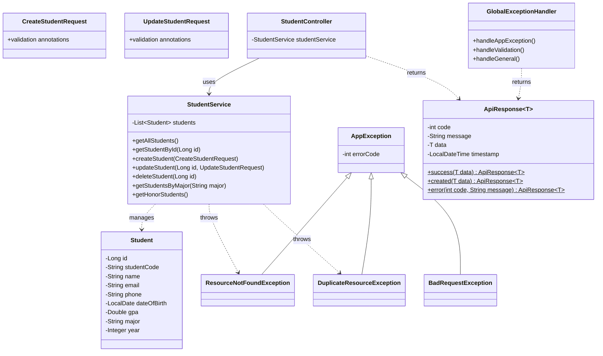

# 📝 BTVN Buổi 3

## Đề bài: Hệ thống Quản lý Sinh viên — Student Management API

Xây dựng REST API quản lý sinh viên, áp dụng đầy đủ kiến thức Buổi 3: **Bean Validation**, **ApiResponse chuẩn hóa**, **Custom Exception** và **Global Exception Handling**.

### Yêu cầu:

- Tạo model `Student` gồm các field: `id` (Long, tự tăng), `studentCode` (String, format `"SVxxx"` VD: SV001), `name`, `email`, `phone` (10 chữ số, bắt đầu bằng 0), `dateOfBirth` (LocalDate, phải ở quá khứ), `gpa` (Double, 0.0 – 4.0), `major` (String), `year` (Integer, 1–6).
- Tạo `CreateStudentRequest` DTO với validation cho **tất cả** các field trên (tự chọn annotation phù hợp, đặt message tiếng Việt rõ ràng).
- Tạo `UpdateStudentRequest` tương tự nhưng **không** chứa `studentCode` (vì mã SV không được thay đổi).
- Tạo `ApiResponse<T>` để **chuẩn hóa toàn bộ** response trả về (cả thành công lẫn lỗi).
- Tạo các **Custom Exception**: `ResourceNotFoundException` (404), `DuplicateResourceException` (409), `BadRequestException` (400) kế thừa từ một `AppException` base class.
- Tạo `GlobalExceptionHandler` dùng `@ControllerAdvice` xử lý tập trung: validation error, custom exception, và fallback cho exception chung.
- Tạo `StudentService` (lưu trữ in-memory bằng `List<Student>`) với các nghiệp vụ:
  - CRUD cơ bản (tạo, đọc, sửa, xóa)
  - Khi **tạo**: kiểm tra trùng `studentCode` và trùng `email` → throw `DuplicateResourceException`
  - Khi **sửa**: kiểm tra email mới có bị trùng với sinh viên **khác** không
  - Khi **tìm/sửa/xóa** theo id: throw `ResourceNotFoundException` nếu không tồn tại
  - Lọc sinh viên theo ngành học (`major`)
  - Lấy danh sách sinh viên xuất sắc (GPA ≥ 3.6)
- Tạo `StudentController` với 7 endpoint REST:
  - `GET /api/students` — lấy tất cả
  - `GET /api/students/{id}` — lấy theo id
  - `POST /api/students` — tạo mới
  - `PUT /api/students/{id}` — cập nhật
  - `DELETE /api/students/{id}` — xóa
  - `GET /api/students/major/{major}` — lọc theo ngành
  - `GET /api/students/honors` — danh sách sinh viên xuất sắc
- **Tất cả** endpoint phải trả về `ResponseEntity<ApiResponse<...>>`.
- Test bằng Postman đảm bảo đủ các case: tạo thành công, validation fail (gửi dữ liệu sai), trùng studentCode, trùng email, tìm id không tồn tại, xóa id không tồn tại.

### Class Diagram:

### Notice
- Tự thiết kế cấu trúc package hợp lý, clean code.
- Tự chọn validation annotation phù hợp cho từng field (đã học trong bài).
- Có thể ghi chú trong code những đoạn khó hiểu hoặc giải thích cách làm.
- Khuyến khích sáng tạo: thêm field, thêm logic nghiệp vụ, thêm endpoint nếu muốn.

### Nộp bài:
- Push lên GitHub, hạn nộp **23h00 02/04/2026**
