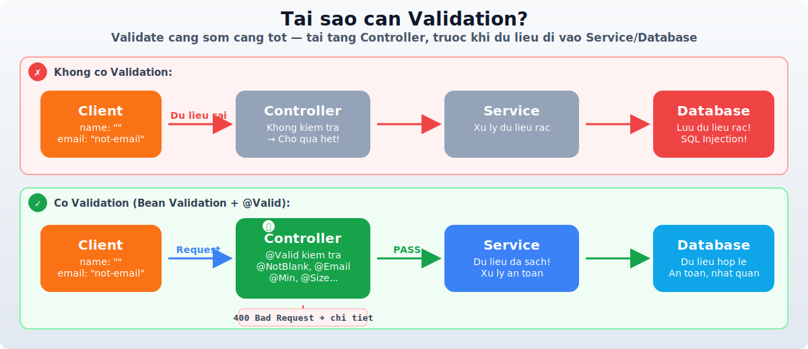
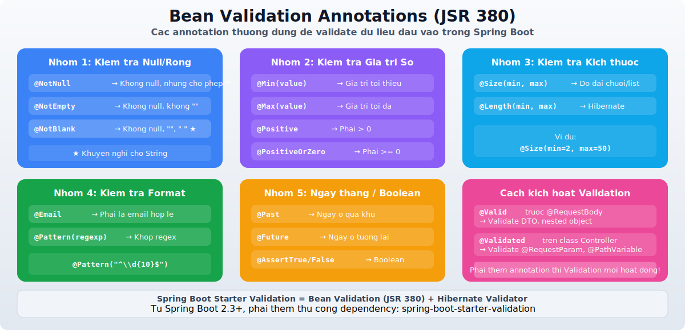
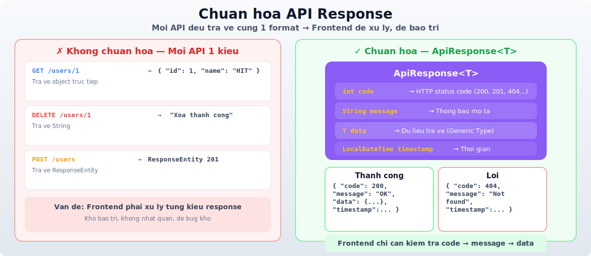
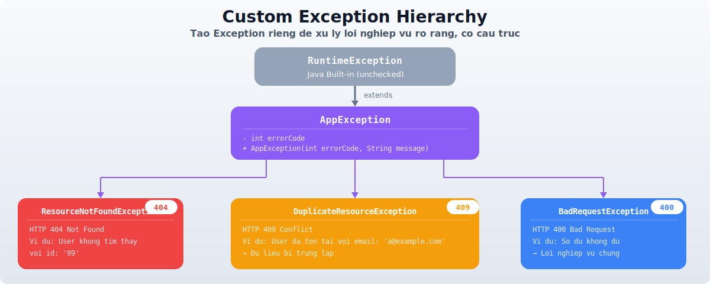
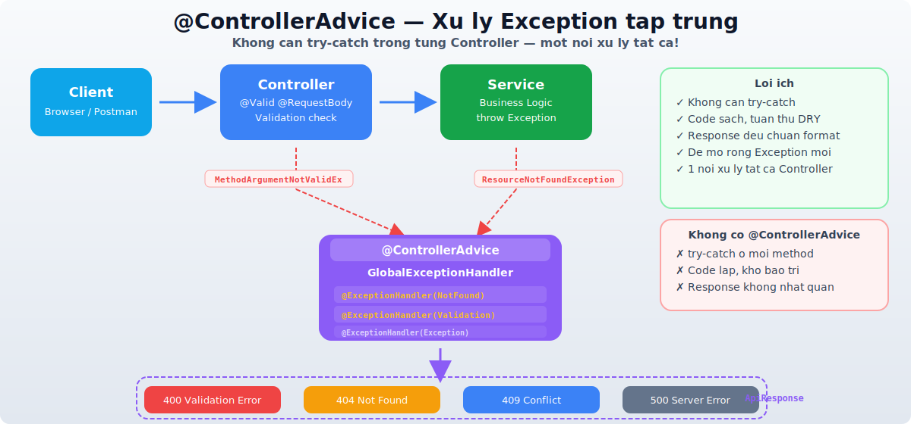
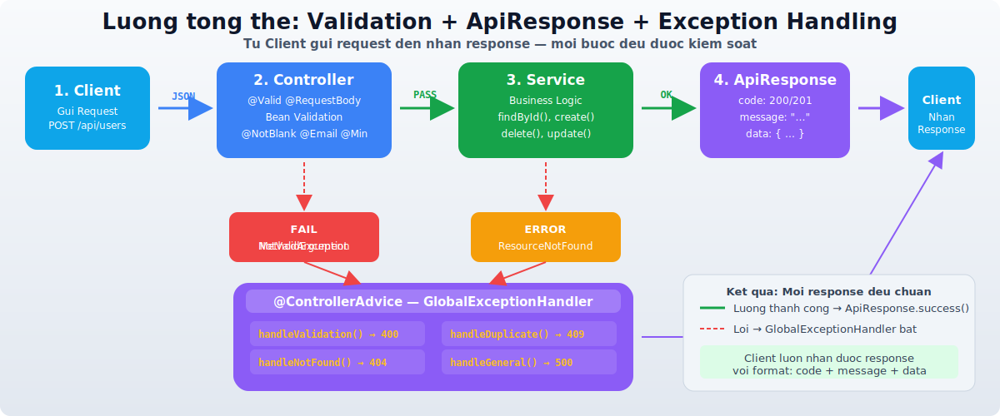

# Buổi 3: Validation, API Response & Exception Handling trong Spring Boot

---

## Mục tiêu buổi học

- Hiểu và sử dụng **Bean Validation** để kiểm tra dữ liệu đầu vào
- Xây dựng **chuẩn API Response** thống nhất cho toàn bộ ứng dụng
- Tạo **Custom Exception** để xử lý lỗi nghiệp vụ rõ ràng
- Sử dụng **@ControllerAdvice** và **@ExceptionHandler** để xử lý exception tập trung
- Kết hợp Validation + Exception Handling để tạo API chuyên nghiệp

---

## I. Tại sao cần Validation?



### 1. Vấn đề khi không có Validation

Ở Buổi 2, ta đã biết cách nhận dữ liệu qua `@RequestBody`. Nhưng nếu client gửi dữ liệu **thiếu** hoặc **sai định dạng** thì sao?

```java
// POST /api/users
// Body: { "name": "", "email": "not-an-email", "age": -5 }

@PostMapping("/api/users")
public User createUser(@RequestBody CreateUserRequest request) {
    // name rỗng? email sai format? age âm?
    // → Nếu không kiểm tra → lưu dữ liệu rác vào database!
    return userService.create(request);
}
```

**Hậu quả khi không validate:**

| Vấn đề | Hậu quả |
|---|---|
| Name rỗng | Database chứa dữ liệu vô nghĩa |
| Email sai format | Gửi email thất bại, lỗi hệ thống |
| Age âm | Vi phạm logic nghiệp vụ |
| SQL Injection trong input | Bảo mật bị xâm phạm |

### 2. Validate ở đâu?

```
┌──────────┐     ┌──────────────┐     ┌──────────────┐     ┌──────────┐
│  Client  │────▶│  Controller  │────▶│   Service    │────▶│ Database │
│          │     │  (Validate   │     │  (Business   │     │          │
│          │     │   input)     │     │   Logic)     │     │          │
└──────────┘     └──────────────┘     └──────────────┘     └──────────┘
                       ▲
                       │
                 Validate ở đây!
                 (Càng sớm càng tốt)
```

> **Nguyên tắc:** Validate **sớm nhất có thể** — tại tầng Controller, trước khi dữ liệu đi vào Service/Database.

---

## II. Bean Validation (JSR 380)



### 1. Bean Validation là gì?

- **Bean Validation** (JSR 380) là **đặc tả tiêu chuẩn của Java** cho việc validate dữ liệu
- Hibernate Validator là **implementation phổ biến nhất** của Bean Validation
- Spring Boot tích hợp sẵn Bean Validation qua dependency `spring-boot-starter-validation`

### 2. Thêm Dependency

Thêm vào file `pom.xml`:

```xml
<dependency>
    <groupId>org.springframework.boot</groupId>
    <artifactId>spring-boot-starter-validation</artifactId>
</dependency>
```

> **Lưu ý:** Từ Spring Boot 2.3+, `spring-boot-starter-validation` **không còn được tự động thêm** khi dùng `spring-boot-starter-web`. Bạn phải thêm thủ công.

### 3. Các Annotation Validation thường dùng

#### Nhóm 1: Kiểm tra null/rỗng

| Annotation | Mô tả | Ví dụ |
|---|---|---|
| `@NotNull` | Không được null (nhưng cho phép rỗng `""`) | `@NotNull String name` |
| `@NotEmpty` | Không được null **và** không được rỗng `""` | `@NotEmpty String name` |
| `@NotBlank` | Không được null, không rỗng, không chỉ chứa khoảng trắng | `@NotBlank String name` |

```java
// So sánh @NotNull vs @NotEmpty vs @NotBlank
@NotNull    → null ❌ | "" ✅ | "  " ✅ | "abc" ✅
@NotEmpty   → null ❌ | "" ❌ | "  " ✅ | "abc" ✅
@NotBlank   → null ❌ | "" ❌ | "  " ❌ | "abc" ✅  ← Khuyến nghị cho String
```

#### Nhóm 2: Kiểm tra giá trị số

| Annotation | Mô tả | Ví dụ |
|---|---|---|
| `@Min(value)` | Giá trị tối thiểu | `@Min(0) int age` |
| `@Max(value)` | Giá trị tối đa | `@Max(150) int age` |
| `@Positive` | Phải > 0 | `@Positive BigDecimal price` |
| `@PositiveOrZero` | Phải >= 0 | `@PositiveOrZero int quantity` |
| `@Negative` | Phải < 0 | `@Negative int discount` |
| `@DecimalMin` / `@DecimalMax` | Giới hạn cho số thập phân | `@DecimalMin("0.01") BigDecimal price` |

#### Nhóm 3: Kiểm tra kích thước

| Annotation | Mô tả | Ví dụ |
|---|---|---|
| `@Size(min, max)` | Độ dài chuỗi hoặc kích thước collection | `@Size(min=2, max=50) String name` |
| `@Length(min, max)` | Tương tự `@Size` nhưng của Hibernate | `@Length(min=6, max=20) String password` |

#### Nhóm 4: Kiểm tra format

| Annotation | Mô tả | Ví dụ |
|---|---|---|
| `@Email` | Phải là email hợp lệ | `@Email String email` |
| `@Pattern(regexp)` | Phải khớp regex | `@Pattern(regexp="^\\d{10}$") String phone` |

#### Nhóm 5: Khác

| Annotation | Mô tả | Ví dụ |
|---|---|---|
| `@Past` | Ngày phải ở **quá khứ** | `@Past LocalDate birthDate` |
| `@Future` | Ngày phải ở **tương lai** | `@Future LocalDate eventDate` |
| `@PastOrPresent` | Ngày ở quá khứ hoặc hiện tại | `@PastOrPresent LocalDate createdAt` |
| `@AssertTrue` / `@AssertFalse` | Phải đúng / phải sai | `@AssertTrue boolean agree` |

### 4. Sử dụng Validation trong Spring Boot

#### Bước 1: Tạo DTO với Validation Annotations

```java
import jakarta.validation.constraints.*;

public class CreateUserRequest {

    @NotBlank(message = "Tên không được để trống")
    @Size(min = 2, max = 50, message = "Tên phải từ 2 đến 50 ký tự")
    private String name;

    @NotBlank(message = "Email không được để trống")
    @Email(message = "Email không đúng định dạng")
    private String email;

    @NotNull(message = "Tuổi không được để trống")
    @Min(value = 1, message = "Tuổi phải lớn hơn 0")
    @Max(value = 150, message = "Tuổi phải nhỏ hơn 150")
    private Integer age;

    @Pattern(regexp = "^\\d{10}$", message = "Số điện thoại phải có 10 chữ số")
    private String phone;

    // getters, setters
}
```

#### Bước 2: Kích hoạt Validation trong Controller với `@Valid`

```java
import jakarta.validation.Valid;

@RestController
@RequestMapping("/api/users")
public class UserController {

    @PostMapping
    public ResponseEntity<User> createUser(@Valid @RequestBody CreateUserRequest request) {
        // Nếu validation FAIL → Spring tự động throw MethodArgumentNotValidException
        // Nếu validation PASS → code tiếp tục chạy bình thường
        User user = userService.create(request);
        return ResponseEntity.status(HttpStatus.CREATED).body(user);
    }

    @PutMapping("/{id}")
    public User updateUser(@PathVariable Long id,
                           @Valid @RequestBody UpdateUserRequest request) {
        return userService.update(id, request);
    }
}
```

> **Quan trọng:** Phải thêm `@Valid` trước `@RequestBody` thì Validation mới hoạt động!

#### Bước 3: Kết quả khi Validation thất bại

Khi gửi request với dữ liệu không hợp lệ:

```
POST /api/users
Body: { "name": "", "email": "not-email", "age": -5 }
```

Spring Boot mặc định trả về **400 Bad Request**:

```json
{
    "timestamp": "2026-03-21T08:00:00.000+00:00",
    "status": 400,
    "error": "Bad Request",
    "path": "/api/users"
}
```

> **Vấn đề:** Response mặc định **không chứa chi tiết lỗi validation** → client không biết field nào sai. Ta sẽ xử lý điều này ở phần **Exception Handling**.

### 5. Validation cho @RequestParam và @PathVariable

```java
import org.springframework.validation.annotation.Validated;

@RestController
@RequestMapping("/api/users")
@Validated  // ← Bắt buộc thêm @Validated ở class level
public class UserController {

    // Validate @PathVariable
    @GetMapping("/{id}")
    public User getUser(@PathVariable @Min(1) Long id) {
        return userService.findById(id);
    }

    // Validate @RequestParam
    @GetMapping
    public List<User> searchUsers(
            @RequestParam @NotBlank String keyword,
            @RequestParam @Min(0) int page,
            @RequestParam @Min(1) @Max(100) int size) {
        return userService.search(keyword, page, size);
    }
}
```

> **Lưu ý:**
> - Validate `@RequestBody` → dùng `@Valid` trước parameter
> - Validate `@RequestParam` / `@PathVariable` → dùng `@Validated` trên **class**

### 6. Nested Validation — Validate object lồng nhau

```java
public class CreateOrderRequest {

    @NotBlank(message = "Mã đơn hàng không được để trống")
    private String orderCode;

    @NotNull(message = "Địa chỉ giao hàng không được để trống")
    @Valid  // ← Bắt buộc thêm @Valid để validate object con
    private AddressDTO shippingAddress;

    @NotEmpty(message = "Đơn hàng phải có ít nhất 1 sản phẩm")
    private List<@Valid OrderItemDTO> items;  // Validate từng item trong list
}

public class AddressDTO {

    @NotBlank(message = "Đường không được để trống")
    private String street;

    @NotBlank(message = "Thành phố không được để trống")
    private String city;
}

public class OrderItemDTO {

    @NotNull(message = "Product ID không được để trống")
    @Positive(message = "Product ID phải là số dương")
    private Long productId;

    @Min(value = 1, message = "Số lượng tối thiểu là 1")
    private int quantity;
}
```

> **Quy tắc:** Khi DTO chứa **object con** hoặc **List chứa object**, phải thêm `@Valid` trước field đó để Spring validate **đệ quy** (recursive validation).

### 7. @Valid vs @Validated

| Tiêu chí | @Valid | @Validated |
|---|---|---|
| **Package** | `jakarta.validation` | `org.springframework.validation.annotation` |
| **Đặt ở đâu** | Parameter, field, return type | Class, parameter |
| **Dùng cho** | `@RequestBody`, nested object | `@RequestParam`, `@PathVariable`, validation groups |
| **Hỗ trợ Group** | ❌ Không | ✅ Có |

---

## III. API Response — Chuẩn hóa dữ liệu trả về



### 1. Vấn đề khi không chuẩn hóa Response

```java
// API 1: Trả về object trực tiếp
@GetMapping("/users/{id}")
public User getUser(@PathVariable Long id) {
    return userService.findById(id);
}
// → Response: { "id": 1, "name": "HIT", "email": "hit@email.com" }

// API 2: Trả về String
@DeleteMapping("/users/{id}")
public String deleteUser(@PathVariable Long id) {
    userService.delete(id);
    return "Xóa thành công";
}
// → Response: "Xóa thành công"

// API 3: Trả về ResponseEntity
@PostMapping("/users")
public ResponseEntity<User> createUser(@RequestBody User user) {
    return ResponseEntity.status(201).body(userService.save(user));
}
// → Response: { "id": 2, "name": "ABC", ... }
```

**Vấn đề:** Mỗi API trả về **format khác nhau** → Frontend **phải xử lý từng kiểu** → gây khó bảo trì.

### 2. Thiết kế ApiResponse thống nhất

Tạo một class **wrapper** bọc response cho **tất cả** API:

```
┌───────────────────────────────────────────────┐
│              ApiResponse<T>                    │
├───────────────────────────────────────────────┤
│  int code          → HTTP status code          │
│  String message    → Thông báo mô tả          │
│  T data            → Dữ liệu trả về           │
│  LocalDateTime timestamp → Thời gian response  │
└───────────────────────────────────────────────┘
```

#### Bước 1: Tạo class `ApiResponse<T>`

```java
import com.fasterxml.jackson.annotation.JsonInclude;
import java.time.LocalDateTime;

@JsonInclude(JsonInclude.Include.NON_NULL)  // Bỏ qua field null khi serialize JSON
public class ApiResponse<T> {

    private int code;
    private String message;
    private T data;
    private LocalDateTime timestamp;

    // Constructor cho response thành công (có data)
    public ApiResponse(int code, String message, T data) {
        this.code = code;
        this.message = message;
        this.data = data;
        this.timestamp = LocalDateTime.now();
    }

    // Constructor cho response không có data (delete, error...)
    public ApiResponse(int code, String message) {
        this.code = code;
        this.message = message;
        this.timestamp = LocalDateTime.now();
    }

    // === Static factory methods ===

    public static <T> ApiResponse<T> success(T data) {
        return new ApiResponse<>(200, "Thành công", data);
    }

    public static <T> ApiResponse<T> success(String message, T data) {
        return new ApiResponse<>(200, message, data);
    }

    public static <T> ApiResponse<T> created(T data) {
        return new ApiResponse<>(201, "Tạo thành công", data);
    }

    public static <T> ApiResponse<T> error(int code, String message) {
        return new ApiResponse<>(code, message);
    }

    // getters, setters
}
```

#### Bước 2: Sử dụng ApiResponse trong Controller

```java
@RestController
@RequestMapping("/api/users")
public class UserController {

    private final UserService userService;

    public UserController(UserService userService) {
        this.userService = userService;
    }

    // GET /api/users → Lấy tất cả
    @GetMapping
    public ResponseEntity<ApiResponse<List<User>>> getAllUsers() {
        List<User> users = userService.findAll();
        return ResponseEntity.ok(ApiResponse.success(users));
    }

    // GET /api/users/1 → Lấy theo id
    @GetMapping("/{id}")
    public ResponseEntity<ApiResponse<User>> getUserById(@PathVariable Long id) {
        User user = userService.findById(id);
        return ResponseEntity.ok(ApiResponse.success(user));
    }

    // POST /api/users → Tạo mới
    @PostMapping
    public ResponseEntity<ApiResponse<User>> createUser(
            @Valid @RequestBody CreateUserRequest request) {
        User user = userService.create(request);
        return ResponseEntity
                .status(HttpStatus.CREATED)
                .body(ApiResponse.created(user));
    }

    // PUT /api/users/1 → Cập nhật
    @PutMapping("/{id}")
    public ResponseEntity<ApiResponse<User>> updateUser(
            @PathVariable Long id,
            @Valid @RequestBody UpdateUserRequest request) {
        User user = userService.update(id, request);
        return ResponseEntity.ok(ApiResponse.success("Cập nhật thành công", user));
    }

    // DELETE /api/users/1 → Xóa
    @DeleteMapping("/{id}")
    public ResponseEntity<ApiResponse<Void>> deleteUser(@PathVariable Long id) {
        userService.delete(id);
        return ResponseEntity.ok(ApiResponse.success("Xóa thành công", null));
    }
}
```

#### Bước 3: Kết quả response thống nhất

**Thành công:**

```json
{
    "code": 200,
    "message": "Thành công",
    "data": {
        "id": 1,
        "name": "Nguyen Van A",
        "email": "a@example.com",
        "age": 20
    },
    "timestamp": "2026-03-21T15:30:00"
}
```

**Tạo mới thành công:**

```json
{
    "code": 201,
    "message": "Tạo thành công",
    "data": {
        "id": 2,
        "name": "Nguyen Van B",
        "email": "b@example.com",
        "age": 22
    },
    "timestamp": "2026-03-21T15:31:00"
}
```

**Lỗi:**

```json
{
    "code": 404,
    "message": "Không tìm thấy user với id: 99",
    "timestamp": "2026-03-21T15:32:00"
}
```

> **Lợi ích:** Frontend chỉ cần kiểm tra `code` → hiển thị `message` → sử dụng `data`. **Mọi API đều cùng format!**

---

## IV. Custom Exception — Xử lý lỗi nghiệp vụ



### 1. Tại sao cần Custom Exception?

Khi xử lý logic nghiệp vụ, ta thường gặp các tình huống lỗi:

```java
@Service
public class UserService {

    public User findById(Long id) {
        User user = userRepository.findById(id);
        if (user == null) {
            // Lỗi: User không tồn tại → làm sao thông báo cho client?
            // Cách 1: return null → ❌ Client không biết user không tồn tại hay lỗi server
            // Cách 2: throw RuntimeException → ❌ Quá chung chung, không rõ ràng
            // Cách 3: throw Custom Exception → ✅ Rõ ràng, dễ xử lý
        }
        return user;
    }
}
```

### 2. Tạo Custom Exception

#### Base Exception

```java
public class AppException extends RuntimeException {

    private final int errorCode;

    public AppException(int errorCode, String message) {
        super(message);
        this.errorCode = errorCode;
    }

    public int getErrorCode() {
        return errorCode;
    }
}
```

#### Các Exception cụ thể

```java
// Lỗi không tìm thấy tài nguyên (404)
public class ResourceNotFoundException extends AppException {

    public ResourceNotFoundException(String resourceName, String fieldName, Object fieldValue) {
        super(404, String.format("%s không tìm thấy với %s: '%s'", resourceName, fieldName, fieldValue));
    }
}

// Ví dụ: throw new ResourceNotFoundException("User", "id", 99);
// → Message: "User không tìm thấy với id: '99'"
```

```java
// Lỗi dữ liệu đã tồn tại (409 Conflict)
public class DuplicateResourceException extends AppException {

    public DuplicateResourceException(String resourceName, String fieldName, Object fieldValue) {
        super(409, String.format("%s đã tồn tại với %s: '%s'", resourceName, fieldName, fieldValue));
    }
}

// Ví dụ: throw new DuplicateResourceException("User", "email", "a@example.com");
// → Message: "User đã tồn tại với email: 'a@example.com'"
```

```java
// Lỗi nghiệp vụ chung (400 Bad Request)
public class BadRequestException extends AppException {

    public BadRequestException(String message) {
        super(400, message);
    }
}

// Ví dụ: throw new BadRequestException("Số dư không đủ để thực hiện giao dịch");
```

### 3. Sử dụng Custom Exception trong Service

```java
@Service
public class UserService {

    private final List<User> users = new ArrayList<>();
    private Long nextId = 1L;

    public User findById(Long id) {
        return users.stream()
                .filter(u -> u.getId().equals(id))
                .findFirst()
                .orElseThrow(() -> new ResourceNotFoundException("User", "id", id));
    }

    public User create(CreateUserRequest request) {
        // Kiểm tra email trùng
        boolean emailExists = users.stream()
                .anyMatch(u -> u.getEmail().equals(request.getEmail()));

        if (emailExists) {
            throw new DuplicateResourceException("User", "email", request.getEmail());
        }

        User user = new User();
        user.setId(nextId++);
        user.setName(request.getName());
        user.setEmail(request.getEmail());
        user.setAge(request.getAge());
        users.add(user);
        return user;
    }

    public User update(Long id, UpdateUserRequest request) {
        User user = findById(id);  // Tự throw ResourceNotFoundException nếu không tìm thấy
        user.setName(request.getName());
        user.setEmail(request.getEmail());
        return user;
    }

    public void delete(Long id) {
        User user = findById(id);  // Tự throw nếu không tìm thấy
        users.remove(user);
    }
}
```

### 4. Cấu trúc package cho Exception

```
com.example.demo/
├── controller/
│   └── UserController.java
├── service/
│   └── UserService.java
├── dto/
│   ├── request/
│   │   ├── CreateUserRequest.java
│   │   └── UpdateUserRequest.java
│   └── response/
│       └── ApiResponse.java
├── exception/                          ← Package chứa exception
│   ├── AppException.java               ← Base exception
│   ├── ResourceNotFoundException.java
│   ├── DuplicateResourceException.java
│   ├── BadRequestException.java
│   └── GlobalExceptionHandler.java     ← Xử lý exception tập trung
└── model/
    └── User.java
```

---

## V. Exception Handling — Xử lý Exception tập trung



### 1. Vấn đề khi xử lý exception thủ công

```java
// ❌ Xử lý exception trong từng method → code lặp lại, khó bảo trì
@GetMapping("/{id}")
public ResponseEntity<ApiResponse<User>> getUser(@PathVariable Long id) {
    try {
        User user = userService.findById(id);
        return ResponseEntity.ok(ApiResponse.success(user));
    } catch (ResourceNotFoundException e) {
        return ResponseEntity.status(404).body(ApiResponse.error(404, e.getMessage()));
    } catch (Exception e) {
        return ResponseEntity.status(500).body(ApiResponse.error(500, "Lỗi server"));
    }
}

// Phải lặp lại try-catch ở MỌI method → DRY violation!
```

### 2. @ControllerAdvice — Giải pháp xử lý tập trung

`@ControllerAdvice` cho phép **xử lý exception ở một nơi duy nhất** cho **toàn bộ** Controller.

```
┌──────────────────────────────────────────────────────────────────┐
│                   Request Flow                                    │
│                                                                  │
│  Client ──▶ Controller ──▶ Service ──▶ throw Exception           │
│                                              │                    │
│                                              ▼                    │
│                                    @ControllerAdvice              │
│                                    GlobalExceptionHandler        │
│                                              │                    │
│  Client ◀── JSON Response ◀────────────────┘                    │
│  (ApiResponse with error code & message)                         │
│                                                                  │
│  → Exception được "bắt" tập trung, KHÔNG cần try-catch          │
│    trong từng Controller method!                                 │
└──────────────────────────────────────────────────────────────────┘
```

### 3. Tạo GlobalExceptionHandler

```java
import org.springframework.http.HttpStatus;
import org.springframework.http.ResponseEntity;
import org.springframework.web.bind.MethodArgumentNotValidException;
import org.springframework.web.bind.annotation.ControllerAdvice;
import org.springframework.web.bind.annotation.ExceptionHandler;

import java.util.HashMap;
import java.util.Map;

@ControllerAdvice
public class GlobalExceptionHandler {

    // === 1. Xử lý Custom Exception ===

    // Bắt ResourceNotFoundException → 404
    @ExceptionHandler(ResourceNotFoundException.class)
    public ResponseEntity<ApiResponse<Void>> handleResourceNotFound(
            ResourceNotFoundException ex) {
        return ResponseEntity
                .status(HttpStatus.NOT_FOUND)
                .body(ApiResponse.error(404, ex.getMessage()));
    }

    // Bắt DuplicateResourceException → 409
    @ExceptionHandler(DuplicateResourceException.class)
    public ResponseEntity<ApiResponse<Void>> handleDuplicateResource(
            DuplicateResourceException ex) {
        return ResponseEntity
                .status(HttpStatus.CONFLICT)
                .body(ApiResponse.error(409, ex.getMessage()));
    }

    // Bắt BadRequestException → 400
    @ExceptionHandler(BadRequestException.class)
    public ResponseEntity<ApiResponse<Void>> handleBadRequest(
            BadRequestException ex) {
        return ResponseEntity
                .status(HttpStatus.BAD_REQUEST)
                .body(ApiResponse.error(400, ex.getMessage()));
    }

    // === 2. Xử lý Validation Exception ===

    // Bắt MethodArgumentNotValidException → validation @RequestBody thất bại
    @ExceptionHandler(MethodArgumentNotValidException.class)
    public ResponseEntity<ApiResponse<Map<String, String>>> handleValidationErrors(
            MethodArgumentNotValidException ex) {

        Map<String, String> errors = new HashMap<>();
        ex.getBindingResult().getFieldErrors().forEach(error ->
                errors.put(error.getField(), error.getDefaultMessage())
        );

        ApiResponse<Map<String, String>> response = new ApiResponse<>(
                400, "Dữ liệu không hợp lệ", errors
        );

        return ResponseEntity.badRequest().body(response);
    }

    // Bắt ConstraintViolationException → validation @RequestParam/@PathVariable thất bại
    @ExceptionHandler(jakarta.validation.ConstraintViolationException.class)
    public ResponseEntity<ApiResponse<Map<String, String>>> handleConstraintViolation(
            jakarta.validation.ConstraintViolationException ex) {

        Map<String, String> errors = new HashMap<>();
        ex.getConstraintViolations().forEach(violation -> {
            String fieldName = violation.getPropertyPath().toString();
            errors.put(fieldName, violation.getMessage());
        });

        ApiResponse<Map<String, String>> response = new ApiResponse<>(
                400, "Tham số không hợp lệ", errors
        );

        return ResponseEntity.badRequest().body(response);
    }

    // === 3. Xử lý Exception chung (Fallback) ===

    // Bắt tất cả exception không xác định → 500
    @ExceptionHandler(Exception.class)
    public ResponseEntity<ApiResponse<Void>> handleGenericException(Exception ex) {
        return ResponseEntity
                .status(HttpStatus.INTERNAL_SERVER_ERROR)
                .body(ApiResponse.error(500, "Lỗi hệ thống. Vui lòng thử lại sau."));
    }
}
```

### 4. Kết quả khi exception xảy ra

#### Validation thất bại:

```
POST /api/users
Body: { "name": "", "email": "not-email", "age": -5 }
```

```json
{
    "code": 400,
    "message": "Dữ liệu không hợp lệ",
    "data": {
        "name": "Tên không được để trống",
        "email": "Email không đúng định dạng",
        "age": "Tuổi phải lớn hơn 0"
    },
    "timestamp": "2026-03-21T15:30:00"
}
```

#### Resource không tìm thấy:

```
GET /api/users/999
```

```json
{
    "code": 404,
    "message": "User không tìm thấy với id: '999'",
    "timestamp": "2026-03-21T15:31:00"
}
```

#### Dữ liệu trùng lặp:

```
POST /api/users
Body: { "name": "New User", "email": "existing@email.com", "age": 25 }
```

```json
{
    "code": 409,
    "message": "User đã tồn tại với email: 'existing@email.com'",
    "timestamp": "2026-03-21T15:32:00"
}
```

### 5. Controller giờ rất gọn gàng

```java
@RestController
@RequestMapping("/api/users")
public class UserController {

    private final UserService userService;

    public UserController(UserService userService) {
        this.userService = userService;
    }

    @GetMapping("/{id}")
    public ResponseEntity<ApiResponse<User>> getUser(@PathVariable Long id) {
        // Không cần try-catch!
        // Nếu không tìm thấy → Service throw ResourceNotFoundException
        // → GlobalExceptionHandler tự bắt và trả 404
        User user = userService.findById(id);
        return ResponseEntity.ok(ApiResponse.success(user));
    }

    @PostMapping
    public ResponseEntity<ApiResponse<User>> createUser(
            @Valid @RequestBody CreateUserRequest request) {
        // Validation fail → MethodArgumentNotValidException → Handler bắt → 400
        // Email trùng → DuplicateResourceException → Handler bắt → 409
        // Thành công → 201
        User user = userService.create(request);
        return ResponseEntity.status(HttpStatus.CREATED).body(ApiResponse.created(user));
    }
}
```

> **So sánh:** Trước phải viết try-catch ở **mỗi** method. Giờ **không cần** → code sạch, DRY, dễ bảo trì!

### 6. Thứ tự ưu tiên của @ExceptionHandler

Khi exception xảy ra, Spring tìm handler theo **thứ tự cụ thể nhất → chung nhất**:

```
ResourceNotFoundException → @ExceptionHandler(ResourceNotFoundException.class) ✅
                          → @ExceptionHandler(AppException.class)
                          → @ExceptionHandler(RuntimeException.class)
                          → @ExceptionHandler(Exception.class)
```

> Spring sẽ chọn handler **cụ thể nhất** (khớp đúng class exception). Nếu không tìm thấy, tìm tiếp handler cho class cha.

---

## VI. Luồng tổng thể — Kết hợp Validation + ApiResponse + Exception Handling



```
Client gửi request
       │
       ▼
┌──────────────────┐
│    Controller     │
│                  │───── @Valid validate DTO ──── FAIL ──▶ MethodArgumentNotValidException
│  @Valid          │                                              │
│  @RequestBody    │                                              ▼
└────────┬─────────┘                                   GlobalExceptionHandler
         │                                             → 400 + chi tiết lỗi
         ▼ (Validation PASS)
┌──────────────────┐
│     Service      │
│                  │───── Không tìm thấy ──────── throw ResourceNotFoundException
│  Business Logic  │                                              │
│                  │───── Dữ liệu trùng ─────── throw DuplicateResourceException
│                  │                                              │
└────────┬─────────┘                                              ▼
         │                                             GlobalExceptionHandler
         ▼ (Logic OK)                                  → 404 / 409 + message
┌──────────────────┐
│   ApiResponse    │
│                  │
│  code: 200/201   │
│  message: "..."  │
│  data: { ... }   │
└──────────────────┘
         │
         ▼
Client nhận response thống nhất
```

---

## VII. Ví dụ tổng hợp — Full Flow

### 1. Model

```java
public class User {
    private Long id;
    private String name;
    private String email;
    private Integer age;

    // constructors, getters, setters
}
```

### 2. DTO Request

```java
import jakarta.validation.constraints.*;

public class CreateUserRequest {

    @NotBlank(message = "Tên không được để trống")
    @Size(min = 2, max = 50, message = "Tên phải từ 2 đến 50 ký tự")
    private String name;

    @NotBlank(message = "Email không được để trống")
    @Email(message = "Email không đúng định dạng")
    private String email;

    @NotNull(message = "Tuổi không được để trống")
    @Min(value = 1, message = "Tuổi phải lớn hơn 0")
    @Max(value = 150, message = "Tuổi phải nhỏ hơn 150")
    private Integer age;

    // getters, setters
}
```

### 3. ApiResponse

```java
import com.fasterxml.jackson.annotation.JsonInclude;
import java.time.LocalDateTime;

@JsonInclude(JsonInclude.Include.NON_NULL)
public class ApiResponse<T> {

    private int code;
    private String message;
    private T data;
    private LocalDateTime timestamp;

    public ApiResponse(int code, String message, T data) {
        this.code = code;
        this.message = message;
        this.data = data;
        this.timestamp = LocalDateTime.now();
    }

    public ApiResponse(int code, String message) {
        this(code, message, null);
    }

    public static <T> ApiResponse<T> success(T data) {
        return new ApiResponse<>(200, "Thành công", data);
    }

    public static <T> ApiResponse<T> created(T data) {
        return new ApiResponse<>(201, "Tạo thành công", data);
    }

    public static <T> ApiResponse<T> error(int code, String message) {
        return new ApiResponse<>(code, message);
    }

    // getters, setters
}
```

### 4. Custom Exceptions

```java
// === AppException.java ===
public class AppException extends RuntimeException {
    private final int errorCode;

    public AppException(int errorCode, String message) {
        super(message);
        this.errorCode = errorCode;
    }

    public int getErrorCode() { return errorCode; }
}

// === ResourceNotFoundException.java ===
public class ResourceNotFoundException extends AppException {
    public ResourceNotFoundException(String resource, String field, Object value) {
        super(404, String.format("%s không tìm thấy với %s: '%s'", resource, field, value));
    }
}

// === DuplicateResourceException.java ===
public class DuplicateResourceException extends AppException {
    public DuplicateResourceException(String resource, String field, Object value) {
        super(409, String.format("%s đã tồn tại với %s: '%s'", resource, field, value));
    }
}

// === BadRequestException.java ===
public class BadRequestException extends AppException {
    public BadRequestException(String message) {
        super(400, message);
    }
}
```

### 5. Service

```java
@Service
public class UserService {

    private final List<User> users = new ArrayList<>();
    private Long nextId = 1L;

    public List<User> findAll() {
        return users;
    }

    public User findById(Long id) {
        return users.stream()
                .filter(u -> u.getId().equals(id))
                .findFirst()
                .orElseThrow(() -> new ResourceNotFoundException("User", "id", id));
    }

    public User create(CreateUserRequest request) {
        // Kiểm tra email trùng
        boolean emailExists = users.stream()
                .anyMatch(u -> u.getEmail().equals(request.getEmail()));
        if (emailExists) {
            throw new DuplicateResourceException("User", "email", request.getEmail());
        }

        User user = new User();
        user.setId(nextId++);
        user.setName(request.getName());
        user.setEmail(request.getEmail());
        user.setAge(request.getAge());
        users.add(user);
        return user;
    }

    public void delete(Long id) {
        User user = findById(id);
        users.remove(user);
    }
}
```

### 6. GlobalExceptionHandler

```java
@ControllerAdvice
public class GlobalExceptionHandler {

    @ExceptionHandler(AppException.class)
    public ResponseEntity<ApiResponse<Void>> handleAppException(AppException ex) {
        return ResponseEntity
                .status(ex.getErrorCode())
                .body(ApiResponse.error(ex.getErrorCode(), ex.getMessage()));
    }

    @ExceptionHandler(MethodArgumentNotValidException.class)
    public ResponseEntity<ApiResponse<Map<String, String>>> handleValidation(
            MethodArgumentNotValidException ex) {
        Map<String, String> errors = new HashMap<>();
        ex.getBindingResult().getFieldErrors().forEach(error ->
                errors.put(error.getField(), error.getDefaultMessage()));
        return ResponseEntity.badRequest()
                .body(new ApiResponse<>(400, "Dữ liệu không hợp lệ", errors));
    }

    @ExceptionHandler(Exception.class)
    public ResponseEntity<ApiResponse<Void>> handleGeneral(Exception ex) {
        return ResponseEntity.status(500)
                .body(ApiResponse.error(500, "Lỗi hệ thống. Vui lòng thử lại sau."));
    }
}
```

### 7. Controller

```java
@RestController
@RequestMapping("/api/users")
public class UserController {

    private final UserService userService;

    public UserController(UserService userService) {
        this.userService = userService;
    }

    @GetMapping
    public ResponseEntity<ApiResponse<List<User>>> getAllUsers() {
        return ResponseEntity.ok(ApiResponse.success(userService.findAll()));
    }

    @GetMapping("/{id}")
    public ResponseEntity<ApiResponse<User>> getUserById(@PathVariable Long id) {
        return ResponseEntity.ok(ApiResponse.success(userService.findById(id)));
    }

    @PostMapping
    public ResponseEntity<ApiResponse<User>> createUser(
            @Valid @RequestBody CreateUserRequest request) {
        User user = userService.create(request);
        return ResponseEntity.status(HttpStatus.CREATED).body(ApiResponse.created(user));
    }

    @DeleteMapping("/{id}")
    public ResponseEntity<ApiResponse<Void>> deleteUser(@PathVariable Long id) {
        userService.delete(id);
        return ResponseEntity.ok(ApiResponse.success("Xóa thành công", null));
    }
}
```

---

## Tổng kết Buổi 3

| Chủ đề | Nội dung chính |
|---|---|
| Bean Validation | `@NotBlank`, `@Email`, `@Min`, `@Max`, `@Size`, `@Pattern` — validate dữ liệu đầu vào |
| @Valid / @Validated | Kích hoạt validation cho `@RequestBody`, `@RequestParam`, `@PathVariable` |
| ApiResponse | Class wrapper chuẩn hóa response: `code`, `message`, `data`, `timestamp` |
| Custom Exception | `AppException`, `ResourceNotFoundException`, `DuplicateResourceException` — lỗi nghiệp vụ rõ ràng |
| @ControllerAdvice | Xử lý exception tập trung cho toàn bộ Controller |
| @ExceptionHandler | Bắt và xử lý từng loại exception cụ thể |
| Luồng tổng thể | Client → Validation → Service Logic → ApiResponse / ExceptionHandler → Client |

---

## Câu hỏi ôn tập

1. `@NotNull`, `@NotEmpty`, `@NotBlank` khác nhau thế nào? Khi nào dùng cái nào?
2. Tại sao validate `@RequestBody` dùng `@Valid` nhưng validate `@RequestParam` lại cần `@Validated` ở class level?
3. Tại sao cần chuẩn hóa API Response? Nếu không chuẩn hóa sẽ gặp vấn đề gì?
4. Tại sao nên tạo Custom Exception thay vì dùng `RuntimeException` trực tiếp?
5. `@ControllerAdvice` hoạt động như thế nào? Tại sao giúp code sạch hơn try-catch?
6. Nếu có 2 `@ExceptionHandler` cùng bắt được 1 exception, Spring chọn handler nào?
7. `@JsonInclude(JsonInclude.Include.NON_NULL)` trong ApiResponse có tác dụng gì?
8. Nested validation (validate object lồng nhau) cần thêm gì?

---

## Bài tập thực hành

### Bài 1: Thêm Validation cho Product API (Buổi 2)

Mở lại bài tập CRUD Product từ Buổi 2, thêm các yêu cầu:

- `name`: Không được trống, 2-100 ký tự
- `price`: Không được null, phải > 0
- `description`: Tối đa 500 ký tự (có thể null)
- `category`: Không được trống
- Response trả về theo chuẩn `ApiResponse<T>`

### Bài 2: Xây dựng Exception Handling hoàn chỉnh

Tiếp tục từ Bài 1:

- Tạo `ResourceNotFoundException`, `DuplicateResourceException` (trùng tên sản phẩm)
- Tạo `GlobalExceptionHandler` xử lý tập trung
- Test các trường hợp: validation fail, product không tồn tại, tên trùng
- Đảm bảo **mọi response** đều theo format `ApiResponse`

### Bài 3: Tìm hiểu thêm

- **Custom Validation Annotation**: Tạo annotation `@ValidPhoneNumber` để validate số điện thoại Việt Nam (bắt đầu bằng 0, 10 chữ số)
- **Validation Groups**: Tìm hiểu cách dùng `groups` để validate khác nhau cho Create và Update
- **@RestControllerAdvice vs @ControllerAdvice**: Sự khác nhau là gì?
- **ResponseEntityExceptionHandler**: Tìm hiểu class base có sẵn của Spring để extend

---

## Tài liệu tham khảo

### Spring Official Docs

- [Spring Boot Validation](https://docs.spring.io/spring-boot/docs/current/reference/html/io.html#io.validation)
- [Spring MVC — Validation](https://docs.spring.io/spring-framework/reference/web/webmvc/mvc-controller/ann-validation.html)
- [Spring MVC — Exception Handling](https://docs.spring.io/spring-framework/reference/web/webmvc/mvc-controller/ann-exceptionhandler.html)
- [Bean Validation (Jakarta EE)](https://jakarta.ee/specifications/bean-validation/3.0/)

### Baeldung (English)

- [Spring Boot Validation](https://www.baeldung.com/spring-boot-bean-validation)
- [Spring @Valid and @Validated](https://www.baeldung.com/spring-valid-vs-validated)
- [Spring @ControllerAdvice](https://www.baeldung.com/exception-handling-for-rest-with-spring)
- [Spring Custom Validation](https://www.baeldung.com/spring-mvc-custom-validator)
- [Spring ResponseEntity](https://www.baeldung.com/spring-response-entity)
- [Spring Error Handling Best Practices](https://www.baeldung.com/rest-api-error-handling-best-practices)

### Viblo (Vietnamese)

- [Validation trong Spring Boot](https://viblo.asia/p/validation-trong-spring-boot-Qbq5QREzKD8)
- [Exception Handling trong Spring Boot](https://viblo.asia/p/xu-ly-exception-trong-spring-boot-07LKXzpelV4)
- [Chuẩn hóa API Response](https://viblo.asia/p/chuan-hoa-api-response-trong-spring-boot-bWrZnxbY5xw)
- [Custom Exception trong Java](https://viblo.asia/p/custom-exception-trong-java-gGJ59jzxKX2)

### Khác

- [Jakarta Bean Validation Specification](https://beanvalidation.org/)
- [Hibernate Validator Documentation](https://hibernate.org/validator/)
- [Spring Error Handling Guide](https://spring.io/blog/2013/11/01/exception-handling-in-spring-mvc)
