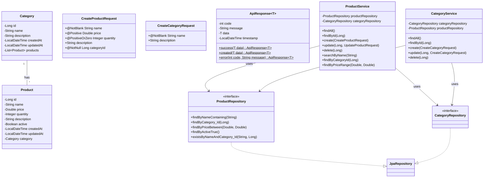
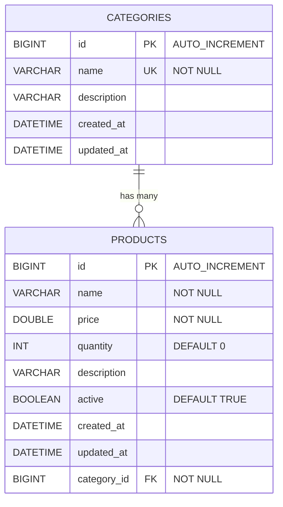

# BTVN Buổi 4

## Đề bài: Hệ thống Quản lý Sản phẩm & Danh mục — Product Management API (Database)

### Yêu cầu:

- Cài đặt **MySQL** + **DBeaver**, tạo database `hit_springboot_product`.
- Tạo entity `Category` gồm: `id` (Long, auto increment), `name` (String, unique, không rỗng), `description` (String, tối đa 500 ký tự), `createdAt` (LocalDateTime, auto set khi tạo), `updatedAt` (LocalDateTime, auto set khi tạo/update).
- Tạo entity `Product` gồm: `id` (Long, auto increment), `name` (String, 2–100 ký tự, không rỗng), `price` (Double, > 0), `quantity` (Integer, >= 0), `description` (String, tối đa 1000 ký tự, nullable), `active` (Boolean, default true), `createdAt`, `updatedAt`.
- Thiết lập quan hệ **@ManyToOne** từ `Product` → `Category` (nhiều Product thuộc 1 Category), và **@OneToMany** từ `Category` → `List<Product>`.
- Sử dụng **Lombok** cho tất cả entity và DTO (`@Getter`, `@Setter`, `@NoArgsConstructor`, `@AllArgsConstructor`, `@Builder`). **Không dùng `@Data`** cho Entity.
- Tạo `CategoryRepository` và `ProductRepository` extends `JpaRepository`.
- Thêm Derived Query methods vào `ProductRepository`:
  - `findByNameContaining(String keyword)`
  - `findByCategory_Id(Long categoryId)`
  - `findByPriceBetween(Double min, Double max)`
  - `findByActiveTrue()`
  - `existsByNameAndCategory_Id(String name, Long categoryId)`
- Tạo DTO: `CreateProductRequest`, `UpdateProductRequest`, `CreateCategoryRequest` với validation phù hợp (tái sử dụng kiến thức Buổi 3).
- Tạo `ApiResponse<T>` (dùng Lombok) để chuẩn hóa response.
- Tạo Custom Exception + `GlobalExceptionHandler` (tái sử dụng Buổi 3).
- Tạo `CategoryService` và `ProductService` với đầy đủ nghiệp vụ:
  - CRUD cho cả Category và Product
  - Khi tạo Product: kiểm tra Category có tồn tại → nếu không → throw `ResourceNotFoundException`
  - Khi tạo Product: kiểm tra tên trùng trong cùng Category → throw `DuplicateResourceException`
  - Khi xóa Category: kiểm tra còn Product nào thuộc Category → nếu có → throw `BadRequestException("Không thể xóa Category đang chứa Product")`
  - Tìm Product theo tên (search), theo Category, theo khoảng giá
- Tạo `CategoryController` và `ProductController` với REST API:

**CategoryController:**

| Method | URL | Mô tả |
|---|---|---|
| GET | `/api/categories` | Lấy tất cả |
| GET | `/api/categories/{id}` | Lấy theo id |
| POST | `/api/categories` | Tạo mới |
| PUT | `/api/categories/{id}` | Cập nhật |
| DELETE | `/api/categories/{id}` | Xóa (kiểm tra ràng buộc) |

**ProductController:**

| Method | URL | Mô tả |
|---|---|---|
| GET | `/api/products` | Lấy tất cả |
| GET | `/api/products/{id}` | Lấy theo id |
| POST | `/api/products` | Tạo mới (body chứa `categoryId`) |
| PUT | `/api/products/{id}` | Cập nhật |
| DELETE | `/api/products/{id}` | Xóa |
| GET | `/api/products/search?keyword=xxx` | Tìm theo tên |
| GET | `/api/products/category/{categoryId}` | Lấy theo danh mục |
| GET | `/api/products/price?min=x&max=y` | Lọc theo khoảng giá |

- Tất cả endpoint trả về `ResponseEntity<ApiResponse<...>>`.
- Test bằng **Postman** và kiểm tra dữ liệu trong **DBeaver**.

### Class Diagram:

### ER Diagram:

### Kịch bản test (Test Scenarios):

1. **Tạo Category** → 201 Created
2. **Tạo Product** với `categoryId` hợp lệ → 201 Created → kiểm tra DBeaver
3. **Tạo Product** với `categoryId` không tồn tại → 404 Not Found
4. **Tạo Product** tên trùng trong cùng Category → 409 Conflict
5. **Validation fail** (tên rỗng, giá âm) → 400 Bad Request + chi tiết lỗi
6. **Tìm product** theo tên → trả danh sách khớp
7. **Lọc product** theo khoảng giá → trả danh sách khớp
8. **Xóa Category** đang chứa Product → 400 Bad Request + message
9. **Xóa tất cả Product** trong Category → xóa Category → 200 OK
10. **Cập nhật Product** → kiểm tra `updatedAt` thay đổi trong DBeaver

### Notice:

- Tự thiết kế cấu trúc package hợp lý (controller, service, repository, entity, dto, exception).
- Sử dụng Lombok cho tất cả class. Với Entity, dùng `@Getter @Setter` thay vì `@Data`.
- Dùng `@PrePersist` / `@PreUpdate` cho `createdAt` / `updatedAt` (hoặc tạo `BaseEntity` để tái sử dụng).
- Đảm bảo `spring.jpa.hibernate.ddl-auto=update` để kiểm tra table tự tạo.
- Khuyến khích bổ sung: phân trang (`Pageable`), tạo `BaseEntity`, thêm endpoint thống kê (`GET /api/products/stats` — tổng sản phẩm, giá trung bình...).

### Nộp bài:

- Push lên GitHub, hạn nộp **23h00 09/04/2026**
