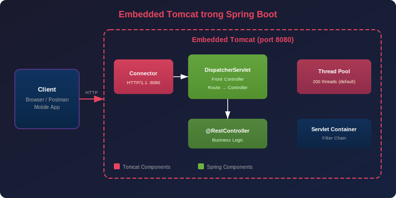
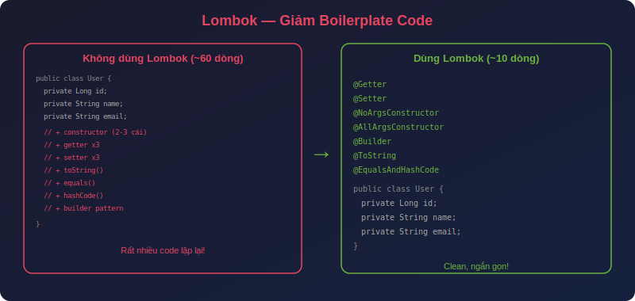
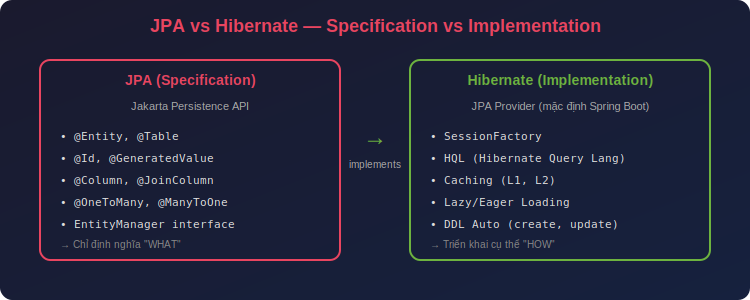
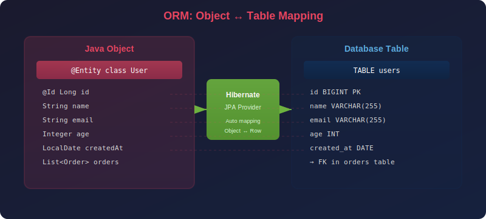
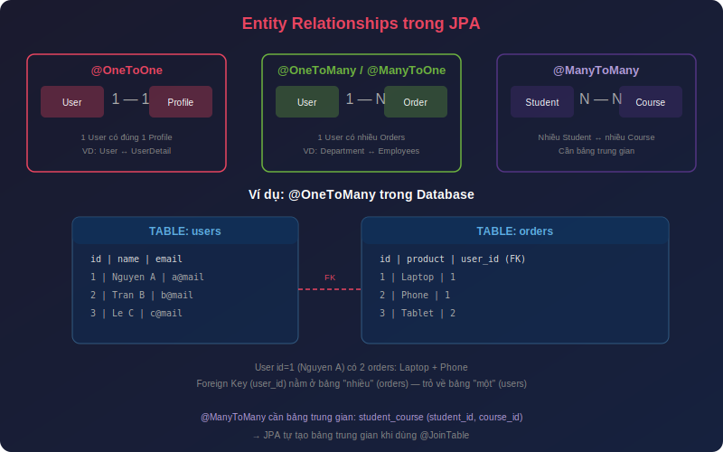
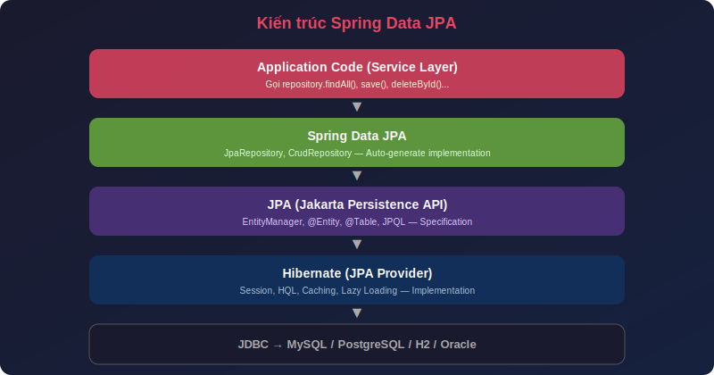
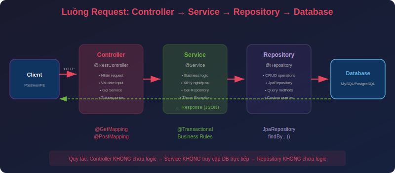

# Buổi 4: Database, JPA/Hibernate, Lombok & Spring Data JPA

---

## Mục tiêu buổi học

- Hiểu cách **Embedded Tomcat** hoạt động trong Spring Boot
- Kết nối ứng dụng Spring Boot với **Database** (MySQL) qua **DBeaver**
- Nắm khái niệm **JPA** (specification) và **Hibernate** (implementation)
- Sử dụng **Lombok** để giảm boilerplate code
- Hiểu cách **ORM** map Java Object ↔ Database Table
- Thành thạo các loại **Relationship**: `@OneToOne`, `@OneToMany`, `@ManyToOne`, `@ManyToMany`
- Dùng **Spring Data JPA** (`JpaRepository`) để thao tác database nhanh chóng
- Ôn lại luồng request trong **Spring MVC**: Controller → Service → Repository

---

## Hướng dẫn: Chọn Dependencies khi tạo Project (Spring Initializr)

Khi tạo project mới trên [start.spring.io](https://start.spring.io/), cần tích chọn các dependency sau:

### Dependencies cần chọn

| ✅ | Dependency | Thuộc nhóm | Nhiệm vụ |
|---|---|---|---|
| ☑️ | **Spring Web** | Web | Tạo REST API, tích hợp Embedded Tomcat, xử lý HTTP request/response, bao gồm Jackson (JSON) |
| ☑️ | **Spring Data JPA** | SQL | Tích hợp JPA + Hibernate + HikariCP, cung cấp `JpaRepository` (CRUD tự động, Derived Query) |
| ☑️ | **MySQL Driver** | SQL | JDBC Driver kết nối MySQL — chỉ cần khi runtime, không cần khi compile |
| ☑️ | **Validation** | I/O | Bean Validation (JSR 380) — `@NotBlank`, `@Email`, `@Min`, `@Max`, `@Size`, `@Pattern`... |
| ☑️ | **Lombok** | Developer Tools | Tự sinh getter/setter/constructor/builder/log — giảm boilerplate code |
| ☑️ | **Spring Boot DevTools** | Developer Tools | Hot reload (auto restart khi sửa code), LiveReload browser |

### Cấu hình Spring Initializr

| Mục | Giá trị |
|---|---|
| **Project** | Maven |
| **Language** | Java |
| **Spring Boot** | 3.4.x (latest stable) |
| **Group** | `com.hit` |
| **Artifact** | `springboot-base` |
| **Name** | `HIT Spring Boot Base` |
| **Packaging** | Jar |
| **Java** | 21 |

### Sau khi Generate

Giải nén file `.zip` và mở trong IntelliJ IDEA hoặc VS Code. File `pom.xml` sẽ chứa tất cả dependency đã chọn.

> **Mẹo:** Dependency **Validation** phải thêm thủ công — từ Spring Boot 2.3+ nó không còn bao gồm trong `spring-boot-starter-web` nữa. Nếu quên thêm → `@Valid` sẽ **không hoạt động**.

### Giải thích chi tiết từng Dependency trong pom.xml

```xml
<!-- 1. Spring Web — Xây dựng REST API -->
<!-- Bao gồm: Embedded Tomcat, Spring MVC, Jackson JSON -->
<dependency>
    <groupId>org.springframework.boot</groupId>
    <artifactId>spring-boot-starter-web</artifactId>
</dependency>

<!-- 2. Spring Data JPA — Thao tác Database -->
<!-- Bao gồm: JPA API, Hibernate (ORM), HikariCP (Connection Pool) -->
<dependency>
    <groupId>org.springframework.boot</groupId>
    <artifactId>spring-boot-starter-data-jpa</artifactId>
</dependency>

<!-- 3. Validation — Kiểm tra dữ liệu đầu vào -->
<!-- Bao gồm: Jakarta Validation API, Hibernate Validator -->
<dependency>
    <groupId>org.springframework.boot</groupId>
    <artifactId>spring-boot-starter-validation</artifactId>
</dependency>

<!-- 4. MySQL Driver — Kết nối MySQL -->
<!-- scope=runtime: chỉ cần khi chạy, JPA abstract hóa DB -->
<dependency>
    <groupId>com.mysql</groupId>
    <artifactId>mysql-connector-j</artifactId>
    <scope>runtime</scope>
</dependency>

<!-- 5. Lombok — Giảm boilerplate code -->
<!-- optional=true: không truyền sang project phụ thuộc -->
<dependency>
    <groupId>org.projectlombok</groupId>
    <artifactId>lombok</artifactId>
    <optional>true</optional>
</dependency>

<!-- 6. DevTools — Hot reload khi dev -->
<dependency>
    <groupId>org.springframework.boot</groupId>
    <artifactId>spring-boot-devtools</artifactId>
    <scope>runtime</scope>
    <optional>true</optional>
</dependency>
```

### Sơ đồ: Dependency làm gì trong kiến trúc ứng dụng

```
Client (Postman/Browser)
  │
  ▼
┌────────────────────────────────────────────────────────────┐
│  spring-boot-starter-web                                    │
│  ├── Embedded Tomcat (nhận HTTP request)                    │
│  ├── Spring MVC (DispatcherServlet → Controller)            │
│  └── Jackson (JSON ↔ Java Object)                           │
├────────────────────────────────────────────────────────────┤
│  spring-boot-starter-validation                             │
│  └── @Valid → kiểm tra @NotBlank, @Email, @Min...           │
├────────────────────────────────────────────────────────────┤
│  lombok                                                     │
│  └── @Getter, @Setter, @Builder, @Slf4j... (compile time)  │
├────────────────────────────────────────────────────────────┤
│  spring-boot-starter-data-jpa                               │
│  ├── JPA API (annotation: @Entity, @Id, @Column...)         │
│  ├── Hibernate (ORM implementation)                         │
│  └── HikariCP (Connection Pool)                             │
├────────────────────────────────────────────────────────────┤
│  mysql-connector-j                                          │
│  └── JDBC Driver (giao tiếp MySQL)                          │
└────────────────────────────────────────────────────────────┘
  │
  ▼
MySQL Database
```

---

## I. Web Server & Embedded Tomcat



### 1. Tomcat trong Spring Boot hoạt động thế nào?

Ở Buổi 1, ta đã biết Spring Boot **tích hợp sẵn Tomcat**. Bây giờ đi sâu hơn:

```
┌─────────────────────────────────────────────────────────────────┐
│                    Spring Boot Application                       │
│                                                                  │
│  ┌──────────────────────────────────────────────────────────┐    │
│  │              Embedded Tomcat Server                       │    │
│  │                                                          │    │
│  │  ┌──────────┐   ┌───────────────────┐   ┌────────────┐  │    │
│  │  │Connector  │──▶│DispatcherServlet  │──▶│ Controller │  │    │
│  │  │:8080      │   │(Front Controller) │   │ @RestCtrl  │  │    │
│  │  └──────────┘   └───────────────────┘   └────────────┘  │    │
│  │                                                          │    │
│  │  Thread Pool: 200 threads (mặc định)                     │    │
│  └──────────────────────────────────────────────────────────┘    │
│                                                                  │
│  Khởi động: java -jar app.jar → Tomcat tự khởi động             │
└─────────────────────────────────────────────────────────────────┘
```

**Luồng xử lý request:**

1. Client gửi HTTP request đến `localhost:8080`
2. **Connector** nhận request, lấy 1 thread từ Thread Pool
3. **DispatcherServlet** phân tích URL, tìm Controller phù hợp
4. **Controller** xử lý request, trả về response
5. Response gửi ngược lại Client, thread trả về Pool

### 2. Cấu hình Tomcat trong application.properties

```properties
# Đổi port mặc định
server.port=8080

# Số thread tối đa
server.tomcat.threads.max=200

# Số thread tối thiểu (luôn sẵn sàng)
server.tomcat.threads.min-spare=10

# Timeout cho request (mặc định 60s)
server.tomcat.connection-timeout=20000

# Context path
server.servlet.context-path=/api/v1
```

> **Lưu ý:** Trong production, có thể thay Tomcat bằng **Undertow** hoặc **Jetty** chỉ bằng cách đổi dependency trong `pom.xml`.

---

## II. Kết nối Database

### 1. Tổng quan kiến trúc

```
┌──────────┐     ┌──────────────┐     ┌──────────┐     ┌──────────┐
│  Client  │────▶│  Spring Boot │────▶│  JDBC /  │────▶│ Database │
│          │     │  Application │     │  HikariCP│     │  MySQL   │
│          │     │              │     │(Conn Pool)│    │PostgreSQL│
└──────────┘     └──────────────┘     └──────────┘     └──────────┘
```

**Spring Boot sử dụng HikariCP** (Connection Pool mặc định) để quản lý kết nối database hiệu quả — thay vì mở/đóng connection mỗi request.

### 2. Cài đặt MySQL

- Tải MySQL Community Server: https://dev.mysql.com/downloads/mysql/
- Hoặc cài qua **XAMPP** (bao gồm MySQL + Apache): https://www.apachefriends.org/
- Sau khi cài, tạo database:

```sql
CREATE DATABASE hit_springboot;
```

### 3. Thêm Dependencies vào pom.xml

```xml
<!-- MySQL Driver -->
<dependency>
    <groupId>com.mysql</groupId>
    <artifactId>mysql-connector-j</artifactId>
    <scope>runtime</scope>
</dependency>

<!-- Spring Data JPA (bao gồm Hibernate) -->
<dependency>
    <groupId>org.springframework.boot</groupId>
    <artifactId>spring-boot-starter-data-jpa</artifactId>
</dependency>

<!-- Lombok -->
<dependency>
    <groupId>org.projectlombok</groupId>
    <artifactId>lombok</artifactId>
    <optional>true</optional>
</dependency>
```

### 4. Cấu hình kết nối trong application.properties

```properties
# === Database Connection ===
spring.datasource.url=jdbc:mysql://localhost:3306/hit_springboot?useSSL=false&serverTimezone=UTC&allowPublicKeyRetrieval=true
spring.datasource.username=root
spring.datasource.password=your_password
spring.datasource.driver-class-name=com.mysql.cj.jdbc.Driver

# === JPA / Hibernate ===
spring.jpa.hibernate.ddl-auto=update
spring.jpa.show-sql=true
spring.jpa.properties.hibernate.format_sql=true
spring.jpa.properties.hibernate.dialect=org.hibernate.dialect.MySQLDialect
```

**Giải thích `spring.jpa.hibernate.ddl-auto`:**

| Giá trị | Mô tả | Khi nào dùng? |
|---|---|---|
| `none` | Không làm gì với schema | Production |
| `validate` | Chỉ kiểm tra schema khớp Entity | Production (khuyến nghị) |
| `update` | Tự động tạo/cập nhật table | Development |
| `create` | Xóa và tạo lại table mỗi lần chạy | Testing |
| `create-drop` | Như `create` + xóa khi tắt app | Unit test |

> **Cảnh báo:** **KHÔNG BAO GIỜ** dùng `create` hoặc `create-drop` trong production — sẽ mất toàn bộ dữ liệu!

### 5. DBeaver — Công cụ quản lý Database

**DBeaver** là IDE database miễn phí, hỗ trợ MySQL, PostgreSQL, Oracle, MongoDB, SQLite...

- Tải tại: https://dbeaver.io/download/
- Phiên bản Community miễn phí, đủ dùng cho hầu hết nhu cầu

**Cách kết nối MySQL trong DBeaver:**

1. Mở DBeaver → `Database` → `New Database Connection`
2. Chọn **MySQL** → Next
3. Nhập thông tin:
   - **Host**: `localhost`
   - **Port**: `3306`
   - **Database**: `hit_springboot`
   - **Username**: `root`
   - **Password**: `your_password`
4. Nhấn **Test Connection** → nếu thành công → **Finish**
5. Mở rộng connection → thấy database `hit_springboot` → sẵn sàng

**Tại sao dùng DBeaver thay vì MySQL Workbench?**

| Tiêu chí | DBeaver | MySQL Workbench |
|---|---|---|
| Hỗ trợ DB | Tất cả (MySQL, PostgreSQL, Oracle...) | Chỉ MySQL |
| Giao diện | Hiện đại, dễ dùng | Hơi nặng, phức tạp |
| Giá | Miễn phí (Community) | Miễn phí |
| Tính năng | ER Diagram, Data Export, SQL Editor | SQL Editor, Modeling |
| Phổ biến | Rất phổ biến trong cộng đồng | Phổ biến cho MySQL |

> **Khuyến nghị:** Dùng **DBeaver** vì hỗ trợ đa database — sau này chuyển sang PostgreSQL, MongoDB... không cần đổi tool.

### 6. Kiểm tra kết nối

Sau khi cấu hình xong, chạy ứng dụng Spring Boot:

```bash
./mvnw spring-boot:run
```

Nếu console hiển thị:

```
HikariPool-1 - Starting...
HikariPool-1 - Added connection com.mysql.cj.jdbc.ConnectionImpl@xxxxxxx
HikariPool-1 - Start completed.
```

→ Kết nối database **thành công**.

Nếu lỗi `Access denied for user 'root'@'localhost'` → kiểm tra lại username/password trong `application.properties`.

---

## III. Lombok — Giảm Boilerplate Code



### 1. Lombok là gì?

- **Lombok** là thư viện Java giúp **tự động sinh code** (getter, setter, constructor, builder, toString, equals...) tại compile time
- Giảm đáng kể lượng code lặp lại (boilerplate), giúp class gọn gàng hơn
- Hoạt động qua **annotation processing** — chỉ sinh code khi build, không ảnh hưởng runtime

### 2. Cài đặt Lombok

#### Bước 1: Thêm dependency

Đã thêm ở phần II. Nếu chưa:

```xml
<dependency>
    <groupId>org.projectlombok</groupId>
    <artifactId>lombok</artifactId>
    <optional>true</optional>
</dependency>
```

#### Bước 2: Cài plugin cho IDE

**IntelliJ IDEA:**
- `File` → `Settings` → `Plugins` → Tìm **Lombok** → Install → Restart
- `Settings` → `Build, Execution, Deployment` → `Compiler` → `Annotation Processors` → Bật **Enable annotation processing**

**VS Code:**
- Lombok được hỗ trợ tự động qua Extension Pack for Java

### 3. Các Annotation Lombok thường dùng

#### Nhóm 1: Getter / Setter

```java
import lombok.Getter;
import lombok.Setter;

@Getter
@Setter
public class User {
    private Long id;
    private String name;
    private String email;
}

// Lombok tự sinh:
// - getId(), getName(), getEmail()
// - setId(), setName(), setEmail()
```

#### Nhóm 2: Constructor

| Annotation | Mô tả | Sinh ra |
|---|---|---|
| `@NoArgsConstructor` | Constructor không tham số | `User() {}` |
| `@AllArgsConstructor` | Constructor tất cả field | `User(Long id, String name, String email) {}` |
| `@RequiredArgsConstructor` | Constructor cho field `final` hoặc `@NonNull` | Constructor cho các field bắt buộc |

```java
@NoArgsConstructor
@AllArgsConstructor
public class User {
    private Long id;
    private String name;
    private String email;
}

// Tự sinh:
// public User() {}
// public User(Long id, String name, String email) { ... }
```

#### Nhóm 3: @Data — All-in-one

```java
@Data  // = @Getter + @Setter + @ToString + @EqualsAndHashCode + @RequiredArgsConstructor
public class User {
    private Long id;
    private String name;
    private String email;
}
```

> **Cảnh báo:** `@Data` tạo `equals()` và `hashCode()` dựa trên **tất cả field** — có thể gây vấn đề với JPA Entity (circular reference, lazy loading). Với Entity, nên dùng `@Getter @Setter` riêng thay vì `@Data`.

#### Nhóm 4: @Builder — Builder Pattern

```java
@Builder
@Getter
@Setter
@NoArgsConstructor
@AllArgsConstructor
public class User {
    private Long id;
    private String name;
    private String email;
    private Integer age;
}

// Sử dụng:
User user = User.builder()
        .name("Nguyen Van A")
        .email("a@example.com")
        .age(20)
        .build();
```

#### Nhóm 5: @Slf4j — Logging

```java
@Slf4j  // Tự tạo: private static final Logger log = LoggerFactory.getLogger(UserService.class);
@Service
public class UserService {

    public User findById(Long id) {
        log.info("Tìm user với id: {}", id);
        // ...
    }
}
```

### 4. Bảng tổng hợp Lombok Annotations

| Annotation | Mô tả |
|---|---|
| `@Getter` | Sinh getter cho tất cả field |
| `@Setter` | Sinh setter cho tất cả field |
| `@ToString` | Sinh `toString()` |
| `@EqualsAndHashCode` | Sinh `equals()` và `hashCode()` |
| `@NoArgsConstructor` | Constructor không tham số |
| `@AllArgsConstructor` | Constructor đầy đủ tham số |
| `@RequiredArgsConstructor` | Constructor cho field `final` |
| `@Data` | Tổng hợp: Getter + Setter + ToString + EqualsAndHashCode + RequiredArgsConstructor |
| `@Builder` | Builder pattern |
| `@Slf4j` | Logging (SLF4J) |
| `@Value` | Immutable class (tất cả field `private final`) |

> **Best Practice với JPA Entity:** Dùng `@Getter @Setter @NoArgsConstructor @AllArgsConstructor` thay vì `@Data`. Tránh `@EqualsAndHashCode` trên tất cả field.

---

## IV. JPA & Hibernate — Khái niệm



### 1. ORM là gì?

**ORM** (Object-Relational Mapping) là kỹ thuật ánh xạ giữa **Java Object** và **Database Table**:

- Mỗi **class** → 1 **table**
- Mỗi **field** → 1 **column**
- Mỗi **object instance** → 1 **row** (bản ghi)

```
Java World                    Database World
───────────                   ──────────────
Class User            ↔       TABLE users
  field id (Long)     ↔         column id (BIGINT)
  field name (String) ↔         column name (VARCHAR)
  field email (String)↔         column email (VARCHAR)
  object instance     ↔         1 row in table
```

**Lợi ích ORM:**
- Không cần viết SQL thủ công cho CRUD cơ bản
- Code Java thuần, không phụ thuộc vào database cụ thể
- Tự động quản lý relationship giữa các table
- Tự động tạo/cập nhật schema

### 2. JPA là gì?

- **JPA** (Jakarta Persistence API, trước là Java Persistence API) là **đặc tả** (specification) của Java cho ORM
- JPA chỉ **định nghĩa** các annotation và interface — **không có code triển khai**
- Giống như một bản "hợp đồng" mà các ORM framework phải tuân theo

Các thành phần chính của JPA:

| Thành phần | Mô tả |
|---|---|
| `@Entity` | Đánh dấu class là Entity (map với table) |
| `@Table` | Chỉ định tên table |
| `@Id` | Đánh dấu primary key |
| `@GeneratedValue` | Chiến lược tạo ID tự động |
| `@Column` | Tùy chỉnh column (tên, nullable, unique...) |
| `EntityManager` | Interface quản lý Entity (persist, find, remove...) |
| `JPQL` | Ngôn ngữ query hướng đối tượng |

### 3. Hibernate là gì?

- **Hibernate** là **implementation** (triển khai) phổ biến nhất của JPA
- Spring Boot **mặc định dùng Hibernate** làm JPA Provider
- Hibernate cung cấp thêm nhiều tính năng vượt trội so với JPA specification

```
JPA (Specification)          Hibernate (Implementation)
─────────────────           ──────────────────────────
Định nghĩa @Entity     →    Triển khai logic map object → table
Định nghĩa EntityManager → Triển khai SessionFactory
Định nghĩa JPQL        →    Triển khai HQL + JPQL
Không có caching        →    Cung cấp L1 + L2 Cache
Không có DDL auto       →    Hỗ trợ tự tạo/update schema
```

> **Kết luận:** JPA là **hợp đồng** (what), Hibernate là **người thực thi** (how). Khi code, ta dùng annotation/interface của JPA → Hibernate tự xử lý phía sau. Nếu muốn đổi sang EclipseLink, chỉ cần đổi dependency — code không đổi.

---

## V. ORM Mapping — Entity & Annotation



### 1. Tạo Entity đầu tiên

```java
import jakarta.persistence.*;
import lombok.*;

@Entity                     // Đánh dấu: class này map với 1 table
@Table(name = "users")      // Tên table trong database (không bắt buộc, mặc định = tên class)
@Getter
@Setter
@NoArgsConstructor
@AllArgsConstructor
@Builder
public class User {

    @Id                                      // Primary Key
    @GeneratedValue(strategy = GenerationType.IDENTITY)  // Auto Increment
    private Long id;

    @Column(name = "full_name", nullable = false, length = 100)
    private String name;

    @Column(unique = true, nullable = false)
    private String email;

    @Column(nullable = true)
    private Integer age;

    @Column(name = "created_at")
    private LocalDateTime createdAt;

    @PrePersist  // Tự động gọi trước khi lưu vào DB lần đầu
    protected void onCreate() {
        this.createdAt = LocalDateTime.now();
    }
}
```

Hibernate sẽ tự tạo table tương ứng:

```sql
CREATE TABLE users (
    id BIGINT AUTO_INCREMENT PRIMARY KEY,
    full_name VARCHAR(100) NOT NULL,
    email VARCHAR(255) NOT NULL UNIQUE,
    age INT,
    created_at DATETIME
);
```

### 2. Các Annotation JPA cho Entity

| Annotation | Mô tả | Ví dụ |
|---|---|---|
| `@Entity` | Đánh dấu class là Entity | `@Entity class User {}` |
| `@Table(name)` | Chỉ định tên table | `@Table(name = "users")` |
| `@Id` | Đánh dấu Primary Key | `@Id Long id` |
| `@GeneratedValue` | Chiến lược sinh ID | `@GeneratedValue(strategy = GenerationType.IDENTITY)` |
| `@Column` | Tùy chỉnh column | `@Column(nullable = false, unique = true, length = 100)` |
| `@Transient` | Không map field này vào DB | `@Transient String tempData` |
| `@Enumerated` | Map Java Enum → DB | `@Enumerated(EnumType.STRING) Role role` |
| `@Temporal` | Map Date/Calendar (legacy) | `@Temporal(TemporalType.TIMESTAMP) Date date` |
| `@Lob` | Large Object (text/binary lớn) | `@Lob String content` |
| `@PrePersist` | Callback trước khi INSERT | Tặng giá trị mặc định |
| `@PreUpdate` | Callback trước khi UPDATE | Cập nhật `updatedAt` |

### 3. Chiến lược GenerationType

| Strategy | Mô tả | Database |
|---|---|---|
| `IDENTITY` | Database tự tăng ID (AUTO_INCREMENT) | MySQL, PostgreSQL |
| `SEQUENCE` | Dùng sequence của DB | PostgreSQL, Oracle |
| `TABLE` | Dùng table riêng để sinh ID | Mọi DB (chậm) |
| `AUTO` | JPA tự chọn strategy phù hợp | Tùy DB |

> **Khuyến nghị:** Dùng `GenerationType.IDENTITY` cho MySQL, `GenerationType.SEQUENCE` cho PostgreSQL.

### 4. @Column — Chi tiết

```java
@Column(
    name = "full_name",       // Tên column trong DB (mặc định = tên field)
    nullable = false,         // NOT NULL
    unique = true,            // UNIQUE constraint
    length = 100,             // VARCHAR(100) — chỉ cho String
    columnDefinition = "TEXT", // Ghi đè kiểu dữ liệu
    insertable = true,        // Có tham gia INSERT không
    updatable = false          // Có tham gia UPDATE không
)
private String name;
```

### 5. Enum Mapping

```java
public enum Role {
    ADMIN, USER, MODERATOR
}

@Entity
public class User {
    @Id
    @GeneratedValue(strategy = GenerationType.IDENTITY)
    private Long id;

    private String name;

    @Enumerated(EnumType.STRING)  // Lưu dạng chuỗi: "ADMIN", "USER"
    private Role role;

    // Nếu dùng EnumType.ORDINAL → lưu số: 0, 1, 2 (KHÔNG khuyến nghị — thêm enum sẽ sai thứ tự)
}
```

> **Quy tắc:** Luôn dùng `EnumType.STRING`. Tránh `EnumType.ORDINAL` vì thêm/xoá giá trị enum sẽ gây lỗi mapping.

### 6. Entity Lifecycle Callbacks

```java
@Entity
@Getter @Setter
public class BaseEntity {

    @Column(name = "created_at", updatable = false)
    private LocalDateTime createdAt;

    @Column(name = "updated_at")
    private LocalDateTime updatedAt;

    @PrePersist
    protected void onCreate() {
        this.createdAt = LocalDateTime.now();
        this.updatedAt = LocalDateTime.now();
    }

    @PreUpdate
    protected void onUpdate() {
        this.updatedAt = LocalDateTime.now();
    }
}
```

> **Mẹo:** Tạo `BaseEntity` chứa `createdAt`, `updatedAt` → các Entity khác kế thừa → tự động tracking thời gian.

---

## VI. Entity Relationships



### 1. @OneToOne — Quan hệ 1-1

**Ví dụ:** 1 User có đúng 1 Profile.

```java
@Entity
@Table(name = "users")
@Getter @Setter @NoArgsConstructor @AllArgsConstructor @Builder
public class User {

    @Id
    @GeneratedValue(strategy = GenerationType.IDENTITY)
    private Long id;

    private String name;

    @OneToOne(cascade = CascadeType.ALL)
    @JoinColumn(name = "profile_id", referencedColumnName = "id")
    private Profile profile;
}

@Entity
@Table(name = "profiles")
@Getter @Setter @NoArgsConstructor @AllArgsConstructor @Builder
public class Profile {

    @Id
    @GeneratedValue(strategy = GenerationType.IDENTITY)
    private Long id;

    private String bio;
    private String avatarUrl;

    @OneToOne(mappedBy = "profile")  // Phía "không sở hữu" FK
    private User user;
}
```

**Database:**

```sql
TABLE users:     id | name      | profile_id (FK)
TABLE profiles:  id | bio       | avatar_url
```

### 2. @OneToMany / @ManyToOne — Quan hệ 1-N

**Ví dụ:** 1 User có nhiều Orders. Mỗi Order thuộc về 1 User.

```java
@Entity
@Table(name = "users")
@Getter @Setter @NoArgsConstructor @AllArgsConstructor
public class User {

    @Id
    @GeneratedValue(strategy = GenerationType.IDENTITY)
    private Long id;

    private String name;

    @OneToMany(mappedBy = "user", cascade = CascadeType.ALL, fetch = FetchType.LAZY)
    private List<Order> orders = new ArrayList<>();
}

@Entity
@Table(name = "orders")
@Getter @Setter @NoArgsConstructor @AllArgsConstructor
public class Order {

    @Id
    @GeneratedValue(strategy = GenerationType.IDENTITY)
    private Long id;

    private String product;
    private Double price;

    @ManyToOne(fetch = FetchType.LAZY)
    @JoinColumn(name = "user_id")  // FK nằm ở bảng "nhiều" (orders)
    private User user;
}
```

**Database:**

```sql
TABLE users:   id | name
TABLE orders:  id | product | price | user_id (FK → users.id)
```

> **Quy tắc quan trọng:**
> - **Foreign Key luôn nằm ở bảng "nhiều"** (bảng con)
> - `mappedBy` đặt ở phía **không sở hữu** FK (phía "một")
> - `@JoinColumn` đặt ở phía **sở hữu** FK (phía "nhiều")

### 3. @ManyToMany — Quan hệ N-N

**Ví dụ:** Nhiều Student học nhiều Course.

```java
@Entity
@Getter @Setter @NoArgsConstructor @AllArgsConstructor
public class Student {

    @Id
    @GeneratedValue(strategy = GenerationType.IDENTITY)
    private Long id;

    private String name;

    @ManyToMany
    @JoinTable(
        name = "student_course",                                    // Tên bảng trung gian
        joinColumns = @JoinColumn(name = "student_id"),             // FK trỏ về Student
        inverseJoinColumns = @JoinColumn(name = "course_id")        // FK trỏ về Course
    )
    private List<Course> courses = new ArrayList<>();
}

@Entity
@Getter @Setter @NoArgsConstructor @AllArgsConstructor
public class Course {

    @Id
    @GeneratedValue(strategy = GenerationType.IDENTITY)
    private Long id;

    private String title;

    @ManyToMany(mappedBy = "courses")  // Phía không sở hữu
    private List<Student> students = new ArrayList<>();
}
```

**Database tự sinh 3 tables:**

```sql
TABLE students:       id | name
TABLE courses:        id | title
TABLE student_course: student_id (FK) | course_id (FK)    ← Bảng trung gian
```

### 4. Cascade & Fetch Type

#### CascadeType — Lan truyền thao tác

| Type | Mô tả |
|---|---|
| `CascadeType.PERSIST` | Khi save parent → tự save child |
| `CascadeType.MERGE` | Khi update parent → tự update child |
| `CascadeType.REMOVE` | Khi delete parent → tự delete child |
| `CascadeType.ALL` | Tất cả các cascade trên |
| `CascadeType.DETACH` | Khi detach parent → detach child |

```java
// Khi save User → tự save luôn Profile (không cần save riêng)
@OneToOne(cascade = CascadeType.ALL)
private Profile profile;
```

#### FetchType — Chiến lược load dữ liệu

| Type | Mô tả | Mặc định cho |
|---|---|---|
| `LAZY` | Chỉ load khi **truy cập** field đó | `@OneToMany`, `@ManyToMany` |
| `EAGER` | Load **ngay lập tức** cùng parent | `@ManyToOne`, `@OneToOne` |

```java
// LAZY: orders không được load cho đến khi gọi user.getOrders()
@OneToMany(mappedBy = "user", fetch = FetchType.LAZY)
private List<Order> orders;

// EAGER: user được load ngay khi load Order
@ManyToOne(fetch = FetchType.EAGER)
private User user;
```

> **Best Practice:** Dùng `LAZY` cho **tất cả** relationship, chỉ chuyển sang `EAGER` khi thực sự cần. Lý do: `EAGER` load quá nhiều dữ liệu → ảnh hưởng hiệu năng (N+1 problem).

### 5. Bảng tổng hợp Relationships

| Relationship | Annotation | FK nằm ở | Ví dụ |
|---|---|---|---|
| 1 — 1 | `@OneToOne` | Bảng chủ (owning side) | User ↔ Profile |
| 1 — N | `@OneToMany` + `@ManyToOne` | Bảng "nhiều" (child) | User ↔ Orders |
| N — N | `@ManyToMany` | Bảng trung gian (join table) | Student ↔ Course |

---

## VII. Spring Data JPA — Thao tác Database nhanh



### 1. Spring Data JPA là gì?

- **Spring Data JPA** là module của Spring, xây dựng **trên nền JPA/Hibernate**
- Cung cấp `JpaRepository` — chỉ cần khai báo interface, **Spring tự sinh implementation**
- Không cần viết SQL hay JPQL cho các thao tác CRUD cơ bản

```
Không có Spring Data JPA:
    → Tự viết EntityManager.persist(), find(), createQuery()...
    → Viết DAO class, implement thủ công

Có Spring Data JPA:
    → Khai báo interface extends JpaRepository
    → Xong! Spring tự implement tất cả CRUD methods
```

### 2. Tạo Repository

```java
import org.springframework.data.jpa.repository.JpaRepository;
import org.springframework.stereotype.Repository;

@Repository
public interface UserRepository extends JpaRepository<User, Long> {
    // JpaRepository<EntityType, PrimaryKeyType>
    // → Spring tự sinh implementation cho tất cả CRUD methods
    // → Không cần viết gì thêm nếu chỉ dùng CRUD!
}
```

#### Các method có sẵn trong JpaRepository

| Method | Mô tả | SQL tương đương |
|---|---|---|
| `save(entity)` | Insert hoặc Update | `INSERT INTO` / `UPDATE` |
| `findById(id)` | Tìm theo ID | `SELECT * WHERE id = ?` |
| `findAll()` | Lấy tất cả | `SELECT *` |
| `deleteById(id)` | Xóa theo ID | `DELETE WHERE id = ?` |
| `count()` | Đếm số bản ghi | `SELECT COUNT(*)` |
| `existsById(id)` | Kiểm tra tồn tại | `SELECT EXISTS(...)` |
| `findAll(Sort)` | Lấy tất cả + sắp xếp | `SELECT * ORDER BY` |
| `findAll(Pageable)` | Phân trang | `SELECT * LIMIT ? OFFSET ?` |
| `saveAll(List)` | Lưu nhiều entity | Batch INSERT |
| `deleteAll()` | Xóa tất cả | `DELETE FROM table` |

### 3. Derived Query Methods — Tạo query từ tên method

Spring Data JPA cho phép **tạo query tự động từ tên method** theo quy tắc:

```java
@Repository
public interface UserRepository extends JpaRepository<User, Long> {

    // Tìm theo email → SELECT * FROM users WHERE email = ?
    Optional<User> findByEmail(String email);

    // Tìm theo name (chứa) → SELECT * FROM users WHERE name LIKE '%keyword%'
    List<User> findByNameContaining(String keyword);

    // Tìm theo age lớn hơn → SELECT * FROM users WHERE age > ?
    List<User> findByAgeGreaterThan(Integer age);

    // Tìm theo name và email → SELECT * FROM users WHERE name = ? AND email = ?
    Optional<User> findByNameAndEmail(String name, String email);

    // Kiểm tra tồn tại → SELECT EXISTS(SELECT 1 FROM users WHERE email = ?)
    boolean existsByEmail(String email);

    // Đếm → SELECT COUNT(*) FROM users WHERE age > ?
    long countByAgeGreaterThan(Integer age);

    // Sắp xếp → SELECT * FROM users WHERE age >= ? ORDER BY name ASC
    List<User> findByAgeGreaterThanEqualOrderByNameAsc(Integer age);

    // Xóa theo email → DELETE FROM users WHERE email = ?
    void deleteByEmail(String email);
}
```

#### Bảng keyword cho Derived Query

| Keyword | Ví dụ | SQL |
|---|---|---|
| `findBy` | `findByName(name)` | `WHERE name = ?` |
| `And` | `findByNameAndEmail(...)` | `WHERE name = ? AND email = ?` |
| `Or` | `findByNameOrEmail(...)` | `WHERE name = ? OR email = ?` |
| `Between` | `findByAgeBetween(18, 30)` | `WHERE age BETWEEN 18 AND 30` |
| `LessThan` | `findByAgeLessThan(18)` | `WHERE age < 18` |
| `GreaterThan` | `findByAgeGreaterThan(60)` | `WHERE age > 60` |
| `Like` | `findByNameLike("%Nguyen%")` | `WHERE name LIKE '%Nguyen%'` |
| `Containing` | `findByNameContaining("Nguyen")` | `WHERE name LIKE '%Nguyen%'` |
| `StartingWith` | `findByNameStartingWith("Ng")` | `WHERE name LIKE 'Ng%'` |
| `EndingWith` | `findByEmailEndingWith("@gmail.com")` | `WHERE email LIKE '%@gmail.com'` |
| `IsNull` | `findByPhoneIsNull()` | `WHERE phone IS NULL` |
| `IsNotNull` | `findByPhoneIsNotNull()` | `WHERE phone IS NOT NULL` |
| `In` | `findByAgeIn(List.of(20,21))` | `WHERE age IN (20, 21)` |
| `OrderBy` | `findByAgeOrderByNameAsc(20)` | `ORDER BY name ASC` |
| `Not` | `findByNameNot("Admin")` | `WHERE name != 'Admin'` |
| `True` / `False` | `findByActiveTrue()` | `WHERE active = true` |

### 4. Custom Query với @Query

Khi Derived Query quá dài hoặc phức tạp, dùng `@Query`:

```java
@Repository
public interface UserRepository extends JpaRepository<User, Long> {

    // JPQL (hướng đối tượng — dùng tên class/field, không dùng tên table/column)
    @Query("SELECT u FROM User u WHERE u.email = :email")
    Optional<User> findByEmailJPQL(@Param("email") String email);

    // JPQL: tìm user có tuổi trong khoảng
    @Query("SELECT u FROM User u WHERE u.age BETWEEN :min AND :max ORDER BY u.name")
    List<User> findUsersInAgeRange(@Param("min") int min, @Param("max") int max);

    // Native SQL (dùng tên table/column thật trong DB)
    @Query(value = "SELECT * FROM users WHERE email = :email", nativeQuery = true)
    Optional<User> findByEmailNative(@Param("email") String email);

    // Update query
    @Modifying
    @Query("UPDATE User u SET u.name = :name WHERE u.id = :id")
    int updateNameById(@Param("id") Long id, @Param("name") String name);
}
```

> **Khi nào dùng gì?**
> - CRUD cơ bản → **JpaRepository methods** (đã có sẵn)
> - Query đơn giản → **Derived Query** (đặt tên method)
> - Query phức tạp → **@Query** (JPQL hoặc Native SQL)

---

## VIII. Luồng Request: Controller → Service → Repository



### 1. Tại sao phải chia 3 tầng?

```
❌ Mọi thứ trong Controller:
    @GetMapping("/users/{id}")
    public User getUser(@PathVariable Long id) {
        // Validate, business logic, query DB... tất cả ở đây
        // → Code dài, khó test, khó bảo trì
    }

✅ Chia 3 tầng:
    Controller → chỉ nhận/trả request
    Service    → chỉ xử lý logic
    Repository → chỉ truy cập DB
```

| Tầng | Annotation | Trách nhiệm | KHÔNG được làm |
|---|---|---|---|
| **Controller** | `@RestController` | Nhận request, validate, gọi Service, trả response | Chứa business logic, truy cập DB |
| **Service** | `@Service` | Xử lý nghiệp vụ, gọi Repository | Truy cập DB trực tiếp, xử lý HTTP |
| **Repository** | `@Repository` | CRUD database, custom query | Chứa business logic |

### 2. Ví dụ đầy đủ — CRUD User với Database

#### Entity

```java
@Entity
@Table(name = "users")
@Getter @Setter @NoArgsConstructor @AllArgsConstructor @Builder
public class User {

    @Id
    @GeneratedValue(strategy = GenerationType.IDENTITY)
    private Long id;

    @Column(nullable = false, length = 100)
    private String name;

    @Column(nullable = false, unique = true)
    private String email;

    private Integer age;

    @Column(name = "created_at", updatable = false)
    private LocalDateTime createdAt;

    @Column(name = "updated_at")
    private LocalDateTime updatedAt;

    @PrePersist
    protected void onCreate() {
        this.createdAt = LocalDateTime.now();
        this.updatedAt = LocalDateTime.now();
    }

    @PreUpdate
    protected void onUpdate() {
        this.updatedAt = LocalDateTime.now();
    }
}
```

#### Repository

```java
@Repository
public interface UserRepository extends JpaRepository<User, Long> {

    Optional<User> findByEmail(String email);

    boolean existsByEmail(String email);

    List<User> findByNameContaining(String keyword);

    List<User> findByAgeGreaterThan(Integer age);
}
```

#### DTO Request (với Validation + Lombok)

```java
@Getter @Setter @NoArgsConstructor @AllArgsConstructor
public class CreateUserRequest {

    @NotBlank(message = "Tên không được để trống")
    @Size(min = 2, max = 100, message = "Tên phải từ 2 đến 100 ký tự")
    private String name;

    @NotBlank(message = "Email không được để trống")
    @Email(message = "Email không đúng định dạng")
    private String email;

    @Min(value = 1, message = "Tuổi phải lớn hơn 0")
    @Max(value = 150, message = "Tuổi phải nhỏ hơn 150")
    private Integer age;
}
```

#### Service

```java
@Service
@RequiredArgsConstructor  // Lombok tự sinh constructor cho userRepository (final field)
public class UserService {

    private final UserRepository userRepository;

    public List<User> findAll() {
        return userRepository.findAll();
    }

    public User findById(Long id) {
        return userRepository.findById(id)
                .orElseThrow(() -> new ResourceNotFoundException("User", "id", id));
    }

    public User create(CreateUserRequest request) {
        // Kiểm tra email trùng
        if (userRepository.existsByEmail(request.getEmail())) {
            throw new DuplicateResourceException("User", "email", request.getEmail());
        }

        User user = User.builder()
                .name(request.getName())
                .email(request.getEmail())
                .age(request.getAge())
                .build();

        return userRepository.save(user);  // INSERT vào database
    }

    public User update(Long id, CreateUserRequest request) {
        User user = findById(id);  // Throw 404 nếu không tìm thấy

        // Kiểm tra email trùng với user khác
        userRepository.findByEmail(request.getEmail())
                .ifPresent(existing -> {
                    if (!existing.getId().equals(id)) {
                        throw new DuplicateResourceException("User", "email", request.getEmail());
                    }
                });

        user.setName(request.getName());
        user.setEmail(request.getEmail());
        user.setAge(request.getAge());

        return userRepository.save(user);  // UPDATE trong database
    }

    public void delete(Long id) {
        User user = findById(id);
        userRepository.delete(user);  // DELETE từ database
    }

    public List<User> searchByName(String keyword) {
        return userRepository.findByNameContaining(keyword);
    }
}
```

> **Chú ý:** `@RequiredArgsConstructor` (Lombok) tự sinh constructor cho tất cả field `final` → thay thế `@Autowired` constructor injection.

#### Controller

```java
@RestController
@RequestMapping("/api/users")
@RequiredArgsConstructor
public class UserController {

    private final UserService userService;

    @GetMapping
    public ResponseEntity<ApiResponse<List<User>>> getAllUsers() {
        return ResponseEntity.ok(ApiResponse.success(userService.findAll()));
    }

    @GetMapping("/{id}")
    public ResponseEntity<ApiResponse<User>> getUserById(@PathVariable Long id) {
        return ResponseEntity.ok(ApiResponse.success(userService.findById(id)));
    }

    @PostMapping
    public ResponseEntity<ApiResponse<User>> createUser(
            @Valid @RequestBody CreateUserRequest request) {
        User user = userService.create(request);
        return ResponseEntity.status(HttpStatus.CREATED).body(ApiResponse.created(user));
    }

    @PutMapping("/{id}")
    public ResponseEntity<ApiResponse<User>> updateUser(
            @PathVariable Long id,
            @Valid @RequestBody CreateUserRequest request) {
        return ResponseEntity.ok(ApiResponse.success("Cập nhật thành công", userService.update(id, request)));
    }

    @DeleteMapping("/{id}")
    public ResponseEntity<ApiResponse<Void>> deleteUser(@PathVariable Long id) {
        userService.delete(id);
        return ResponseEntity.ok(ApiResponse.success("Xóa thành công", null));
    }

    @GetMapping("/search")
    public ResponseEntity<ApiResponse<List<User>>> searchUsers(@RequestParam String keyword) {
        return ResponseEntity.ok(ApiResponse.success(userService.searchByName(keyword)));
    }
}
```

### 3. So sánh: Trước và Sau khi dùng Database

| Tiêu chí | Buổi 3 (In-Memory) | Buổi 4 (Database) |
|---|---|---|
| Lưu trữ | `List<User>` trong Service | MySQL Table |
| Mất dữ liệu khi restart | Có | Không |
| Repository | Không có | `JpaRepository` |
| ID | Tự quản lý `nextId++` | Database tự tăng |
| Query | `stream().filter()` | JPA Derived Query |
| Boilerplate | Getter/Setter thủ công | Lombok |

### 4. Cấu trúc package hoàn chỉnh

```
com.example.demo/
├── DemoApplication.java
├── controller/
│   └── UserController.java
├── service/
│   └── UserService.java
├── repository/
│   └── UserRepository.java          ← MỚI
├── entity/                           ← ĐỔI TÊN từ model/
│   └── User.java                     ← Thêm @Entity
├── dto/
│   ├── request/
│   │   ├── CreateUserRequest.java    ← Thêm Lombok
│   │   └── UpdateUserRequest.java
│   └── response/
│       └── ApiResponse.java          ← Thêm Lombok
├── exception/
│   ├── AppException.java
│   ├── ResourceNotFoundException.java
│   ├── DuplicateResourceException.java
│   ├── BadRequestException.java
│   └── GlobalExceptionHandler.java
└── config/                            ← (Tùy chọn) cấu hình
```

---

## Tổng kết Buổi 4

| Chủ đề | Nội dung chính |
|---|---|
| Embedded Tomcat | Web server tích hợp sẵn trong Spring Boot, cấu hình qua `application.properties` |
| Database Connection | MySQL + HikariCP, cấu hình `spring.datasource.*`, kiểm tra qua DBeaver |
| DBeaver | IDE database miễn phí, hỗ trợ đa database, dùng quản lý và kiểm tra dữ liệu |
| JPA | Specification (đặc tả) ORM của Java — định nghĩa annotation và interface |
| Hibernate | Implementation phổ biến nhất của JPA, Spring Boot dùng mặc định |
| Lombok | Giảm boilerplate: `@Getter`, `@Setter`, `@Builder`, `@Data`, `@Slf4j` |
| ORM Mapping | `@Entity`, `@Table`, `@Id`, `@Column`, `@GeneratedValue` — map class ↔ table |
| Relationships | `@OneToOne`, `@OneToMany`/`@ManyToOne`, `@ManyToMany` — `CascadeType`, `FetchType` |
| Spring Data JPA | `JpaRepository` — CRUD tự động, Derived Query, `@Query` |
| MVC Flow | Controller (nhận request) → Service (xử lý logic) → Repository (truy cập DB) |

---

## Câu hỏi ôn tập

1. JPA và Hibernate khác nhau như thế nào? Tại sao không dùng trực tiếp Hibernate mà dùng JPA?
2. `spring.jpa.hibernate.ddl-auto=update` và `create` khác nhau thế nào? Khi nào dùng cái nào?
3. Tại sao không khuyến nghị dùng `@Data` cho JPA Entity?
4. `FetchType.LAZY` và `FetchType.EAGER` khác nhau thế nào? Khi nào dùng `LAZY`?
5. Foreign Key nằm ở bảng nào trong quan hệ `@OneToMany`?
6. `mappedBy` dùng để làm gì? Đặt ở phía nào?
7. `CascadeType.ALL` có ý nghĩa gì? Khi nào nên và không nên dùng?
8. Derived Query `findByNameContainingAndAgeGreaterThan` sẽ sinh SQL gì?
9. `@RequiredArgsConstructor` thay thế được `@Autowired` như thế nào?
10. Khi nào dùng Derived Query, khi nào dùng `@Query`?

---

## Bài tập thực hành

### Bài 1: Setup Database + Entity cơ bản

- Cài MySQL, tạo database `hit_springboot`
- Cài DBeaver, kết nối tới MySQL
- Cấu hình `application.properties` cho Spring Boot
- Tạo entity `User` với Lombok + JPA annotation
- Chạy ứng dụng, kiểm tra table được tạo tự động trong DBeaver

### Bài 2: CRUD User với Database

- Chuyển bài CRUD User từ Buổi 3 (in-memory) sang **database thật**
- Tạo `UserRepository extends JpaRepository<User, Long>`
- Cập nhật `UserService` để gọi Repository thay vì thao tác List
- Thêm Derived Query: `findByEmail`, `existsByEmail`, `findByNameContaining`
- Test bằng Postman + kiểm tra dữ liệu trong DBeaver

### Bài 3: Entity Relationship

- Tạo thêm entity `Order` (id, product, price, quantity, createdAt)
- Thiết lập quan hệ `@OneToMany` (User → Orders) và `@ManyToOne` (Order → User)
- Tạo API:
  - `POST /api/users/{userId}/orders` — tạo order cho user
  - `GET /api/users/{userId}/orders` — lấy tất cả orders của user
- Kiểm tra bảng `orders` trong DBeaver — cột `user_id` (FK) có đúng không

### Bài 4: Tìm hiểu thêm

- **Pagination & Sorting**: Dùng `Pageable` trong `findAll(Pageable)` để phân trang
- **@MappedSuperclass**: Tạo `BaseEntity` chứa `createdAt`, `updatedAt` để các entity khác kế thừa
- **DTO Mapping**: Tìm hiểu MapStruct hoặc ModelMapper để convert Entity ↔ DTO
- **N+1 Problem**: Tìm hiểu vấn đề N+1 query khi dùng `FetchType.LAZY` và cách giải quyết bằng `@EntityGraph` hoặc `JOIN FETCH`

---

## Tài liệu tham khảo

### Spring Official Docs

- [Spring Data JPA — Reference](https://docs.spring.io/spring-data/jpa/reference/)
- [Spring Boot — Data Access (JPA)](https://docs.spring.io/spring-boot/docs/current/reference/html/data.html#data.sql)
- [Spring Boot — Database Initialization](https://docs.spring.io/spring-boot/docs/current/reference/html/howto.html#howto.data-initialization)

### Hibernate

- [Hibernate ORM User Guide](https://docs.jboss.org/hibernate/orm/6.4/userguide/html_single/Hibernate_User_Guide.html)
- [Hibernate Getting Started](https://hibernate.org/orm/documentation/getting-started/)

### Baeldung (English)

- [Spring Data JPA Introduction](https://www.baeldung.com/the-persistence-layer-with-spring-data-jpa)
- [Spring JPA @Entity](https://www.baeldung.com/jpa-entities)
- [JPA Entity Relationships](https://www.baeldung.com/jpa-hibernate-associations)
- [Spring Data JPA Derived Query Methods](https://www.baeldung.com/spring-data-derived-queries)
- [Spring Data JPA @Query](https://www.baeldung.com/spring-data-jpa-query)
- [Introduction to Project Lombok](https://www.baeldung.com/intro-to-project-lombok)
- [JPA Cascade Types](https://www.baeldung.com/jpa-cascade-types)
- [Eager/Lazy Loading](https://www.baeldung.com/hibernate-lazy-eager-loading)

### Viblo (Vietnamese)

- [Spring Data JPA từ cơ bản đến nâng cao](https://viblo.asia/p/spring-data-jpa-tu-co-ban-den-nang-cao-3P0lPkmpZox)
- [JPA và Hibernate cho người mới](https://viblo.asia/p/jpa-va-hibernate-cho-nguoi-moi-bat-dau-gGJ59jGblX2)
- [Lombok — Giảm code lặp trong Java](https://viblo.asia/p/su-dung-lombok-trong-java-spring-boot-gDVK2pXe5Lj)
- [Entity Relationship trong JPA](https://viblo.asia/p/entity-relationships-trong-jpa-hibernate-1VgZvwk7KAw)
- [Kết nối MySQL trong Spring Boot](https://viblo.asia/p/ket-noi-mysql-trong-spring-boot-RnB5pGkd5PG)

### Tools

- [DBeaver Download](https://dbeaver.io/download/)
- [MySQL Community Server](https://dev.mysql.com/downloads/mysql/)
- [Project Lombok](https://projectlombok.org/)
- [Spring Initializr](https://start.spring.io/)
