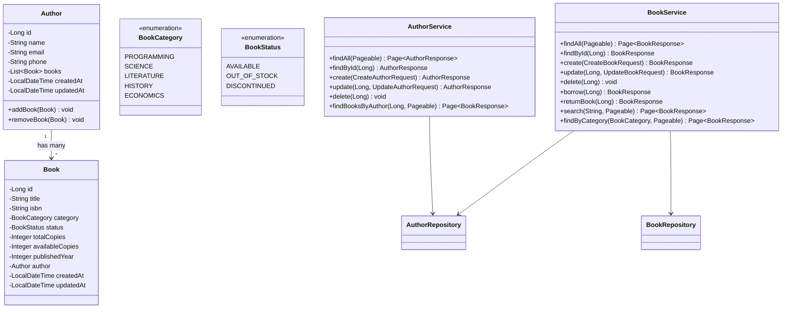
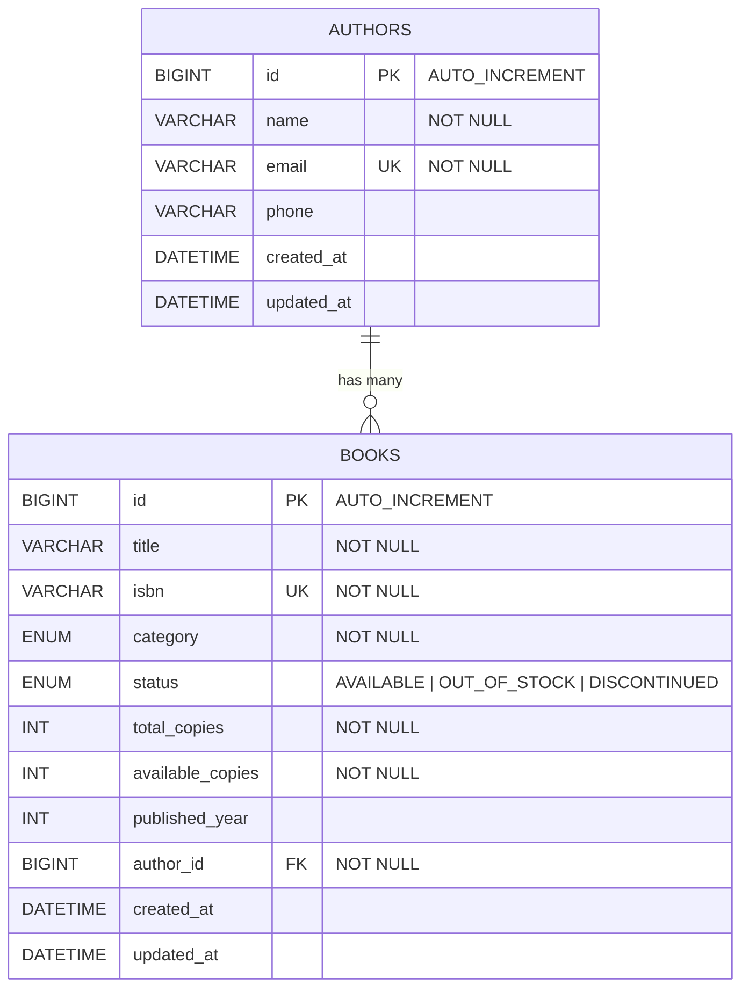

# BTVN Buổi 5 — Hệ thống Quản lý Thư viện

## Đề bài

Xây dựng RESTful API cho hệ thống quản lý thư viện mini gồm 2 entity chính: **Author** (Tác giả) và **Book** (Sách).

---

## Entity

### Author

| Field | Kiểu | Ràng buộc |
|---|---|---|
| `id` | Long | AUTO_INCREMENT, PK |
| `name` | String | NOT NULL, 2–100 ký tự |
| `email` | String | UNIQUE, NOT NULL |
| `phone` | String | 10 ký tự |
| `createdAt` | LocalDateTime | auto set |
| `updatedAt` | LocalDateTime | auto set |

### Book

| Field | Kiểu | Ràng buộc |
|---|---|---|
| `id` | Long | AUTO_INCREMENT, PK |
| `title` | String | NOT NULL, 2–200 ký tự |
| `isbn` | String | UNIQUE, NOT NULL |
| `category` | Enum(`PROGRAMMING`, `SCIENCE`, `LITERATURE`, `HISTORY`, `ECONOMICS`) | NOT NULL |
| `status` | Enum(`AVAILABLE`, `OUT_OF_STOCK`, `DISCONTINUED`) | NOT NULL, default `AVAILABLE` |
| `totalCopies` | Integer | NOT NULL, >= 1 |
| `availableCopies` | Integer | NOT NULL, >= 0 |
| `publishedYear` | Integer | nullable |
| `author` | Author | FK, NOT NULL |
| `createdAt` | LocalDateTime | auto set |
| `updatedAt` | LocalDateTime | auto set |

### Quan hệ

```
Author (1) ──────< Book (N)
```

- 1 Author có nhiều Book
- 1 Book thuộc về đúng 1 Author

---

## API Endpoints

### AuthorController — `/api/authors`

| Method | URL | Mô tả |
|---|---|---|
| `POST` | `/api/authors` | Tạo tác giả mới |
| `GET` | `/api/authors` | Danh sách tác giả (phân trang) |
| `GET` | `/api/authors/{id}` | Chi tiết 1 tác giả |
| `PUT` | `/api/authors/{id}` | Cập nhật tác giả |
| `DELETE` | `/api/authors/{id}` | Xóa tác giả |
| `GET` | `/api/authors/{id}/books` | Danh sách sách của tác giả |

### BookController — `/api/books`

| Method | URL | Mô tả |
|---|---|---|
| `POST` | `/api/books` | Thêm sách mới (gắn với Author qua `authorId`) |
| `GET` | `/api/books` | Danh sách sách (phân trang) |
| `GET` | `/api/books/{id}` | Chi tiết 1 cuốn sách |
| `PUT` | `/api/books/{id}` | Cập nhật thông tin sách |
| `DELETE` | `/api/books/{id}` | Xóa sách |
| `POST` | `/api/books/{id}/borrow` | Mượn sách |
| `POST` | `/api/books/{id}/return` | Trả sách |
| `GET` | `/api/books/search?keyword=` | Tìm sách theo title |
| `GET` | `/api/books/category/{category}` | Lọc sách theo thể loại |

---

## Nghiệp vụ

### Tạo Author
- Email không được trùng → **409** nếu đã tồn tại

### Xóa Author
- Không được xóa nếu Author còn sách trong hệ thống → **400**

### Thêm sách
- `authorId` phải tồn tại → **404** nếu không
- `isbn` không được trùng → **409** nếu đã tồn tại
- `availableCopies` khởi tạo bằng `totalCopies`

### ⭐ Mượn sách (`POST /api/books/{id}/borrow`)
1. Book phải tồn tại → **404**
2. Sách đã `DISCONTINUED` → **400** `"Sách đã ngừng lưu hành"`
3. `availableCopies == 0` → **400** `"Sách hiện tại đã hết"`
4. Giảm `availableCopies` đi 1
5. Nếu `availableCopies` về 0 → chuyển status sang `OUT_OF_STOCK`

### ⭐ Trả sách (`POST /api/books/{id}/return`)
1. Book phải tồn tại → **404**
2. `availableCopies == totalCopies` → **400** `"Sách đã đủ, không thể trả thêm"`
3. Tăng `availableCopies` lên 1
4. Nếu đang `OUT_OF_STOCK` → chuyển status về `AVAILABLE`

### Xóa sách
- Không được xóa nếu `availableCopies < totalCopies` (đang có người mượn) → **400**

---

## Class Diagram



---

## ER Diagram



---

## Kịch bản test Postman

| # | Hành động | Kết quả mong đợi |
|---|---|---|
| 1 | Tạo Author | 201 Created |
| 2 | Tạo Author trùng email | 409 Conflict |
| 3 | Thêm sách với `totalCopies = 3` | 201, `availableCopies = 3`, status `AVAILABLE` |
| 4 | Thêm sách trùng ISBN | 409 Conflict |
| 5 | Mượn sách (lần 1) | `availableCopies = 2` |
| 6 | Mượn sách (lần 2) | `availableCopies = 1` |
| 7 | Mượn sách (lần 3) | `availableCopies = 0`, status → `OUT_OF_STOCK` |
| 8 | Mượn sách (lần 4) | 400 — "Sách hiện tại đã hết" |
| 9 | Trả sách | `availableCopies = 1`, status → `AVAILABLE` |
| 10 | Xóa sách đang có người mượn | 400 — "Không thể xóa" |
| 11 | Xóa Author còn sách | 400 — "Không thể xóa" |
| 12 | `GET /api/books?page=0&size=5` | Phân trang OK |
| 13 | `GET /api/books/search?keyword=hoa` | Tìm kiếm OK |

---

## Nộp bài

- Push lên GitHub
- Hạn nộp: **23h00 14/04/2026**
- Kèm file **README.md** mô tả cách chạy project + danh sách API
