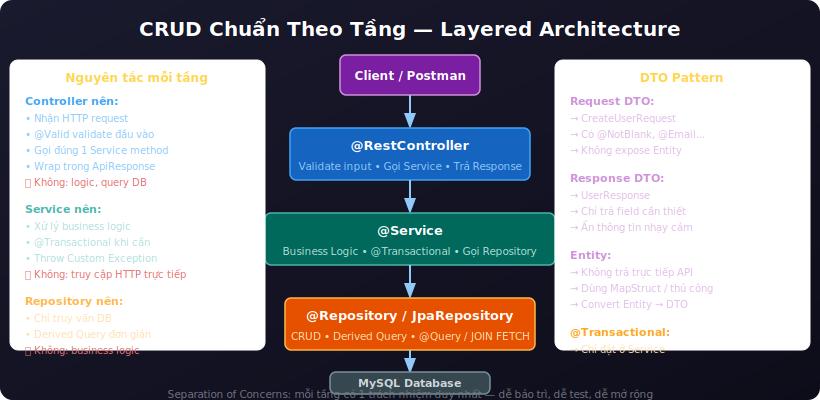
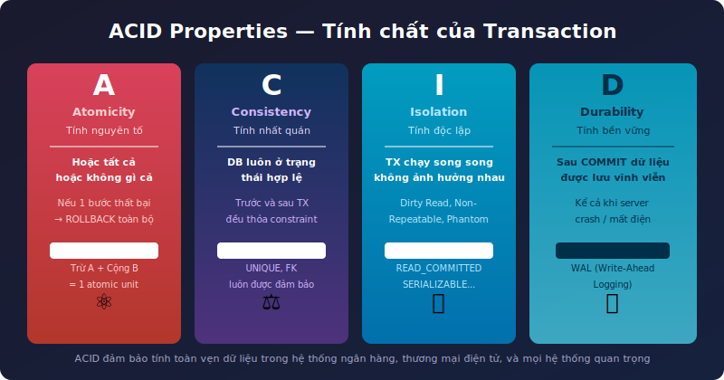
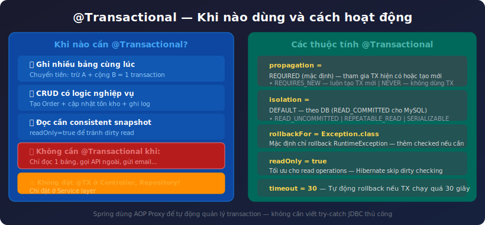
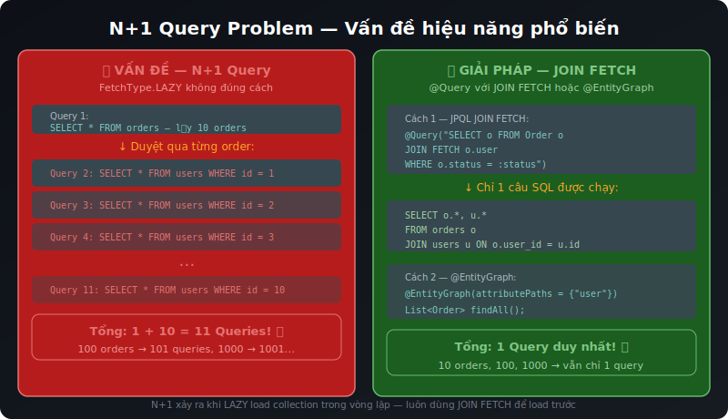
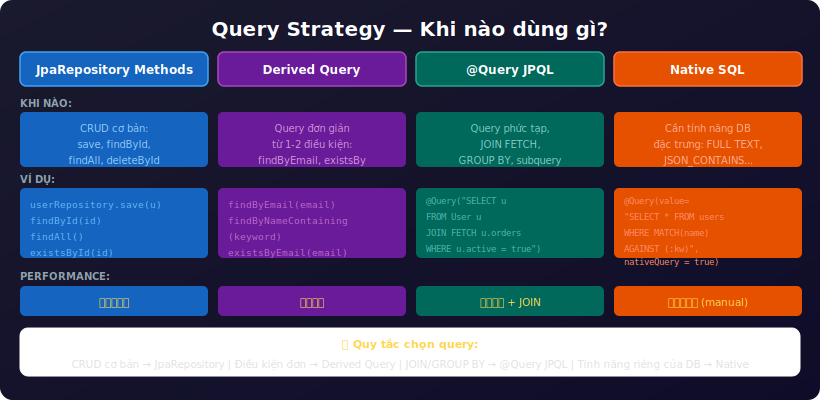
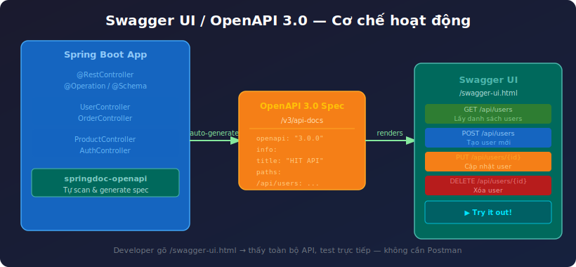
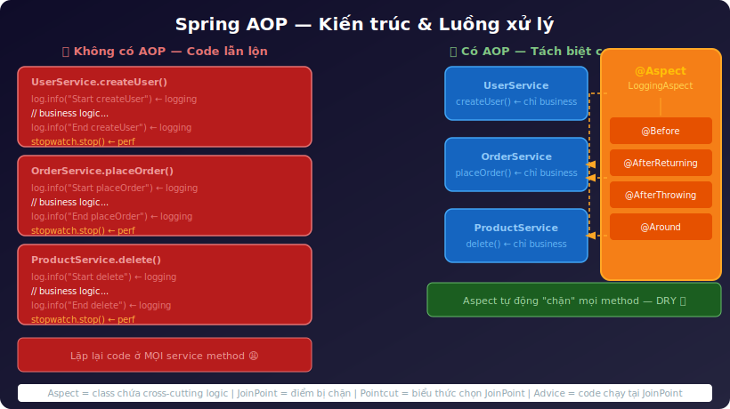
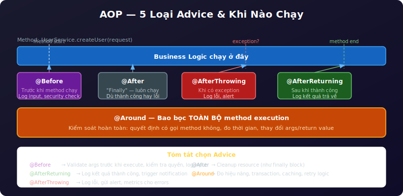

# Buổi 5: JPA CRUD Chuẩn, ACID, Transaction, SQL Optimization, Swagger & AOP

---

## Mục tiêu buổi học

- Thực hành **CRUD chuẩn theo tầng** với đầy đủ DTO Pattern
- Hiểu sâu **ACID** và tại sao Transaction quan trọng trong hệ thống thực tế
- Dùng **`@Transactional`** đúng chỗ — biết khi nào cần, đặt ở đâu
- Chọn **query phù hợp**: Derived Query vs `@Query` vs Native SQL
- Giải quyết **N+1 Query Problem** — lỗi hiệu năng phổ biến nhất khi dùng JPA
- Tích hợp **Swagger / OpenAPI 3.0** — tự sinh tài liệu API
- Hiểu **Spring AOP** và ứng dụng thực tế: Logging, Performance Monitoring

> **Lưu ý:** Buổi 4 đã dạy JPA/Hibernate cơ bản, Entity, Repository. Buổi 5 đi sâu hơn vào **tính đúng đắn** (ACID, Transaction) và **hiệu năng** (query optimization, N+1), đồng thời bổ sung Swagger & AOP.

---

## I. CRUD Chuẩn Theo Tầng — DTO Pattern



### 1. Tại sao không trả Entity trực tiếp?

```
❌ Trả Entity trực tiếp:
    → Lộ thông tin nhạy cảm (password, internal fields)
    → Vòng lặp JSON vô hạn khi có @OneToMany/@ManyToOne
    → Tight coupling giữa DB schema và API contract

✅ Dùng DTO:
    → Kiểm soát hoàn toàn field trả về
    → Tách biệt DB schema với API contract
    → An toàn, dễ phiên bản hóa API
```

### 2. Cấu trúc đầy đủ

```
com.example.demo/
├── entity/          UserEntity.java
├── dto/
│   ├── request/     CreateUserRequest.java, UpdateUserRequest.java
│   └── response/    UserResponse.java
├── controller/      UserController.java
├── service/         UserService.java
└── repository/      UserRepository.java
```

### 3. Request & Response DTO

```java
// CreateUserRequest.java
@Getter @Setter @NoArgsConstructor @AllArgsConstructor
public class CreateUserRequest {

    @NotBlank(message = "Tên không được để trống")
    @Size(min = 2, max = 100)
    private String name;

    @NotBlank @Email(message = "Email không đúng định dạng")
    private String email;

    @Pattern(regexp = "^0[0-9]{9}$", message = "Số điện thoại phải có 10 chữ số")
    private String phoneNumber;
}
```

```java
// UpdateUserRequest.java — email KHÔNG cho phép update qua API này
@Getter @Setter @NoArgsConstructor @AllArgsConstructor
public class UpdateUserRequest {

    @NotBlank @Size(min = 2, max = 100)
    private String name;

    @Pattern(regexp = "^0[0-9]{9}$")
    private String phoneNumber;
}
```

```java
// UserResponse.java — static factory để convert từ Entity
@Getter @Setter @Builder
public class UserResponse {

    private Long id;
    private String name;
    private String email;
    private String phoneNumber;
    private Boolean active;
    private LocalDateTime createdAt;

    public static UserResponse from(User user) {
        return UserResponse.builder()
                .id(user.getId())
                .name(user.getName())
                .email(user.getEmail())
                .phoneNumber(user.getPhoneNumber())
                .active(user.getActive())
                .createdAt(user.getCreatedAt())
                .build();
    }
}
```

### 4. Service — Business Logic + Transaction

```java
@Service
@RequiredArgsConstructor
@Slf4j
public class UserService {

    private final UserRepository userRepository;

    @Transactional(readOnly = true)
    public Page<UserResponse> findAll(Pageable pageable) {
        return userRepository.findAll(pageable).map(UserResponse::from);
    }

    @Transactional(readOnly = true)
    public UserResponse findById(Long id) {
        return userRepository.findById(id)
                .map(UserResponse::from)
                .orElseThrow(() -> new ResourceNotFoundException("User", "id", id));
    }

    @Transactional
    public UserResponse create(CreateUserRequest req) {
        if (userRepository.existsByEmail(req.getEmail()))
            throw new DuplicateResourceException("User", "email", req.getEmail());

        User user = User.builder()
                .name(req.getName()).email(req.getEmail()).phoneNumber(req.getPhoneNumber())
                .active(true).build();
        return UserResponse.from(userRepository.save(user));
    }

    @Transactional
    public UserResponse update(Long id, UpdateUserRequest req) {
        User user = userRepository.findById(id)
                .orElseThrow(() -> new ResourceNotFoundException("User", "id", id));

        user.setName(req.getName());
        user.setPhoneNumber(req.getPhoneNumber());
        // Không cần save() — Dirty Checking tự UPDATE khi transaction kết thúc
        return UserResponse.from(user);
    }

    @Transactional
    public void delete(Long id) {
        if (!userRepository.existsById(id))
            throw new ResourceNotFoundException("User", "id", id);
        userRepository.deleteById(id);
    }
}
```

### 5. Controller — Gọn, chỉ route

```java
@RestController
@RequestMapping("/api/users")
@RequiredArgsConstructor
public class UserController {

    private final UserService userService;

    @GetMapping
    public ResponseEntity<ApiResponse<Page<UserResponse>>> getAll(
            @RequestParam(defaultValue = "0") int page,
            @RequestParam(defaultValue = "10") int size) {
        return ResponseEntity.ok(ApiResponse.success(
                userService.findAll(PageRequest.of(page, size, Sort.by("createdAt").descending()))));
    }

    @GetMapping("/{id}")
    public ResponseEntity<ApiResponse<UserResponse>> getById(@PathVariable Long id) {
        return ResponseEntity.ok(ApiResponse.success(userService.findById(id)));
    }

    @PostMapping
    public ResponseEntity<ApiResponse<UserResponse>> create(@Valid @RequestBody CreateUserRequest req) {
        return ResponseEntity.status(HttpStatus.CREATED).body(ApiResponse.created(userService.create(req)));
    }

    @PutMapping("/{id}")
    public ResponseEntity<ApiResponse<UserResponse>> update(
            @PathVariable Long id, @Valid @RequestBody UpdateUserRequest req) {
        return ResponseEntity.ok(ApiResponse.success("Cập nhật thành công", userService.update(id, req)));
    }

    @DeleteMapping("/{id}")
    public ResponseEntity<ApiResponse<Void>> delete(@PathVariable Long id) {
        userService.delete(id);
        return ResponseEntity.ok(ApiResponse.success("Xóa thành công", null));
    }
}
```

---

## II. ACID — Bốn Tính Chất Của Transaction



### 1. Vì sao cần ACID?

```
Chuyển tiền KHÔNG CÓ ACID:
    Bước 1: Trừ 500k khỏi tài khoản A ✓
    Bước 2: SERVER CRASH ← tại đây!
    → A mất 500k, B không nhận được gì → tiền "biến mất"
```

ACID đảm bảo điều này **không thể xảy ra**.

### 2. A — Atomicity (Tính nguyên tố)

> **"Tất cả hoặc không gì cả"** — mọi bước thành công hoặc ROLLBACK toàn bộ

```java
@Transactional
public void transfer(Long fromId, Long toId, BigDecimal amount) {
    Account from = accountRepository.findById(fromId).orElseThrow(...);
    Account to   = accountRepository.findById(toId).orElseThrow(...);

    if (from.getBalance().compareTo(amount) < 0)
        throw new BadRequestException("Số dư không đủ");

    from.setBalance(from.getBalance().subtract(amount)); // Bước 1
    to.setBalance(to.getBalance().add(amount));          // Bước 2
    // Nếu bước 2 lỗi → bước 1 tự động ROLLBACK
}
```

### 3. C — Consistency (Tính nhất quán)

> **"DB luôn ở trạng thái hợp lệ"** — trước và sau TX đều thỏa constraint

- `NOT NULL`, `UNIQUE`, `FOREIGN KEY`, `CHECK` — luôn được đảm bảo
- Nếu TX vi phạm constraint → tự động ROLLBACK

### 4. I — Isolation (Tính độc lập)

> **"TX song song không ảnh hưởng nhau"**

| Vấn đề | Mô tả |
|---|---|
| **Dirty Read** | Đọc dữ liệu chưa commit của TX khác |
| **Non-Repeatable Read** | Đọc 2 lần cùng query cho kết quả khác |
| **Phantom Read** | Số bản ghi thay đổi giữa 2 lần đọc |

| Isolation Level | Ngăn chặn | Dùng khi |
|---|---|---|
| `READ_COMMITTED` | Dirty Read | Mặc định MySQL InnoDB |
| `REPEATABLE_READ` | + Non-Repeatable | Khi cần snapshot nhất quán |
| `SERIALIZABLE` | Tất cả | Nghiệp vụ ngân hàng (chậm nhất) |

### 5. D — Durability (Tính bền vững)

> **"Sau COMMIT, dữ liệu không bao giờ mất"** — kể cả crash, mất điện

MySQL đảm bảo bằng **WAL** (Write-Ahead Logging): ghi vào log trước khi ghi disk. Khi restart → replay log để phục hồi.

---

## III. @Transactional — Dùng Đúng Cách



### 1. Cơ chế AOP Proxy

```
Có @Transactional — Spring làm ngầm:
    BEGIN TX → method của bạn chạy → COMMIT (hoặc ROLLBACK nếu exception)
```

### 2. Quy tắc đặt @Transactional

```
✅ Đặt ở Service (đúng)
❌ Đặt ở Controller (sai — HTTP layer không nên quản lý TX)
❌ Đặt ở Repository interface (JpaRepository tự quản lý)
   → Ngoại lệ: @Modifying query cần @Transactional
```

### 3. readOnly = true — Tối ưu query đọc

```java
// Mọi GET operation → readOnly = true
@Transactional(readOnly = true)
public UserResponse findById(Long id) { ... }

// Write operations → @Transactional thông thường
@Transactional
public UserResponse create(CreateUserRequest req) { ... }
```

**Lợi ích `readOnly = true`:** Hibernate skip dirty checking → nhanh hơn; có thể route tới read replica.

### 4. rollbackFor — Mặc định chỉ rollback RuntimeException

```java
// Checked Exception → KHÔNG rollback mặc định!
@Transactional(rollbackFor = Exception.class)  // ← Thêm nếu method throws IOException...
public void processFile(...) throws IOException { ... }
```

### 5. Propagation hay dùng

| Propagation | Mô tả | Khi dùng |
|---|---|---|
| `REQUIRED` | Tham gia TX hiện có / tạo mới (mặc định) | Thông thường |
| `REQUIRES_NEW` | Tạo TX mới, suspend TX cũ | Audit log — phải lưu dù nghiệp vụ fail |
| `NESTED` | TX con với savepoint | Rollback 1 phần |

```java
// Ghi log LUÔN thành công dù nghiệp vụ chính fail
@Transactional(propagation = Propagation.REQUIRES_NEW)
public void logFailedAttempt(String msg) { ... }
```

### 6. Self-Invocation — Lỗi hay gặp

```java
@Service
public class UserService {
    public void createBatch(List<...> list) {
        list.forEach(req -> this.create(req)); // ← @Transactional KHÔNG hoạt động!
    }

    @Transactional
    public void create(CreateUserRequest req) { ... }
}
// Lý do: Spring dùng Proxy — gọi this.method() bỏ qua Proxy
// Fix: tách createBatch ra class khác, hoặc đặt @Transactional trên createBatch
```

---

## IV. Dirty Checking — Không Cần Gọi save() Khi Update

```java
@Transactional
public UserResponse update(Long id, UpdateUserRequest req) {
    User user = userRepository.findById(id).orElseThrow(...);
    // Hibernate "snapshot" trạng thái này

    user.setName(req.getName());       // Thay đổi
    user.setPhoneNumber(req.getPhone()); // Thay đổi

    // ← KHÔNG cần userRepository.save(user) !
    // Khi TX kết thúc → Hibernate so snapshot → phát hiện thay đổi → tự UPDATE

    return UserResponse.from(user);
}
```

| Tình huống | Cần save()? |
|---|---|
| Tạo mới entity (INSERT) | **Có** |
| Update entity trong @Transactional | **Không** |
| Entity detached (ngoài session) | **Có** (để re-attach) |

---

## V. N+1 Query Problem



### 1. Vấn đề

```java
// User có nhiều Order (LAZY)
List<User> users = userRepository.findAll();     // Query 1: SELECT * FROM users

users.forEach(user -> {
    int count = user.getOrders().size();         // Query 2, 3, 4 ... N+1 !!!
});
// 100 users → 101 queries. 1000 users → 1001 queries!
```

### 2. Phát hiện

```properties
spring.jpa.show-sql=true
spring.jpa.properties.hibernate.format_sql=true
```

Thấy nhiều `SELECT * FROM orders WHERE user_id = ?` liên tiếp → đang bị N+1.

### 3. Giải pháp

```java
// Cách 1: JOIN FETCH — chỉ 1 SQL duy nhất
@Query("SELECT u FROM User u JOIN FETCH u.orders WHERE u.active = true")
List<User> findActiveUsersWithOrders();

// Cách 2: @EntityGraph
@EntityGraph(attributePaths = {"orders"})
List<User> findByActive(Boolean active);

// Cách 3: DTO Projection — chỉ SELECT field cần, không cần load entity
@Query("SELECT new com.example.dto.UserOrderCountDto(u.name, COUNT(o)) " +
       "FROM User u LEFT JOIN u.orders o GROUP BY u.id, u.name")
List<UserOrderCountDto> findUsersWithOrderCount();
```

> ⚠️ **JOIN FETCH + Pagination:** Không kết hợp trực tiếp — Hibernate load toàn bộ DB vào memory rồi mới phân trang! Dùng 2 query riêng với `countQuery`.

---

## VI. Query Strategy — Đặt Query Như Thế Nào?



```
Độ phức tạp tăng dần:
    JpaRepository built-in   →  Derived Query  →  @Query JPQL  →  Native SQL
         (CRUD cơ bản)          (1-2 điều kiện)   (JOIN, GROUP)    (DB-specific)
```

### Derived Query — Khi nào dừng?

```java
// ✅ Dùng được
Optional<User> findByEmail(String email);
List<User> findByActiveTrue();
Page<User> findByNameContainingIgnoreCase(String name, Pageable p);

// ❌ Quá dài → chuyển sang @Query
Optional<User> findByNameAndEmailAndAgeGreaterThanAndActiveTrueOrderByCreatedAtDesc(...);
// Rule: tên method > 50 ký tự = dấu hiệu cần @Query
```

### @Query JPQL — Best Practices

```java
// JOIN FETCH: tránh N+1
@Query("SELECT DISTINCT o FROM Order o JOIN FETCH o.user JOIN FETCH o.items WHERE o.status = :status")
List<Order> findOrdersWithDetails(@Param("status") OrderStatus status);

// Bulk UPDATE: không load entity vào memory
@Modifying(clearAutomatically = true)
@Transactional
@Query("UPDATE Order o SET o.status = :new WHERE o.status = :old")
int updateStatusBulk(@Param("old") OrderStatus old, @Param("new") OrderStatus nw);
```

> ⚠️ `@Modifying` cần `clearAutomatically = true` để xóa Hibernate cache sau khi bulk update.

---

## VII. SQL Optimization

### 1. Pagination — Không bao giờ load toàn bảng

```java
// ❌ Nguy hiểm với bảng triệu records
List<User> all = userRepository.findAll();

// ✅ Luôn dùng Pageable
Pageable pageable = PageRequest.of(page, size, Sort.by("createdAt").descending());
Page<UserResponse> result = userRepository.findAll(pageable).map(UserResponse::from);
```

### 2. Projection — Chỉ SELECT field cần thiết

```java
// Interface Projection — Spring tự sinh SELECT name, email
public interface UserNameEmail {
    String getName();
    String getEmail();
}
List<UserNameEmail> findByActiveTrue(); // Nhẹ hơn load toàn bộ User
```

### 3. Index

```java
@Entity
@Table(name = "users", indexes = {
    @Index(name = "idx_email", columnList = "email", unique = true),
    @Index(name = "idx_active_created", columnList = "is_active, created_at")
})
public class User { ... }
```

```sql
-- Kiểm tra có dùng index không
EXPLAIN SELECT * FROM users WHERE email = 'a@b.com';
-- Key: idx_email → ✅

-- LIKE '%keyword%' KHÔNG dùng được index!
WHERE name LIKE 'nguyen%'    -- ✅ prefix = có index
WHERE name LIKE '%nguyen%'   -- ❌ contains = full table scan
```

### 4. Batch — Ghi nhiều records hiệu quả

```properties
# application.properties
spring.jpa.properties.hibernate.jdbc.batch_size=50
spring.jpa.properties.hibernate.order_inserts=true
spring.jpa.properties.hibernate.order_updates=true
```

```java
// Dùng saveAll() thay vì save() từng cái
userRepository.saveAll(userList); // Hibernate batch 50 records/query
```

---

## VIII. Swagger / OpenAPI 3.0



### 1. Vấn đề

```
Backend: "Xong rồi, API sẵn sàng!"
Frontend: "API nhận gì? Trả gì? Field tên là gì? Cần token không?"
→ Mất thời gian giải thích thủ công, dễ lỗi thời khi API thay đổi
```

**OpenAPI + Swagger UI:** Tự sinh docs từ code, giao diện test API trực tiếp trên browser.

### 2. Thêm Dependency

```xml
<dependency>
    <groupId>org.springdoc</groupId>
    <artifactId>springdoc-openapi-starter-webmvc-ui</artifactId>
    <version>2.3.0</version>
</dependency>
```

**Sau khi thêm, không cần config gì thêm:**
- Swagger UI: `http://localhost:8080/swagger-ui.html`
- JSON spec: `http://localhost:8080/v3/api-docs`

### 3. Cấu hình thông tin API

```java
@Configuration
public class OpenApiConfig {

    @Bean
    public OpenAPI customOpenAPI() {
        return new OpenAPI()
                .info(new Info()
                        .title("HIT Spring Boot API")
                        .version("1.0.0")
                        .description("API cho ứng dụng Spring Boot — HIT Club"))
                .addSecurityItem(new SecurityRequirement().addList("Bearer Auth"))
                .components(new Components()
                        .addSecuritySchemes("Bearer Auth", new SecurityScheme()
                                .type(SecurityScheme.Type.HTTP)
                                .scheme("bearer")
                                .bearerFormat("JWT")));
    }
}
```

```properties
# Tùy chỉnh URL (tùy chọn)
springdoc.swagger-ui.path=/docs

# Tắt hoàn toàn trên production
springdoc.swagger-ui.enabled=false
springdoc.api-docs.enabled=false
```

### 4. Annotation trên Controller & DTO

```java
@RestController
@RequestMapping("/api/users")
@Tag(name = "User Management", description = "API quản lý người dùng")
public class UserController {

    @Operation(summary = "Lấy danh sách users có phân trang")
    @ApiResponses({
        @ApiResponse(responseCode = "200", description = "Thành công"),
        @ApiResponse(responseCode = "401", description = "Chưa xác thực")
    })
    @GetMapping
    public ResponseEntity<ApiResponse<Page<UserResponse>>> getAll(
            @Parameter(description = "Số trang, bắt đầu từ 0", example = "0")
            @RequestParam(defaultValue = "0") int page,
            @Parameter(description = "Số phần tử/trang", example = "10")
            @RequestParam(defaultValue = "10") int size) { ... }

    @Operation(summary = "Tạo user mới")
    @PostMapping
    public ResponseEntity<ApiResponse<UserResponse>> create(
            @RequestBody CreateUserRequest req) { ... }
}
```

```java
@Getter @Setter @NoArgsConstructor @AllArgsConstructor
@Schema(description = "Dữ liệu để tạo user mới")
public class CreateUserRequest {

    @Schema(description = "Tên đầy đủ", example = "Nguyễn Văn A")
    @NotBlank private String name;

    @Schema(description = "Email", example = "a@gmail.com")
    @NotBlank @Email private String email;
}
```

### 5. Bảng Annotation Swagger

| Annotation | Đặt ở | Tác dụng |
|---|---|---|
| `@Tag` | Controller class | Nhóm API trong Swagger UI |
| `@Operation` | Method | Mô tả summary + description |
| `@ApiResponse` | Method | Mô tả HTTP response codes |
| `@Parameter` | `@PathVariable`, `@RequestParam` | Mô tả tham số |
| `@Schema` | DTO class / field | Mô tả kiểu dữ liệu, ví dụ |
| `@Hidden` | Method / Class | Ẩn khỏi Swagger UI |

---

## IX. Spring AOP — Aspect Oriented Programming



### 1. Vấn đề AOP giải quyết

```java
// ❌ Logging lặp lại ở MỌI service method
public UserResponse create(CreateUserRequest req) {
    log.info("→ createUser: {}", req.getEmail());   // ← lặp lại
    long start = System.currentTimeMillis();          // ← lặp lại
    // ... business logic ...
    log.info("← completed in {}ms", elapsed);         // ← lặp lại
}
// → Vi phạm DRY, khó bảo trì

// ✅ AOP: viết 1 lần, tự động áp dụng cho MỌI service method
```

### 2. Các khái niệm cốt lõi

| Khái niệm | Là gì | Ví dụ |
|---|---|---|
| **Aspect** | Class chứa cross-cutting logic | `LoggingAspect.java` |
| **Advice** | Code thực sự chạy bên trong Aspect | Method log, method đo thời gian |
| **JoinPoint** | Điểm chương trình nơi Advice có thể chạy | Một method được gọi |
| **Pointcut** | Biểu thức chọn JoinPoint nào áp dụng | `execution(* service.*.*(..))` |
| **Weaving** | Quá trình kết nối Aspect vào code | Spring làm qua Proxy tự động |

> **Analogy:** Cửa quay (turnstile) tòa nhà — mọi người vào/ra đều tự động bị log mà không cần tự report. AOP cũng vậy: Aspect tự động "chặn" mọi method call.

### 3. 5 Loại Advice



```java
@Aspect
@Component
public class DemoAspect {

    // ① Trước khi method chạy
    @Before("execution(* com.example.service.*.*(..))")
    public void before(JoinPoint jp) { ... }

    // ② Sau khi kết thúc — dù thành công hay lỗi (như finally)
    @After("execution(* com.example.service.*.*(..))")
    public void after(JoinPoint jp) { ... }

    // ③ Sau khi THÀNH CÔNG — nhận được giá trị trả về
    @AfterReturning(pointcut = "execution(* com.example.service.*.*(..))", returning = "result")
    public void afterReturning(JoinPoint jp, Object result) { ... }

    // ④ Khi có EXCEPTION
    @AfterThrowing(pointcut = "execution(* com.example.service.*.*(..))", throwing = "ex")
    public void afterThrowing(JoinPoint jp, Exception ex) { ... }

    // ⑤ Bao bọc HOÀN TOÀN — mạnh nhất, dùng nhiều nhất
    @Around("execution(* com.example.service.*.*(..))")
    public Object around(ProceedingJoinPoint pjp) throws Throwable {
        // Code trước
        Object result = pjp.proceed(); // Gọi method thực tế
        // Code sau
        return result;
    }
}
```

### 4. Pointcut Expression

```java
// Cú pháp: execution([modifier] return-type class.method(params))
execution(* com.example.service.*.*(..))        // Mọi method trong package service
execution(* com.example.service.UserService.*(..)) // Chỉ UserService
execution(public * *(..))                        // Mọi public method
@annotation(com.example.annotation.LogPerformance) // Method có annotation cụ thể
@within(org.springframework.stereotype.Service)  // Mọi method trong @Service class

// Kết hợp && || !
@Pointcut("execution(* service.*.*(..)) && !execution(* service.*.get*(..))")
public void writeOps() {} // Service methods NGOẠI TRỪ các get*
```

### 5. Ví dụ thực tế: Logging Aspect

```java
@Aspect
@Component
@Slf4j
public class LoggingAspect {

    @Pointcut("execution(* com.example.service.*.*(..))")
    public void serviceLayer() {}

    @Around("serviceLayer()")
    public Object log(ProceedingJoinPoint pjp) throws Throwable {
        String method = pjp.getSignature().toShortString();
        log.info("→ [{}] args: {}", method, Arrays.toString(pjp.getArgs()));
        long start = System.currentTimeMillis();
        try {
            Object result = pjp.proceed();
            log.info("← [{}] completed in {}ms", method, System.currentTimeMillis() - start);
            return result;
        } catch (Exception e) {
            log.error("✗ [{}] threw: {}", method, e.getMessage());
            throw e;
        }
    }
}
```

**Service không cần thay đổi gì** — log tự động xuất hiện cho mọi method!

### 6. Ví dụ: Custom Annotation + Performance

```java
// Định nghĩa annotation
@Target(ElementType.METHOD)
@Retention(RetentionPolicy.RUNTIME)
public @interface TrackPerformance {}

// Aspect
@Aspect @Component @Slf4j
public class PerformanceAspect {

    @Around("@annotation(com.example.annotation.TrackPerformance)")
    public Object track(ProceedingJoinPoint pjp) throws Throwable {
        long start = System.currentTimeMillis();
        Object result = pjp.proceed();
        long elapsed = System.currentTimeMillis() - start;
        if (elapsed > 500)
            log.warn("⚠️ SLOW [{}]: {}ms", pjp.getSignature().getName(), elapsed);
        return result;
    }
}

// Dùng trong Service
@TrackPerformance  // ← AOP tự đo thời gian
public List<UserResponse> generateReport(int year) { ... }
```

### 7. Bảng chọn Advice theo Use Case

| Use Case | Advice | Ghi chú |
|---|---|---|
| Log input/output, đo thời gian | `@Around` | Phổ biến nhất |
| Security check trước khi execute | `@Before` | Kiểm tra quyền |
| Ghi audit trail khi thành công | `@AfterReturning` | Nhận được return value |
| Log lỗi, gửi alert | `@AfterThrowing` | Chỉ chạy khi có exception |
| Cleanup resource | `@After` | Chạy dù thành công hay lỗi |

> ⚠️ **Self-invocation:** Gọi `this.method()` trong cùng class → AOP **không hoạt động** (bỏ qua Proxy) — giống vấn đề `@Transactional` self-invocation.

> **Thực tế:** `@Transactional`, `@Cacheable` trong Spring đều được implement bằng AOP!

---

## Tổng Kết Buổi 5

| Chủ đề | Nội dung chính |
|---|---|
| DTO Pattern | Không trả Entity trực tiếp; `UserResponse.from(entity)` convert |
| ACID | Atomicity (all-or-nothing), Consistency, Isolation, Durability |
| @Transactional | Đặt ở Service; `readOnly=true` cho GET; `rollbackFor` cho checked exception |
| Dirty Checking | Entity MANAGED trong TX → không cần `save()` khi update |
| N+1 Problem | Nhận diện qua `show-sql`; giải quyết bằng JOIN FETCH / @EntityGraph |
| Query Strategy | Built-in → Derived Query → @Query JPQL → Native SQL |
| SQL Optimization | Pagination, Index, Projection, Batch, tránh SELECT * |
| Swagger / OpenAPI | springdoc tự scan → `@Tag`, `@Operation`, `@Schema` → Swagger UI |
| Spring AOP | Aspect, Advice, Pointcut; `@Around` cho logging, performance monitoring |

---

## Câu Hỏi Ôn Tập

1. Tại sao không trả Entity trực tiếp trong REST API? Cách fix là gì?
2. ACID là gì? Giải thích bằng ví dụ chuyển tiền.
3. `@Transactional` self-invocation — vấn đề là gì và cách fix?
4. Dirty Checking là gì? Khi nào cần / không cần gọi `save()`?
5. N+1 Query xảy ra thế nào? Nêu 3 cách giải quyết.
6. `@Modifying` cần đi kèm gì? `clearAutomatically = true` dùng để làm gì?
7. Tại sao `LIKE '%keyword%'` không dùng được Index?
8. Swagger cần thêm dependency gì? Truy cập ở URL nào?
9. `@Operation` khác `@Tag` ở điểm nào? Đặt ở đâu?
10. AOP là gì? `@Around` khác `@Before` + `@After` ở điểm nào quan trọng?
11. `@Transactional` trong Spring có phải AOP không? Giải thích.
12. Pointcut `@within(Service)` và `execution(* service.*.*(..))` khác nhau thế nào?

---

## Bài Tập Thực Hành

### Bài 1: CRUD chuẩn với DTO
- Lấy lại bài từ Buổi 4, tách `CreateUserRequest`, `UpdateUserRequest`, `UserResponse` riêng
- Thêm `UserResponse.from(User)`, đảm bảo Controller không trả Entity
- Thêm endpoint `GET /api/users?page=0&size=10`

### Bài 2: Swagger UI
- Thêm `springdoc-openapi-starter-webmvc-ui`
- Tạo `OpenApiConfig`, thêm `@Tag` + `@Operation` + `@Schema` cho ít nhất 1 Controller
- Test API trực tiếp trên `/swagger-ui.html`

### Bài 3: Logging Aspect
- Tạo `LoggingAspect` với `@Around("execution(* com.example.service.*.*(..))")`
- Log tên method, args, thời gian thực thi, exception nếu có
- Chạy app → xem log tự động xuất hiện

### Bài 4: Bank Transfer (ACID thực tế)
- Entity `Account` (id, accountNumber, balance)
- API `POST /api/accounts/transfer` → body `{fromAccount, toAccount, amount}`
- `@Transactional` đảm bảo ACID: fail bất kỳ bước nào → rollback toàn bộ
- Test: đủ tiền ✓, không đủ ✗, account không tồn tại ✗

### Bài 5 (Nâng cao): N+1 Fix
- Tạo quan hệ `User → Order`, viết method cố ý gây N+1
- Bật `show-sql`, đếm số query
- Fix bằng `JOIN FETCH`, đếm lại → phải chỉ còn 1 query

---

## Tài Liệu Tham Khảo

### Transaction & JPA

- [Spring Data JPA — @Transactional](https://docs.spring.io/spring-data/jpa/reference/jpa/transactions.html)
- [Hibernate — Dirty Checking](https://docs.jboss.org/hibernate/orm/6.4/userguide/html_single/Hibernate_User_Guide.html#pc-managed-state)
- [Hibernate — Fetching Strategies](https://docs.jboss.org/hibernate/orm/6.4/userguide/html_single/Hibernate_User_Guide.html#fetching)
- [Baeldung — @Transactional](https://www.baeldung.com/transaction-configuration-with-jpa-and-spring)
- [Baeldung — JPA N+1 Problem](https://www.baeldung.com/spring-hibernate-n1-problem)
- [Baeldung — Spring Data JPA Projections](https://www.baeldung.com/spring-data-jpa-projections)
- [MySQL — ACID & InnoDB](https://dev.mysql.com/doc/refman/8.0/en/innodb-transaction-model.html)
- [Viblo — Transaction và ACID](https://viblo.asia/p/transaction-va-acid-trong-database-GrLZDXr2Zk0)
- [Viblo — N+1 Query trong JPA](https://viblo.asia/p/n1-query-problem-trong-jpa-hibernate-va-cach-phong-tranh-L4x5xnV1KBM)

### Swagger / OpenAPI

- [springdoc-openapi Official](https://springdoc.org/)
- [OpenAPI 3.0 Specification](https://swagger.io/specification/)
- [Baeldung — Spring REST API with OpenAPI 3](https://www.baeldung.com/spring-rest-openapi-documentation)
- [Viblo — Tích hợp Swagger vào Spring Boot](https://viblo.asia/p/tich-hop-swagger-vao-spring-boot-3-Qbq5QRBzKD8)

### Spring AOP

- [Spring AOP Official Reference](https://docs.spring.io/spring-framework/reference/core/aop.html)
- [Baeldung — Introduction to Spring AOP](https://www.baeldung.com/spring-aop)
- [Baeldung — Spring AOP Pointcut Expressions](https://www.baeldung.com/spring-aop-pointcut-tutorial)
- [Baeldung — Custom Spring AOP Annotation](https://www.baeldung.com/spring-aop-annotation)
- [Viblo — Spring AOP từ cơ bản tới nâng cao](https://viblo.asia/p/spring-aop-tu-co-ban-toi-nang-cao-4dbZNxnqZYM)
