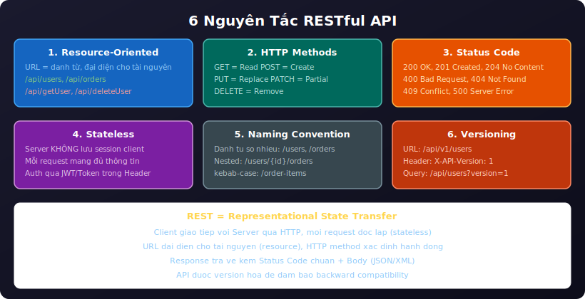
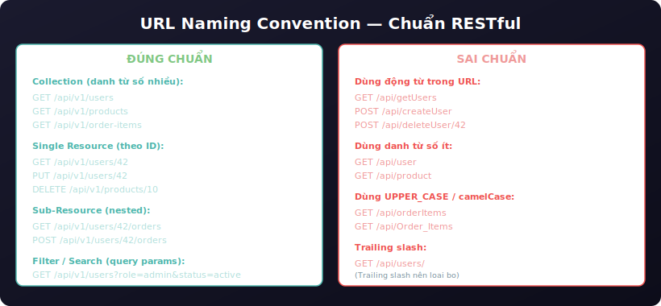
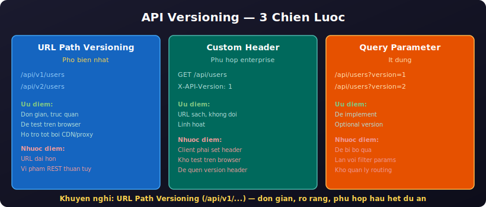
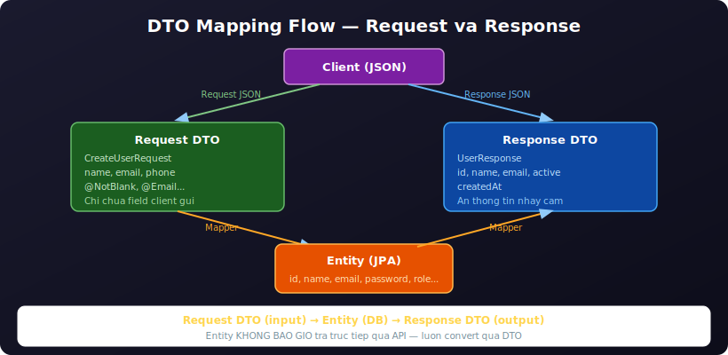
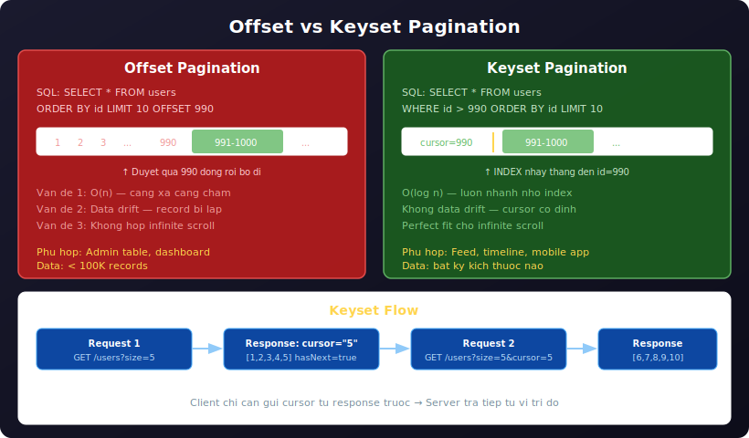
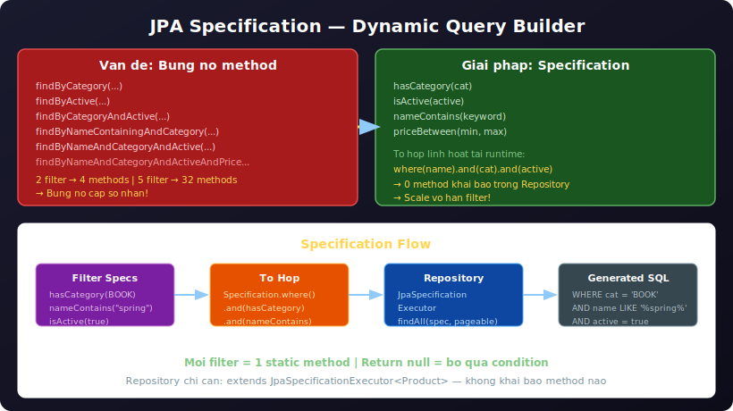
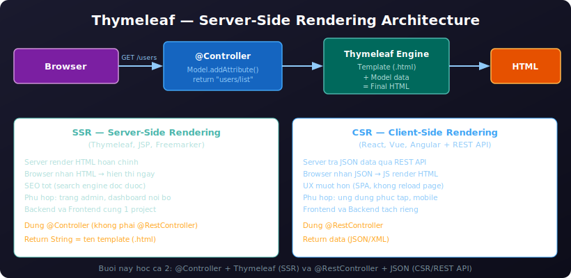
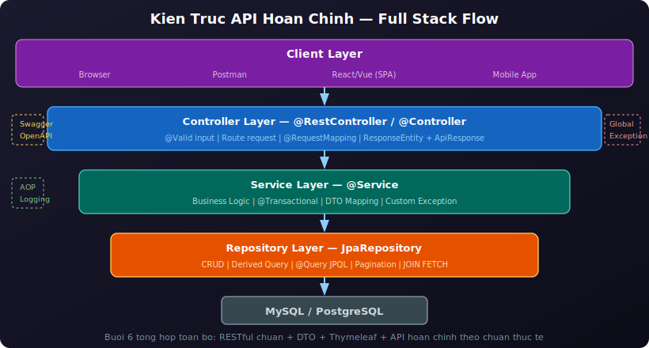

# Buổi 6: Xây Dựng RESTful API Chuẩn & Thymeleaf

---

## Mục tiêu buổi học

- Thiết kế **URL naming convention** chuẩn REST — phân biệt đúng/sai
- **DTO Mapping nâng cao** — List vs Detail DTO, Nested DTO, MapStruct
- Phân biệt **Offset vs Keyset Pagination** — khi nào chọn cái nào
- Triển khai **Keyset Pagination** (cursor-based) trong Spring Boot
- Sử dụng **JPA Specification** — dynamic query builder, tổ hợp filter linh hoạt
- Hiểu **API Versioning** — 3 chiến lược, chọn phù hợp
- Tích hợp **Thymeleaf** — Server-Side Rendering với Spring Boot
- Hoàn thiện bộ API **theo chuẩn thực tế** — từ thiết kế đến triển khai

> **Lưu ý:** Các buổi trước đã dạy REST cơ bản & HTTP Methods (Buổi 2), Validation & Exception Handling (Buổi 3), JPA/Hibernate & Entity (Buổi 4), DTO/Transaction/Swagger/AOP (Buổi 5). Buổi 6 **không lặp lại** mà **nâng cấp** thành bộ API hoàn chỉnh theo chuẩn REST thực tế, bổ sung Thymeleaf cho Server-Side Rendering.

---

## I. RESTful API — Chuẩn Hóa URL & Versioning



> **Nhắc lại nhanh:** Buổi 2 đã dạy REST là gì, HTTP Methods (GET/POST/PUT/PATCH/DELETE), Status Code (2xx/4xx/5xx), Resource-Oriented URL. Buổi 6 bổ sung **2 phần chưa học**: URL Naming Convention chi tiết và API Versioning.

### 1. URL Naming Convention



**Quy tắc đặt tên URL chuẩn REST:**

| Quy tắc | Ví dụ đúng | Ví dụ sai |
|---|---|---|
| Dùng danh từ **số nhiều** | `/api/users`, `/api/orders` | `/api/user`, `/api/order` |
| Dùng **kebab-case** (dấu gạch ngang) | `/api/order-items` | `/api/orderItems`, `/api/Order_Items` |
| Dùng **chữ thường** | `/api/users` | `/api/Users`, `/api/USERS` |
| **Không có trailing slash** | `/api/users` | `/api/users/` |
| **Không dùng động từ** trong URL | `POST /api/users` | `POST /api/create-user` |
| **Không dùng file extension** | `/api/users` | `/api/users.json` |

**Sub-resources (nested resources):**

```
1 User có nhiều Order → truy cập Order của User cụ thể:

GET  /api/users/{userId}/orders          → Danh sách order của user
GET  /api/users/{userId}/orders/{orderId} → Chi tiết 1 order
POST /api/users/{userId}/orders          → Tạo order cho user

Khi nào dùng nested?
    → Khi sub-resource KHÔNG tồn tại NGOÀI parent resource
    → Ví dụ: Order luôn thuộc về 1 User → nested hợp lý

Khi nào KHÔNG dùng nested?
    → Khi resource có thể đứng độc lập
    → Ví dụ: Product không thuộc về User → GET /api/products (flat)
```

**Filtering, Sorting, Searching — qua Query Parameters:**

```
GET /api/users?status=active&role=admin     → Filter
GET /api/users?sort=createdAt,desc          → Sort
GET /api/users?search=nguyen                → Search
GET /api/users?page=0&size=20              → Pagination

❌ SAI: GET /api/users/active              → Không dùng path cho filter
❌ SAI: GET /api/users/search/nguyen       → Search nên qua query param
```

### 2. API Versioning



Khi API thay đổi (thêm/bỏ field, đổi logic), cần **version** để không phá client cũ.

**3 chiến lược:**

| Chiến lược | URL | Ưu điểm | Nhược điểm |
|---|---|---|---|
| **URL Path** | `/api/v1/users` | Trực quan, dễ test | URL dài hơn |
| **Custom Header** | `X-API-Version: 1` | URL sạch | Khó test trên browser |
| **Query Param** | `/api/users?version=1` | Dễ implement | Dễ bị bỏ qua |

**Triển khai URL Path Versioning trong Spring Boot (khuyến nghị):**

```java
// Cách 1: Đặt version trong @RequestMapping class level
@RestController
@RequestMapping("/api/v1/users")
public class UserControllerV1 { ... }

@RestController
@RequestMapping("/api/v2/users")
public class UserControllerV2 { ... }

// Cách 2: Đặt base path trong application.properties
// server.servlet.context-path=/api/v1
// → Tất cả URL tự động bắt đầu bằng /api/v1
```

```properties
# application.properties — context-path cho toàn bộ API
server.servlet.context-path=/api/v1
```

> **Thực tế:** Đa số dự án dùng **URL Path Versioning** (`/api/v1/...`) vì đơn giản, rõ ràng, dễ test. Chỉ version khi API **thực sự thay đổi breaking change**.


---

## II. DTO Mapping Nâng Cao



> Buổi 5 đã giới thiệu DTO cơ bản (CreateUserRequest, UpdateUserRequest, UserResponse, static factory `from()`). Buổi 6 hoàn thiện **DTO mapping theo chuẩn thực tế** — tách List/Detail, Nested DTO, và MapStruct.

### 1. Tách biệt Response cho List vs Detail

```java
// Response cho danh sách — chỉ field cơ bản
@Getter @Setter @Builder
public class UserListResponse {

    private Long id;
    private String name;
    private String email;
    private Boolean active;

    public static UserListResponse from(User user) {
        return UserListResponse.builder()
                .id(user.getId())
                .name(user.getName())
                .email(user.getEmail())
                .active(user.getActive())
                .build();
    }
}

// Response cho chi tiết — đầy đủ hơn
@Getter @Setter @Builder
public class UserDetailResponse {

    private Long id;
    private String name;
    private String email;
    private String phoneNumber;
    private Boolean active;
    private LocalDateTime createdAt;
    private LocalDateTime updatedAt;
    private List<OrderSummary> recentOrders;  // Thông tin bổ sung cho detail

    public static UserDetailResponse from(User user) {
        return UserDetailResponse.builder()
                .id(user.getId())
                .name(user.getName())
                .email(user.getEmail())
                .phoneNumber(user.getPhoneNumber())
                .active(user.getActive())
                .createdAt(user.getCreatedAt())
                .updatedAt(user.getUpdatedAt())
                .build();
    }
}
```

### 2. Nested DTO — Response chứa sub-resource

```java
// Book Response chứa thông tin Author (gọn)
@Getter @Setter @Builder
public class BookResponse {

    private Long id;
    private String title;
    private String isbn;
    private String category;
    private AuthorSummary author;  // ← Nested DTO, không phải Entity

    @Getter @Setter @Builder
    public static class AuthorSummary {
        private Long id;
        private String name;

        public static AuthorSummary from(Author author) {
            return AuthorSummary.builder()
                    .id(author.getId())
                    .name(author.getName())
                    .build();
        }
    }

    public static BookResponse from(Book book) {
        return BookResponse.builder()
                .id(book.getId())
                .title(book.getTitle())
                .isbn(book.getIsbn())
                .category(book.getCategory().name())
                .author(AuthorSummary.from(book.getAuthor()))
                .build();
    }
}
```

> **Quy tắc:** Khi Response cần data từ Entity khác → tạo **inner DTO** (AuthorSummary) thay vì nhúng Entity trực tiếp. Tránh vòng lặp JSON vô hạn.

### 3. MapStruct — Auto Mapping (tùy chọn nâng cao)

Khi project lớn, mapping thủ công gây lặp code. **MapStruct** tự sinh code convert tại compile time:

```xml
<!-- pom.xml -->
<dependency>
    <groupId>org.mapstruct</groupId>
    <artifactId>mapstruct</artifactId>
    <version>1.5.5.Final</version>
</dependency>

<!-- annotation processor -->
<plugin>
    <groupId>org.apache.maven.plugins</groupId>
    <artifactId>maven-compiler-plugin</artifactId>
    <configuration>
        <annotationProcessorPaths>
            <path>
                <groupId>org.mapstruct</groupId>
                <artifactId>mapstruct-processor</artifactId>
                <version>1.5.5.Final</version>
            </path>
            <path>
                <groupId>org.projectlombok</groupId>
                <artifactId>lombok</artifactId>
                <version>${lombok.version}</version>
            </path>
            <path>
                <groupId>org.projectlombok</groupId>
                <artifactId>lombok-mapstruct-binding</artifactId>
                <version>0.2.0</version>
            </path>
        </annotationProcessorPaths>
    </configuration>
</plugin>
```

```java
@Mapper(componentModel = "spring")
public interface UserMapper {

    UserResponse toResponse(User user);

    @Mapping(target = "id", ignore = true)
    @Mapping(target = "createdAt", ignore = true)
    @Mapping(target = "active", constant = "true")
    User toEntity(CreateUserRequest request);

    void updateFromRequest(UpdateUserRequest request, @MappingTarget User user);
}

// Sử dụng trong Service
@Service
@RequiredArgsConstructor
public class UserService {

    private final UserRepository userRepository;
    private final UserMapper userMapper;  // ← inject Mapper

    @Transactional
    public UserResponse create(CreateUserRequest req) {
        User user = userMapper.toEntity(req);
        return userMapper.toResponse(userRepository.save(user));
    }
}
```

> **Khuyến nghị:** Với project nhỏ/vừa, dùng **static factory `from()`** là đủ. MapStruct phù hợp khi entity/DTO lớn và nhiều use case mapping.


---

## III. Pagination — Offset vs Keyset



> Buổi 5 đã giới thiệu cơ bản `Page<T>` và `Pageable` (Offset Pagination). Buổi 6 giới thiệu **Keyset Pagination** — chiến lược hiệu quả hơn cho dữ liệu lớn.

### 1. Offset Pagination — Vấn đề gì?

Offset pagination dùng `LIMIT` + `OFFSET` để phân trang theo "số trang":

```
SQL thực tế khi client gọi ?page=0&size=10:
    SELECT * FROM users ORDER BY id LIMIT 10 OFFSET 0     → Trang 1

Khi client gọi ?page=99&size=10:
    SELECT * FROM users ORDER BY id LIMIT 10 OFFSET 990   → Trang 100
    → Database phải DUYỆT QUA 990 dòng trước rồi mới lấy 10 dòng tiếp
    → Càng xa → càng chậm
```

> **Nhắc lại:** Spring Data mặc định dùng Offset Pagination qua `PageRequest.of(page, size)` — đã học ở Buổi 5. Phần này tập trung vào **vấn đề** của nó.

### 2. Vấn đề của Offset Pagination

```
Vấn đề 1 — Performance degradation (O(n)):
    OFFSET 1,000,000 → DB duyệt 1 triệu dòng rồi bỏ đi
    → Query time tăng tuyến tính theo page number
    → Bảng hàng triệu record: page 10,000+ có thể mất vài giây

Vấn đề 2 — Data drift (dữ liệu trượt):
    Bước 1: Client lấy page=0, size=10 → thấy record 1-10
    Bước 2: Có người INSERT 1 record mới
    Bước 3: Client lấy page=1, size=10 → record 10 bị LẶP LẠI (trượt sang page 1)
    → Người dùng thấy item trùng khi lướt trang

Vấn đề 3 — Không phù hợp infinite scroll:
    → Mobile app / feed không có khái niệm "trang 5"
    → Chỉ có "load thêm từ vị trí hiện tại"
```

### 3. Keyset Pagination — Giải pháp hiệu quả

**Keyset Pagination** (hay **Cursor-based Pagination**) dùng **giá trị cột cuối cùng** làm con trỏ, thay vì offset:

```
Thay vì:
    SELECT * FROM users ORDER BY id LIMIT 10 OFFSET 990     ← Chậm

Keyset dùng:
    SELECT * FROM users WHERE id > 990 ORDER BY id LIMIT 10  ← Nhanh

    → DB dùng INDEX nhảy thẳng đến id=990 → lấy 10 record tiếp
    → Luôn O(log n) nhờ index, bất kể "trang" thứ bao nhiêu
```

```
Minh hoạ flow:

    Request 1: GET /api/v1/users?size=5
    Response:  records [1,2,3,4,5], nextCursor = "5"

    Request 2: GET /api/v1/users?size=5&cursor=5
    Response:  records [6,7,8,9,10], nextCursor = "10"

    Request 3: GET /api/v1/users?size=5&cursor=10
    Response:  records [11,12,13], nextCursor = null (hết data)
```

### 4. So sánh Offset vs Keyset

| Tiêu chí | Offset Pagination | Keyset Pagination |
|---|---|---|
| **SQL** | `LIMIT x OFFSET y` | `WHERE id > cursor LIMIT x` |
| **Performance** | O(n) — chậm dần theo page | O(log n) — luôn nhanh nhờ index |
| **Random access** | Có — nhảy thẳng page 50 | Không — chỉ đi tiếp/lùi |
| **Data drift** | Có — record bị lặp/mất | Không — cursor cố định |
| **Jump to page** | `?page=5` ← dễ | Không hỗ trợ |
| **Infinite scroll** | Không phù hợp | Perfect fit |
| **Phù hợp cho** | Admin table, dashboard | Feed, timeline, mobile app |
| **Spring support** | `PageRequest.of()` sẵn | Tự implement |

> **Quy tắc chọn:**
> - **Offset**: khi cần nhảy trang, data ít (< 100K records), admin panel
> - **Keyset**: khi data lớn, feed/timeline, infinite scroll, real-time data

### 5. Triển khai Keyset Pagination trong Spring Boot

**Response DTO cho keyset pagination:**

```java
@Getter @Setter @Builder
public class CursorPageResponse<T> {

    private List<T> content;
    private int size;
    private boolean hasNext;
    private String nextCursor;    // cursor cho request tiếp theo
    private long totalElements;   // optional — tốn thêm 1 query COUNT

    public static <T> CursorPageResponse<T> of(
            List<T> content, int size, String nextCursor, long totalElements) {
        return CursorPageResponse.<T>builder()
                .content(content)
                .size(content.size())
                .hasNext(nextCursor != null)
                .nextCursor(nextCursor)
                .totalElements(totalElements)
                .build();
    }
}
```

**Repository — query với cursor:**

```java
public interface UserRepository extends JpaRepository<User, Long> {

    // Keyset: lấy records có id > cursor, sắp xếp theo id ASC
    @Query("SELECT u FROM User u WHERE u.id > :cursor ORDER BY u.id ASC")
    List<User> findNextPage(@Param("cursor") Long cursor, Pageable pageable);

    // Keyset: trang đầu tiên (không có cursor)
    @Query("SELECT u FROM User u ORDER BY u.id ASC")
    List<User> findFirstPage(Pageable pageable);

    // Search + Keyset
    @Query("SELECT u FROM User u WHERE u.id > :cursor AND " +
           "(LOWER(u.name) LIKE LOWER(CONCAT('%', :keyword, '%')) OR " +
           "LOWER(u.email) LIKE LOWER(CONCAT('%', :keyword, '%'))) " +
           "ORDER BY u.id ASC")
    List<User> findNextPageWithSearch(@Param("cursor") Long cursor,
                                      @Param("keyword") String keyword,
                                      Pageable pageable);

    // Search trang đầu (không cursor)
    @Query("SELECT u FROM User u WHERE " +
           "LOWER(u.name) LIKE LOWER(CONCAT('%', :keyword, '%')) OR " +
           "LOWER(u.email) LIKE LOWER(CONCAT('%', :keyword, '%')) " +
           "ORDER BY u.id ASC")
    List<User> findFirstPageWithSearch(@Param("keyword") String keyword,
                                       Pageable pageable);
}
```

**Service:**

```java
@Service
@RequiredArgsConstructor
@Slf4j
public class UserService {

    private final UserRepository userRepository;

    @Transactional(readOnly = true)
    public CursorPageResponse<UserListResponse> findAllKeyset(
            Long cursor, int size, String search) {

        // Lấy size + 1 để biết có trang tiếp không
        Pageable limit = PageRequest.of(0, size + 1);

        List<User> users;
        if (search != null && !search.isBlank()) {
            users = cursor != null
                    ? userRepository.findNextPageWithSearch(cursor, search.trim(), limit)
                    : userRepository.findFirstPageWithSearch(search.trim(), limit);
        } else {
            users = cursor != null
                    ? userRepository.findNextPage(cursor, limit)
                    : userRepository.findFirstPage(limit);
        }

        // Kiểm tra có trang tiếp không
        boolean hasNext = users.size() > size;
        if (hasNext) {
            users = users.subList(0, size);  // Bỏ record thừa
        }

        // Cursor tiếp theo = id của record cuối cùng
        String nextCursor = hasNext && !users.isEmpty()
                ? String.valueOf(users.get(users.size() - 1).getId())
                : null;

        List<UserListResponse> content = users.stream()
                .map(UserListResponse::from)
                .toList();

        return CursorPageResponse.of(content, size, nextCursor,
                userRepository.count());
    }
}
```

**Controller:**

```java
@Operation(summary = "Danh sách user — keyset pagination")
@GetMapping
public ResponseEntity<ApiResponse<CursorPageResponse<UserListResponse>>> getAll(

        @Parameter(description = "Cursor — id record cuối trang trước")
        @RequestParam(required = false) Long cursor,

        @Parameter(description = "Số phần tử / trang (tối đa 100)")
        @RequestParam(defaultValue = "10") @Min(1) @Max(100) int size,

        @Parameter(description = "Từ khóa tìm kiếm (tên hoặc email)")
        @RequestParam(required = false) String search) {

    return ResponseEntity.ok(
            ApiResponse.success(userService.findAllKeyset(cursor, size, search)));
}
```

### 6. Response format chuẩn keyset

Request:

```
GET /api/v1/users?size=5&cursor=10&search=nguyen
```

Response:

```json
{
    "code": 200,
    "message": "Thành công",
    "data": {
        "content": [
            { "id": 11, "name": "Nguyen Van K", "email": "k@gmail.com", "active": true },
            { "id": 12, "name": "Nguyen Thi L", "email": "l@gmail.com", "active": true }
        ],
        "size": 2,
        "hasNext": true,
        "nextCursor": "12",
        "totalElements": 50
    },
    "timestamp": "2026-04-14T15:30:00"
}
```

> **Mẹo `size + 1`:** Request thêm 1 record so với client yêu cầu. Nếu trả đủ `size + 1` → còn data → `hasNext = true`. Bỏ record thừa trước khi trả client. Tránh phải query COUNT riêng để biết `hasNext`.

---

## IV. JPA Specification — Dynamic Query Builder



### 1. Vấn đề — Repository bùng nổ method

Khi API có nhiều filter, Repository phải khai báo rất nhiều method:

```java
// ❌ Combinatorial explosion — mỗi tổ hợp filter = 1 method
public interface ProductRepository extends JpaRepository<Product, Long> {

    Page<Product> findByCategory(ProductCategory category, Pageable pageable);
    Page<Product> findByActive(Boolean active, Pageable pageable);
    Page<Product> findByCategoryAndActive(ProductCategory cat, Boolean active, Pageable pageable);
    Page<Product> findByNameContainingIgnoreCase(String name, Pageable pageable);
    Page<Product> findByNameContainingIgnoreCaseAndCategory(String n, ProductCategory c, Pageable p);
    Page<Product> findByNameContainingIgnoreCaseAndCategoryAndActive(...);
    // ... thêm filter = thêm method → không scale được
}
```

```
2 filter  →  4 tổ hợp method
3 filter  →  8 tổ hợp method
5 filter  → 32 tổ hợp method
→ Bùng nổ cấp số nhân — không thể maintain
```

### 2. Specification — Giải pháp

**JPA Specification** cho phép **tổ hợp điều kiện WHERE linh hoạt** tại runtime, thay vì khai báo method cố định:

```
Specification = 1 đối tượng đại diện cho 1 điều kiện WHERE

    Specification<Product> hasCategory = (root, query, cb) ->
        cb.equal(root.get("category"), ProductCategory.BOOK);

    Specification<Product> isActive = (root, query, cb) ->
        cb.equal(root.get("active"), true);

    // TỔ HỢP linh hoạt:
    Specification<Product> combined = hasCategory.and(isActive);
    // → WHERE category = 'BOOK' AND active = true
```

### 3. Cấu hình Repository

Repository chỉ cần extends thêm `JpaSpecificationExecutor`:

```java
public interface ProductRepository extends JpaRepository<Product, Long>,
                                            JpaSpecificationExecutor<Product> {
    // Không cần khai báo query method — Specification lo hết
}
```

### 4. Tạo Specification class

```java
public class ProductSpecification {

    private ProductSpecification() {} // Utility class — chỉ có static method

    public static Specification<Product> hasCategory(ProductCategory category) {
        return (root, query, cb) ->
                category == null ? null : cb.equal(root.get("category"), category);
        // Return null = bỏ qua điều kiện này
    }

    public static Specification<Product> isActive(Boolean active) {
        return (root, query, cb) ->
                active == null ? null : cb.equal(root.get("active"), active);
    }

    public static Specification<Product> nameContains(String keyword) {
        return (root, query, cb) -> {
            if (keyword == null || keyword.isBlank()) return null;
            return cb.like(cb.lower(root.get("name")),
                    "%" + keyword.trim().toLowerCase() + "%");
        };
    }

    public static Specification<Product> priceBetween(BigDecimal min, BigDecimal max) {
        return (root, query, cb) -> {
            if (min == null && max == null) return null;
            if (min != null && max != null) return cb.between(root.get("price"), min, max);
            if (min != null) return cb.greaterThanOrEqualTo(root.get("price"), min);
            return cb.lessThanOrEqualTo(root.get("price"), max);
        };
    }
}
```

> **Pattern:** Mỗi filter = 1 static method trả `Specification<T>`. Return `null` khi filter không được gửi → JPA tự động bỏ qua điều kiện đó.

### 5. Service — tổ hợp Specification + Pagination

```java
@Service
@RequiredArgsConstructor
@Slf4j
public class ProductService {

    private final ProductRepository productRepository;

    @Transactional(readOnly = true)
    public Page<ProductResponse> findAll(Pageable pageable, String search,
                                          ProductCategory category, Boolean active,
                                          BigDecimal minPrice, BigDecimal maxPrice) {

        Specification<Product> spec = Specification
                .where(ProductSpecification.nameContains(search))
                .and(ProductSpecification.hasCategory(category))
                .and(ProductSpecification.isActive(active))
                .and(ProductSpecification.priceBetween(minPrice, maxPrice));

        return productRepository.findAll(spec, pageable)
                .map(ProductResponse::from);
    }
}
```

### 6. Controller nhận filter linh hoạt

```java
@Operation(summary = "Danh sách sản phẩm — filter linh hoạt với Specification")
@GetMapping
public ResponseEntity<ApiResponse<Page<ProductResponse>>> getAll(
        @RequestParam(defaultValue = "0") @Min(0) int page,
        @RequestParam(defaultValue = "10") @Min(1) @Max(100) int size,
        @RequestParam(defaultValue = "createdAt,desc") String sort,
        @RequestParam(required = false) String search,
        @RequestParam(required = false) ProductCategory category,
        @RequestParam(required = false) Boolean active,
        @RequestParam(required = false) BigDecimal minPrice,
        @RequestParam(required = false) BigDecimal maxPrice) {

    String[] sortParts = sort.split(",");
    Pageable pageable = PageRequest.of(page, size,
            Sort.by(sortParts.length > 1 && "asc".equalsIgnoreCase(sortParts[1])
                    ? Sort.Direction.ASC : Sort.Direction.DESC, sortParts[0]));

    return ResponseEntity.ok(ApiResponse.success(
            productService.findAll(pageable, search, category, active, minPrice, maxPrice)));
}
```

**Ví dụ request:**

```
GET /api/v1/products?search=spring&category=BOOK&active=true&minPrice=100000&sort=price,asc&size=20

→ WHERE name LIKE '%spring%' AND category = 'BOOK' AND active = true AND price >= 100000
  ORDER BY price ASC LIMIT 20
```

> **So sánh:** Với cách cũ cần method `findByNameContainingIgnoreCaseAndCategoryAndActiveAndPriceGreaterThanEqual(...)`. Với Specification: **0 method khai báo**, chỉ tổ hợp `where().and().and()`.


---

## V. Content Negotiation — JSON & XML

Spring Boot mặc định trả **JSON** (Jackson). Có thể hỗ trợ thêm XML:

### 1. Thêm dependency XML

```xml
<!-- pom.xml -->
<dependency>
    <groupId>com.fasterxml.jackson.dataformat</groupId>
    <artifactId>jackson-dataformat-xml</artifactId>
</dependency>
```

### 2. Client yêu cầu format — qua Header `Accept`

```
GET /api/v1/users
Accept: application/json     → Trả JSON (mặc định)

GET /api/v1/users
Accept: application/xml      → Trả XML (nếu có dependency)
```

### 3. Controller produces

```java
@GetMapping(produces = {MediaType.APPLICATION_JSON_VALUE, MediaType.APPLICATION_XML_VALUE})
public ResponseEntity<ApiResponse<List<UserResponse>>> getAll() {
    return ResponseEntity.ok(ApiResponse.success(userService.findAll()));
}
```

> **Thực tế:** 99% API hiện đại chỉ dùng **JSON**. XML chỉ cần khi tích hợp hệ thống cũ (ngân hàng, ERP...).

---

## VI. Thymeleaf — Server-Side Rendering



### 1. Thymeleaf là gì?

- **Thymeleaf** là **template engine** cho Java, tích hợp sẵn trong Spring Boot
- Render HTML **trên server** → browser nhận HTML hoàn chỉnh (SSR)
- File template là `.html` chuẩn — có thể mở trực tiếp trên browser (Natural Templates)
- Dùng cho: trang admin, dashboard nội bộ, email template, ứng dụng web nhỏ

### 2. Thêm Dependency

```xml
<dependency>
    <groupId>org.springframework.boot</groupId>
    <artifactId>spring-boot-starter-thymeleaf</artifactId>
</dependency>
```

**Sau khi thêm, Spring Boot tự động cấu hình:**
- Template mặc định: `src/main/resources/templates/`
- Suffix: `.html`
- Encoding: `UTF-8`

### 3. Cấu trúc thư mục

```
src/main/resources/
├── templates/                    ← Thymeleaf templates
│   ├── layout/
│   │   └── base.html            ← Layout chung (header, footer)
│   ├── users/
│   │   ├── list.html            ← Danh sách users
│   │   ├── detail.html          ← Chi tiết user
│   │   └── form.html            ← Form tạo/sửa user
│   ├── index.html               ← Trang chủ
│   └── error/
│       ├── 404.html             ← Trang lỗi 404
│       └── 500.html             ← Trang lỗi 500
├── static/                      ← File tĩnh (CSS, JS, images)
│   ├── css/style.css
│   └── js/app.js
└── application.properties
```

### 4. Controller cho Thymeleaf

> **Lưu ý:** Thymeleaf dùng `@Controller` (trả view name) thay vì `@RestController` (trả JSON). Buổi 2 đã giải thích sự khác biệt — ở đây chỉ áp dụng.

```java
@Controller
@RequestMapping("/users")
@RequiredArgsConstructor
public class UserViewController {

    private final UserService userService;

    // Hiển thị danh sách users
    @GetMapping
    public String listUsers(
            @RequestParam(defaultValue = "0") int page,
            @RequestParam(defaultValue = "10") int size,
            Model model) {

        Page<UserListResponse> users = userService.findAll(
                PageRequest.of(page, size, Sort.by("createdAt").descending()), null);
        model.addAttribute("users", users);
        model.addAttribute("currentPage", page);
        return "users/list";  // → templates/users/list.html
    }

    // Hiển thị chi tiết user
    @GetMapping("/{id}")
    public String userDetail(@PathVariable Long id, Model model) {
        UserDetailResponse user = userService.findById(id);
        model.addAttribute("user", user);
        return "users/detail";  // → templates/users/detail.html
    }

    // Hiển thị form tạo user mới
    @GetMapping("/new")
    public String newUserForm(Model model) {
        model.addAttribute("userForm", new CreateUserRequest());
        return "users/form";
    }

    // Xử lý form submit — tạo user
    @PostMapping
    public String createUser(
            @Valid @ModelAttribute("userForm") CreateUserRequest req,
            BindingResult result,
            Model model,
            RedirectAttributes redirectAttributes) {

        if (result.hasErrors()) {
            return "users/form";  // Trở lại form nếu validation fail
        }

        try {
            userService.create(req);
            redirectAttributes.addFlashAttribute("successMessage", "Tạo user thành công!");
            return "redirect:/users";  // Redirect sau POST (PRG pattern)
        } catch (DuplicateResourceException e) {
            model.addAttribute("errorMessage", e.getMessage());
            return "users/form";
        }
    }
}
```

> **PRG Pattern (Post-Redirect-Get):** Sau khi POST thành công → redirect về trang list. Tránh user refresh → submit lại form.

### 5. Template HTML — Cú pháp Thymeleaf

**Danh sách users** (`templates/users/list.html`):

```html
<!DOCTYPE html>
<html xmlns:th="http://www.thymeleaf.org">
<head>
    <meta charset="UTF-8">
    <title>Danh sách Users</title>
    <link rel="stylesheet" th:href="@{/css/style.css}">
</head>
<body>
    <h1>Quản lý User</h1>

    <!-- Thông báo thành công -->
    <div th:if="${successMessage}" class="alert-success">
        <p th:text="${successMessage}"></p>
    </div>

    <!-- Nút tạo mới -->
    <a th:href="@{/users/new}" class="btn-primary">Tạo User Mới</a>

    <!-- Bảng dữ liệu -->
    <table>
        <thead>
            <tr>
                <th>ID</th>
                <th>Tên</th>
                <th>Email</th>
                <th>Trạng thái</th>
                <th>Hành động</th>
            </tr>
        </thead>
        <tbody>
            <!-- th:each = vòng lặp -->
            <tr th:each="user : ${users.content}">
                <td th:text="${user.id}"></td>
                <td th:text="${user.name}"></td>
                <td th:text="${user.email}"></td>
                <td>
                    <span th:if="${user.active}" class="badge-active">Active</span>
                    <span th:unless="${user.active}" class="badge-inactive">Inactive</span>
                </td>
                <td>
                    <a th:href="@{/users/{id}(id=${user.id})}">Xem</a>
                    <a th:href="@{/users/{id}/edit(id=${user.id})}">Sửa</a>
                </td>
            </tr>
            <!-- Khi không có dữ liệu -->
            <tr th:if="${users.content.empty}">
                <td colspan="5">Không có dữ liệu</td>
            </tr>
        </tbody>
    </table>

    <!-- Phân trang -->
    <div class="pagination">
        <a th:if="${!users.first}"
           th:href="@{/users(page=${currentPage - 1})}">Trang trước</a>
        <span th:text="'Trang ' + (${currentPage} + 1) + ' / ' + ${users.totalPages}"></span>
        <a th:if="${!users.last}"
           th:href="@{/users(page=${currentPage + 1})}">Trang sau</a>
    </div>
</body>
</html>
```

**Form tạo user** (`templates/users/form.html`):

```html
<!DOCTYPE html>
<html xmlns:th="http://www.thymeleaf.org">
<head>
    <meta charset="UTF-8">
    <title>Tạo User Mới</title>
</head>
<body>
    <h1>Tạo User Mới</h1>

    <!-- Thông báo lỗi -->
    <div th:if="${errorMessage}" class="alert-error">
        <p th:text="${errorMessage}"></p>
    </div>

    <!-- Form -->
    <form th:action="@{/users}" th:object="${userForm}" method="post">

        <div class="form-group">
            <label for="name">Tên</label>
            <input type="text" id="name" th:field="*{name}">
            <span th:if="${#fields.hasErrors('name')}" th:errors="*{name}" class="error"></span>
        </div>

        <div class="form-group">
            <label for="email">Email</label>
            <input type="email" id="email" th:field="*{email}">
            <span th:if="${#fields.hasErrors('email')}" th:errors="*{email}" class="error"></span>
        </div>

        <div class="form-group">
            <label for="phoneNumber">Số điện thoại</label>
            <input type="text" id="phoneNumber" th:field="*{phoneNumber}">
            <span th:if="${#fields.hasErrors('phoneNumber')}" th:errors="*{phoneNumber}" class="error"></span>
        </div>

        <button type="submit">Tạo User</button>
        <a th:href="@{/users}">Hủy</a>
    </form>
</body>
</html>
```

### 6. Cú pháp Thymeleaf thường dùng

| Cú pháp | Mô tả | Ví dụ |
|---|---|---|
| `th:text` | Hiển thị text | `<p th:text="${user.name}">` |
| `th:each` | Vòng lặp | `<tr th:each="u : ${users}">` |
| `th:if` / `th:unless` | Điều kiện | `<span th:if="${user.active}">` |
| `th:href` | Link URL | `<a th:href="@{/users/{id}(id=${user.id})}">` |
| `th:field` | Bind form field | `<input th:field="*{name}">` |
| `th:object` | Bind form object | `<form th:object="${userForm}">` |
| `th:errors` | Hiển thị lỗi validation | `<span th:errors="*{name}">` |
| `th:action` | Form action URL | `<form th:action="@{/users}">` |
| `th:src` | Source path | `` |
| `th:class` | Dynamic CSS class | `<div th:class="${active ? 'on' : 'off'}">` |
| `th:fragment` | Định nghĩa fragment | `<div th:fragment="header">` |
| `th:replace` | Chèn fragment | `<div th:replace="~{layout :: header}">` |

### 7. Thymeleaf Expression

```html
<!-- Variable Expression: ${...} — truy cập Model attribute -->
<p th:text="${user.name}">Default Name</p>

<!-- Selection Expression: *{...} — truy cập field của th:object -->
<form th:object="${user}">
    <input th:field="*{name}">  <!-- = ${user.name} -->
</form>

<!-- Link Expression: @{...} — tạo URL -->
<a th:href="@{/users/{id}(id=${user.id})}">Xem</a>
<!-- Kết quả: /users/42 -->

<a th:href="@{/users(page=${page}, size=10)}">Trang sau</a>
<!-- Kết quả: /users?page=1&size=10 -->

<!-- Fragment Expression: ~{...} — tham chiếu fragment -->
<div th:replace="~{layout/base :: header}"></div>

<!-- Literal: string, number, boolean -->
<p th:text="'Xin chào, ' + ${user.name} + '!'"></p>

<!-- Elvis Operator: giá trị mặc định khi null -->
<p th:text="${user.phone} ?: 'Chưa có SĐT'"></p>

<!-- Conditional Expression: ternary -->
<span th:text="${user.active} ? 'Active' : 'Inactive'"></span>

<!-- Utility Objects: #dates, #numbers, #strings, #lists -->
<p th:text="${#temporals.format(user.createdAt, 'dd/MM/yyyy HH:mm')}"></p>
<p th:text="${#numbers.formatDecimal(price, 0, 'COMMA', 0, 'POINT')}"></p>
```

### 8. Layout — Tái sử dụng Header/Footer

Để tránh lặp lại header/footer ở mọi trang, dùng **Thymeleaf Layout Dialect** hoặc **Fragment**:

```html
<!-- templates/layout/base.html — Layout chung -->
<!DOCTYPE html>
<html xmlns:th="http://www.thymeleaf.org">
<head>
    <meta charset="UTF-8">
    <title th:text="${pageTitle} ?: 'HIT Spring Boot'">HIT Spring Boot</title>
    <link rel="stylesheet" th:href="@{/css/style.css}">
</head>
<body>
    <!-- Header Fragment -->
    <header th:fragment="header">
        <nav>
            <a th:href="@{/}">Trang chủ</a>
            <a th:href="@{/users}">Users</a>
            <a th:href="@{/books}">Books</a>
        </nav>
    </header>

    <!-- Footer Fragment -->
    <footer th:fragment="footer">
        <p>HIT Club — Spring Boot 2026</p>
    </footer>
</body>
</html>
```

```html
<!-- templates/users/list.html — sử dụng fragment -->
<!DOCTYPE html>
<html xmlns:th="http://www.thymeleaf.org">
<head>
    <title>Danh sách Users</title>
    <link rel="stylesheet" th:href="@{/css/style.css}">
</head>
<body>
    <!-- Chèn header từ layout -->
    <div th:replace="~{layout/base :: header}"></div>

    <main>
        <h1>Danh sách Users</h1>
        <!-- ... nội dung trang ... -->
    </main>

    <!-- Chèn footer từ layout -->
    <div th:replace="~{layout/base :: footer}"></div>
</body>
</html>
```


---

## VII. Hoàn Thiện API Chuẩn Thực Tế



### 1. Checklist API chuẩn

| # | Tiêu chí | Đã có từ buổi | Buổi 6 bổ sung |
|---|---|---|---|
| 1 | URL naming chuẩn REST | 2 (cơ bản) | Naming convention đầy đủ |
| 2 | HTTP Method đúng ngữ nghĩa | 2 | Đã đủ |
| 3 | Status Code chính xác | 2, 3 | Đã đủ |
| 4 | Request/Response DTO | 5 | List vs Detail DTO, Nested DTO |
| 5 | Validation input | 3 | Đã đủ |
| 6 | ApiResponse thống nhất | 3 | Đã đủ |
| 7 | Exception Handling tập trung | 3 | Đã đủ |
| 8 | Keyset Pagination | Chưa | Cursor-based + so sánh Offset |
| 9 | JPA Specification | Chưa | Dynamic query builder |
| 10 | Swagger/OpenAPI | 5 | Đã đủ |
| 11 | API Versioning | Chưa | `/api/v1/...` |
| 12 | Thymeleaf SSR | Chưa | @Controller + Template |

### 2. Cấu trúc package hoàn chỉnh

```
com.hit.springboot/
├── config/
│   └── OpenApiConfig.java
├── controller/
│   ├── api/                         ← REST API Controllers
│   │   ├── UserController.java
│   │   ├── BookController.java
│   │   └── AuthorController.java
│   └── view/                        ← Thymeleaf View Controllers
│       ├── UserViewController.java
│       └── HomeController.java
├── service/
│   ├── UserService.java
│   ├── BookService.java
│   └── AuthorService.java
├── repository/
│   ├── UserRepository.java
│   ├── BookRepository.java
│   └── AuthorRepository.java
├── entity/
│   ├── User.java
│   ├── Book.java
│   ├── Author.java
│   └── BaseEntity.java              ← @MappedSuperclass: createdAt, updatedAt
├── dto/
│   ├── request/
│   │   ├── CreateUserRequest.java
│   │   └── UpdateUserRequest.java
│   └── response/
│       ├── ApiResponse.java
│       ├── CursorPageResponse.java   ← Keyset pagination wrapper
│       ├── UserListResponse.java
│       ├── UserDetailResponse.java
│       └── BookResponse.java
├── specification/
│   └── ProductSpecification.java     ← Dynamic query builder
├── exception/
│   ├── AppException.java
│   ├── ResourceNotFoundException.java
│   ├── DuplicateResourceException.java
│   ├── BadRequestException.java
│   └── GlobalExceptionHandler.java
└── aspect/
    └── LoggingAspect.java
```

> **Lưu ý:** Code CRUD hoàn chỉnh (Entity → DTO → Repository → Service → Controller) đã thực hành kỹ ở Buổi 5. Buổi 6 chỉ bổ sung **Specification**, **Keyset Pagination**, và **Thymeleaf Controller** — không lặp lại pattern cơ bản.

---

## Tổng Kết Buổi 6

| Chủ đề | Nội dung chính |
|---|---|
| URL Naming Convention | Danh từ số nhiều, kebab-case, lowercase, nested resource, filter qua query param |
| API Versioning | URL Path `/api/v1/...` — đơn giản, phổ biến nhất |
| DTO Mapping nâng cao | List vs Detail DTO, Nested DTO, MapStruct optional |
| Offset vs Keyset Pagination | So sánh 2 chiến lược, trade-off, khi nào chọn cái nào |
| Keyset Pagination | Cursor-based, `WHERE id > cursor LIMIT size`, CursorPageResponse |
| JPA Specification | Dynamic query builder, tổ hợp filter linh hoạt, thay thế method explosion |
| Content Negotiation | JSON mặc định, XML qua `jackson-dataformat-xml` |
| Thymeleaf | `@Controller` + `Model` + template `.html`, SSR, Natural Templates |
| Thymeleaf Syntax | `th:text`, `th:each`, `th:if`, `th:field`, `@{...}`, `${...}`, Fragment |

---

## Câu Hỏi Ôn Tập

1. URL `/api/getUsers` sai chuẩn REST ở đâu? Viết lại cho đúng.
2. Khi nào dùng nested resource `/api/users/{id}/orders`? Khi nào dùng flat `/api/orders`?
3. Tại sao cần tách `UserListResponse` và `UserDetailResponse`?
4. Nested DTO là gì? Khi nào cần dùng? Cho ví dụ `BookResponse` chứa `AuthorSummary`.
5. So sánh Offset Pagination và Keyset Pagination — ưu/nhược điểm, khi nào dùng cái nào?
6. Keyset Pagination giải quyết vấn đề gì của Offset? Mô tả kỹ thuật `size + 1`.
7. JPA Specification giải quyết vấn đề gì? So sánh với việc khai báo nhiều method trong Repository.
8. Viết `Specification<Product>` để filter: tên chứa "spring" AND giá >= 100000. Cho code.
9. 3 chiến lược API Versioning — ưu/nhược điểm của mỗi cách?
10. Cú pháp Thymeleaf `th:each`, `th:if`, `@{...}` dùng để làm gì? Cho ví dụ.
11. PRG Pattern (Post-Redirect-Get) là gì? Tại sao cần dùng trong Thymeleaf?
12. MapStruct giải quyết vấn đề gì? Khi nào nên dùng, khi nào không cần?

---

## Bài Tập Thực Hành

### Bài 1: RESTful API hoàn chỉnh — Product CRUD

Xây dựng API quản lý sản phẩm đầy đủ:
- Entity `Product` (id, name, description, price, category, stockQuantity, active, createdAt, updatedAt)
- Enum `ProductCategory`: `ELECTRONICS`, `CLOTHING`, `FOOD`, `BOOK`, `OTHER`
- REST API chuẩn với URL `/api/v1/products`
- Tất cả endpoint dùng `ApiResponse<T>` wrapper
- Swagger `@Tag`, `@Operation`, `@Schema` trên mọi controller + DTO

### Bài 2: Keyset Pagination + Search

- Implement `CursorPageResponse<T>` wrapper cho keyset pagination
- API `GET /api/v1/users?size=10&cursor=50&search=nguyen`
- Repository dùng `WHERE id > :cursor ORDER BY id LIMIT :size+1`
- Xử lý `hasNext` bằng kỹ thuật `size + 1`
- So sánh query plan (EXPLAIN) giữa Offset và Keyset trên bảng > 10K records

### Bài 3: JPA Specification — Dynamic Filter

- Implement `ProductSpecification` với các filter: name, category, active, price range
- Repository extends `JpaSpecificationExecutor<Product>`
- Controller nhận tất cả filter qua `@RequestParam` optional
- API `GET /api/v1/products?search=spring&category=BOOK&active=true&minPrice=100000&sort=price,asc`
- Test với nhiều tổ hợp filter khác nhau — verify SQL được sinh ra

### Bài 4: Thymeleaf — Trang quản lý Product

- Tạo `ProductViewController` (`@Controller`, `/products`)
- Template `products/list.html`: bảng danh sách + phân trang (offset, cho admin)
- Template `products/form.html`: form tạo/sửa với validation hiển thị lỗi
- Dùng fragment cho header/footer chung
- Áp dụng PRG Pattern khi submit form

### Bài 5 (Nâng cao): API Versioning

- Tạo `UserControllerV1` và `UserControllerV2`
- V1: response trả `UserResponse` (name, email)
- V2: response trả `UserResponseV2` (thêm field `phoneNumber`, `active`, `createdAt`)
- Verify cả 2 API hoạt động đồng thời trên Swagger UI

---

## Tài Liệu Tham Khảo

### DTO & MapStruct

- [Baeldung — DTO Pattern in Java](https://www.baeldung.com/java-dto-pattern)
- [MapStruct Official Guide](https://mapstruct.org/documentation/stable/reference/html/)
- [Baeldung — MapStruct with Spring Boot](https://www.baeldung.com/mapstruct)
- [Viblo — MapStruct trong Spring Boot](https://viblo.asia/p/mapstruct-trong-spring-boot-3Q75wNn9ZWb)

### Pagination & Keyset

- [Keyset Pagination Explained — use-the-index-luke](https://use-the-index-luke.com/no-offset)
- [Spring Data JPA — Pagination and Sorting](https://docs.spring.io/spring-data/jpa/reference/repositories/special-parameters.html)
- [Baeldung — Spring Data JPA Pagination and Sorting](https://www.baeldung.com/spring-data-jpa-pagination-sorting)
- [Baeldung — Keyset Pagination with Spring](https://www.baeldung.com/spring-data-jpa-keyset-pagination)
- [Viblo — Pagination trong Spring Boot](https://viblo.asia/p/pagination-trong-spring-boot-data-jpa-924lJPwbKPM)

### JPA Specification

- [Spring Data JPA — Specifications](https://docs.spring.io/spring-data/jpa/reference/jpa/specifications.html)
- [Baeldung — REST Query Language with Spring Data JPA Specifications](https://www.baeldung.com/rest-api-search-language-spring-data-specifications)
- [Baeldung — JPA Criteria Queries](https://www.baeldung.com/spring-data-criteria-queries)
- [Viblo — JPA Specification trong Spring Boot](https://viblo.asia/p/su-dung-specification-trong-spring-data-jpa-YWOZrp6rKQ0)

### API Design & Versioning

- [RESTful API Design Best Practices — Microsoft](https://learn.microsoft.com/en-us/azure/architecture/best-practices/api-design)
- [Baeldung — REST API Versioning](https://www.baeldung.com/rest-versioning)
- [REST API Tutorial](https://restfulapi.net/)

### Thymeleaf

- [Thymeleaf Official Documentation](https://www.thymeleaf.org/documentation.html)
- [Thymeleaf + Spring Boot — Official Guide](https://www.thymeleaf.org/doc/tutorials/3.1/thymeleafspring.html)
- [Baeldung — Thymeleaf in Spring Boot](https://www.baeldung.com/thymeleaf-in-spring-mvc)
- [Baeldung — Thymeleaf Layouts](https://www.baeldung.com/thymeleaf-spring-layouts)
- [Viblo — Thymeleaf cơ bản đến nâng cao](https://viblo.asia/p/thymeleaf-tu-co-ban-den-nang-cao-3P0lPyBG5ox)
